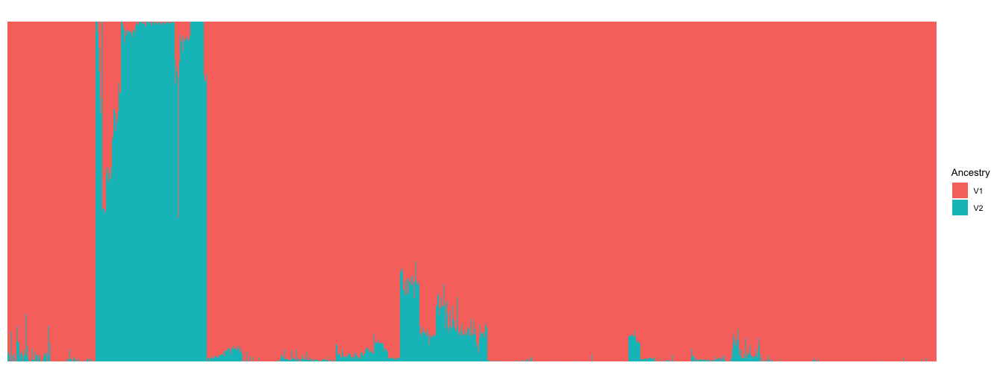
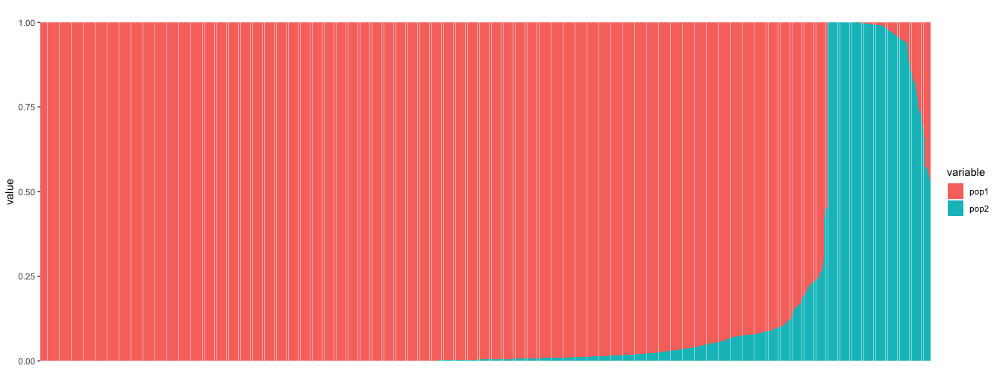
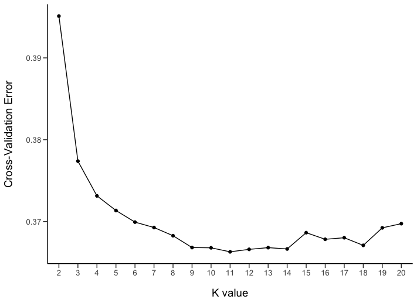

## ADMIXTURE analysis

The authors carried out admixture analysis using ADMIXTURE1 (v. 1.23), including 2,437 individuals (2,345 modern humans and 92 ancient ones).

The dataset that I will work with is the [Fully public genotype dataset (354,212 SNPs)](https://reich.hms.harvard.edu/datasets) provided by [Haak *et al*. Nature (2015)](https://www.nature.com/articles/nature14317)

The dataset contains **2,071** individuals, each represented by **354,212 autosomal** single nucleotide polymorphisms (SNPs).The full dataset of 2,437 individuals includes samples that cannot be posted in public.

The authors excluded individuals I0114 and I0411 that appear to be related to individuals I0117 and I0410 respectively, as in their experience, unsupervised ADMIXTURE clustering analysis often infers spurious clusters when pairs of relatives are included in the analysis dataset. 

### Data preparation

I downloaded the Haak *et al*. 2015 dataset from [here](https://reich.hms.harvard.edu/datasets), and then unzipped the file in the terminal:

```
tar -xvzf Haak2015PublicData.tar.gz

# The followings will show on your screen.
data.geno
data.ind
data.pops
data.snp
README
```

Then, I changed the prefix of those files from 'data' to 'Haak'.

```
Haak.geno
Haak.ind
Haak.snp
```

The program called [**Admixture**](http://software.genetics.ucla.edu/admixture/) needs ```.bed``` file format to run, and we also need to filter out some individuals/populations, like Chimp, Neanderthal genome, using [**Plink**](http://www.cog-genomics.org/plink2/), which also needs the ```.bed``` file format. So I have to convert the orginal ```PACKEDANCESTRYMAP``` format to ```PACKEDPED``` using ```convertf``` program in [EIGENSOFT v6.1.4](https://www.hsph.harvard.edu/alkes-price/software/) package. The ```PACKEDPED``` format using by **EIGENSOFT** pacakge is the same/similar to **Plink** ```.bed``` format.

See the ```PACKEDANCESTRYMAP``` and ```PACKEDPED``` format used by **EIGENSOFT** , [available here](https://github.com/DReichLab/EIG/tree/master/CONVERTF) and See the ```.bed``` format used by **Plink** , [available here](http://zzz.bwh.harvard.edu/plink/data.shtml#long).


Making parameter file for  ```convertf```:
```

# Convert the PACKEDANCESTRYMAP format to PACKEDPED.
# Use nano text editor in the terminal to make the par file named: " par.PACKEDANCESTRYMAP.PACKEDPED ".

nano par.PACKEDANCESTRYMAP.PACKEDPED

# And type the following in the text editor and save it.

genotypename: Haak.geno
snpname: Haak.snp
indivname: Haak.ind
outputformat: PACKEDPED
genotypeoutname: Haak.bed
snpoutname: Haak.bim
indivoutname: Haak.fam
```

Run ```convertf```:

```
/Path/To/EIG-6.1.4/bin/convertf -p par.PACKEDANCESTRYMAP.PACKEDPED 


packed geno read OK
numvalidind:   2071  maxmiss: 2071001
packedped output
##end of convertf run.
````

Now you have:

```
Haak.bed
Haak.bim
Haak.fam
```

If you check the ```data.fam``` file, I noticed that the family/population group information (the first column, showing only numbers) were lost during the format conversion. I found the population group information in the ```data.ind``` file, and updated the ```data.fam```file in excel manually. I also uploaded the modified ```data.fam``` file in the folder.
  
  ```
  # The original data.fam file.
  
  head Haak.fam
  
  1 SA1004 0 0 2 1
  2 SA063 0 0 2 1
  3 SA010 0 0 2 1
  4 SA064 0 0 1 1
  5 SA073 0 0 2 1
  6 SA1025 0 0 2 1
  7 SA078 0 0 2 1
  8 SA083 0 0 2 1
  9 Yuk_009 0 0 1 1
  10 Yuk_025 0 0 2 1

  # The updated data.fam file.
  
  head Haak.fam
  
  Khomani	SA1004	0	0	2	1
  Khomani	SA063	0	0	2	1
  Khomani	SA010	0	0	2	1
  Khomani	SA064	0	0	1	1
  Khomani	SA073	0	0	2	1
  Khomani	SA1025	0	0	2	1
  Khomani	SA078	0	0	2	1
  Khomani	SA083	0	0	2	1
  Yukagir	Yuk_009	0	0	1	1
  Yukagir	Yuk_025	0	0	2	1

  ```

[Haak.fam](data/Haak.fam)


By comapring the full and high resolution [admixture plot](data/admixture.haak.pdf) made by Haak *et al*. (2015) with the [Fully public genotype dataset (354,212 SNPs)](https://reich.hms.harvard.edu/datasets) that I downloaded, there are only **2013 individuals** (92 ancient + 1921 modern) from 193 population categories that match/overlap between the admxiture plot and the "fully public genotype dataset".

They are 41 population categories in the admixture plot but can't find in the "fully public genotype dataset".


So, I decided to just use those **2013 individuals** (92 ancient + 1921 modern) from 193 population categories to conducte admixture analysis.


**I need to extract those individuals from the "fully public genotype dataset" using ```Plink```. **


1. I made a list of those 190 population categories, [populationlist](data/population.list.txt).

2. I make a Family ID / Individual ID pairs file required by ```Plink```.

```
caat population.txt | while read line
do 
grep -w "$line" Haak.fam | awk '{print $1 "\t" $2}' >> list.ind.txt
done

```

[list.ind.txt](data/list.ind.txt)

```
head list.ind.txt

Baalberge_MN	I0559
Baalberge_MN	I0560
Baalberge_MN	I0807
Esperstedt_MN	I0172
Spain_MN	I0405
Spain_MN	I0406
Spain_MN	I0407
Spain_MN	I0408
```
3. Run the ```Plink``` to extract individuals.

```
plink --bfile Haak --keep list.ind.txt --make-bed --out admixture


# Log file
PLINK v1.90b4 64-bit (20 Mar 2017)             www.cog-genomics.org/plink/1.9/
(C) 2005-2017 Shaun Purcell, Christopher Chang   GNU General Public License v3
Logging to admixture.log.
Options in effect:
  --bfile Haak
  --keep list.ind.txt
  --make-bed
  --out admixture

8703 MB RAM detected; reserving 4351 MB for main workspace.
354212 variants loaded from .bim file.
2071 people (1307 males, 764 females) loaded from .fam.
2071 phenotype values loaded from .fam.
--keep: 2013 people remaining.
Using 1 thread (no multithreaded calculations invoked).
Before main variant filters, 2013 founders and 0 nonfounders present.
Calculating allele frequencies... done.
Total genotyping rate in remaining samples is 0.979204.
354212 variants and 2013 people pass filters and QC.
Among remaining phenotypes, 0 are cases and 2013 are controls.
--make-bed to admixture.bed + admixture.bim + admixture.fam ... done.

#sort the oder of those individuals

plink --bfile admixture --indiv-sort f list.ind.txt --make-bed --out Haak.admixture


# Log file
PLINK v1.90b4 64-bit (20 Mar 2017)             www.cog-genomics.org/plink/1.9/
(C) 2005-2017 Shaun Purcell, Christopher Chang   GNU General Public License v3
Logging to Haak.admixture.log.
Options in effect:
  --bfile admixture
  --indiv-sort f list.ind.txt
  --make-bed
  --out Haak.admixture

8703 MB RAM detected; reserving 4351 MB for main workspace.
354212 variants loaded from .bim file.
2013 people (1272 males, 741 females) loaded from .fam.
2013 phenotype values loaded from .fam.
Using 1 thread (no multithreaded calculations invoked).
Before main variant filters, 2013 founders and 0 nonfounders present.
Calculating allele frequencies... done.
Total genotyping rate is 0.979204.
354212 variants and 2013 people pass filters and QC.
Among remaining phenotypes, 0 are cases and 2013 are controls.
--make-bed to Haak.admixture.bed + Haak.admixture.bim + Haak.admixture.fam ...
done.

```


So now, the data set contains 1,921 modern humans and 92 ancient ones, with the oder consistent with the Haak's admixture plot.


```
Haak.admixture.bed
Haak.admixture.bim
Haak.admixture.fam
```


The initial set of 354,212 SNPs was pruned for linkage disequilibrium in PLINK (v. 1.9) using parameters: 

```--indep-pairwise 200 25 0.5```

The command above that specifies 200 25 0.5 would a) consider a window of 200 SNPs, b) calculate LD between each pair of SNPs in the window, b) remove one of a pair of SNPs if the LD is greater than 0.5, c) shift the window 25 SNPs forward and repeat the procedure.

```
plink --bfile Haak.admixture --indep-pairwise 200 25 0.5 


# log file
PLINK v1.90b4 64-bit (20 Mar 2017)             www.cog-genomics.org/plink/1.9/
(C) 2005-2017 Shaun Purcell, Christopher Chang   GNU General Public License v3
Logging to plink.log.
Options in effect:
  --bfile Haak.admixture
  --indep-pairwise 200 25 0.5

8703 MB RAM detected; reserving 4351 MB for main workspace.
354212 variants loaded from .bim file.
2013 people (1272 males, 741 females) loaded from .fam.
2013 phenotype values loaded from .fam.
Using 1 thread (no multithreaded calculations invoked).
Before main variant filters, 2013 founders and 0 nonfounders present.
Calculating allele frequencies... done.
Total genotyping rate is 0.979204.
354212 variants and 2013 people pass filters and QC.
Among remaining phenotypes, 0 are cases and 2013 are controls.
Pruned 11404 variants from chromosome 1, leaving 18583.
Pruned 12049 variants from chromosome 2, leaving 19435.
Pruned 10022 variants from chromosome 3, leaving 15867.
Pruned 8461 variants from chromosome 4, leaving 13896.
Pruned 8502 variants from chromosome 5, leaving 13956.
Pruned 8591 variants from chromosome 6, leaving 13025.
Pruned 6642 variants from chromosome 7, leaving 11045.
Pruned 7128 variants from chromosome 8, leaving 11341.
Pruned 5327 variants from chromosome 9, leaving 9667.
Pruned 7526 variants from chromosome 10, leaving 12145.
Pruned 7035 variants from chromosome 11, leaving 11260.
Pruned 6699 variants from chromosome 12, leaving 11259.
Pruned 4093 variants from chromosome 13, leaving 7907.
Pruned 4476 variants from chromosome 14, leaving 7685.
Pruned 4229 variants from chromosome 15, leaving 7404.
Pruned 3944 variants from chromosome 16, leaving 7647.
Pruned 3144 variants from chromosome 17, leaving 6349.
Pruned 4039 variants from chromosome 18, leaving 7191.
Pruned 1577 variants from chromosome 19, leaving 3775.
Pruned 3667 variants from chromosome 20, leaving 6316.
Pruned 1651 variants from chromosome 21, leaving 3393.
Pruned 1537 variants from chromosome 22, leaving 3323.
Pruning complete.  131743 of 354212 variants removed.
Marker lists written to plink.prune.in and plink.prune.out .
```

You are getting two files [plink.prune.in](data/plink.prune.in) and [plink.prune.out](data/plink.prune.out). To make a new, pruned file, then use the following command to extract SNPs that meet the LD standard.


```
plink --bfile Haak.admixture --extract plink.prune.in --make-bed --out Haak.admxi.final


# Log file
PLINK v1.90b4 64-bit (20 Mar 2017)             www.cog-genomics.org/plink/1.9/
(C) 2005-2017 Shaun Purcell, Christopher Chang   GNU General Public License v3
Logging to Haak.admxi.final.log.
Options in effect:
  --bfile Haak.admixture
  --extract plink.prune.in
  --make-bed
  --out Haak.admxi.final

8703 MB RAM detected; reserving 4351 MB for main workspace.
354212 variants loaded from .bim file.
2013 people (1272 males, 741 females) loaded from .fam.
2013 phenotype values loaded from .fam.
--extract: 222469 variants remaining.
Using 1 thread (no multithreaded calculations invoked).
Before main variant filters, 2013 founders and 0 nonfounders present.
Calculating allele frequencies... done.
Total genotyping rate is 0.979254.
222469 variants and 2013 people pass filters and QC.
Among remaining phenotypes, 0 are cases and 2013 are controls.
--make-bed to Haak.admxi.final.bed + Haak.admxi.final.bim +
Haak.admxi.final.fam ... done.

```

Thus, resulting in a pruned set of 222,469 SNPs used for admxiture analysis. 


### Running admxiture analysis

The ```ADMIXTURE``` program version is 1.3.0. For downloading, installation and runing the Admixture program, see [the homepage](http://software.genetics.ucla.edu/admixture/download.html). 

Now we have the genotype dataset (222,469 SNPs), which including 92 ancient + 1921 modern individuals from 193 population categories(33 ancient + 163 modern).

```
Haak.admxi.final.bed 
Haak.admxi.final.bim 
Haak.admxi.final.fam
```

```
for K in {2..20}
do 
./admixture --cv Haak.admxi.final $K -j4 | tee log${K}.out
done

or

for k in {2..20}; do ./admixture --cv Haak.admxi.final $K -j4 | tee log${K}.out; done

```

### Plot the Admixture results

After finishing running admixture analysis K=2 to K=20, you will get ```*.Q```, ```*.P``` and ```log*.out``` files for each K value. ```*.Q``` file will be used to plot the admixture graph, it contains ancestry proportion information.

```
Haak.admxi.final.2.Q
Haak.admxi.final.3.Q
Haak.admxi.final.4.Q
Haak.admxi.final.5.Q
.
.
.
Haak.admxi.final.19.Q
Haak.admxi.final.20.Q

```

```
Haak.admxi.final.2.P
Haak.admxi.final.3.P
Haak.admxi.final.4.P
Haak.admxi.final.5.P
.
.
.
Haak.admxi.final.19.P
Haak.admxi.final.20.p
```
```
log2.out
log3.out
log4.out
log5.out
log6.out.
.
.
log19.out
log20.out
```

I tried three ways to plot the Admixture results and I was trying to get a similar look as Haak *et al* (2015) admxiture plot. The first two kind of failed becasue I didn't figure out how to label populations. For third way, I used [Pophelper 2.2.9](https://github.com/royfrancis/pophelper) package in R and after studing the manual, following the tutorial and trying to play with it with my own data, I was able to make a similar admixture graph similar to Haak *et al*. 's. Here is [Haak *et al*. ' admixture plot}(data/admixture.haak.pdf).

Here, I will show you those three ways. I will improve the first two in the future.

**1. Plot the admixture using ```gglot2()``` in R**

Here, I only use ```Haak.admxi.final.2.Q``` file to show an example.

```
#extract population and individual name information from .fam file in the terminal.
awk '{print$1 "\t" $2}' Haak.admxi.final.fam > pop.names
```
Here are the R codes:

```
library(ggplot2)
library(reshape2)
# Read population and individual name information in R.
pop.name <- read.table("pop.names")

# Name each column in R.
names(pop.name) <- c("population","individual")

# Read .Q file.
Q2 <- read.table("Haak.admxi.final.2.Q")

# Add population/individual name information to .Q file, like combining those columns.
final.Q2 <- cbind(pop.name, Q2)

# Melt (reshape data from wide format to long format).                
m.final.Q2 <- melt(final.Q2, id.vars=c("individual","population"), 
            variable.name="Ancestry", value.name="Fraction")

#plot with indivual order that I provided.
m.final.Q2$individual <- factor(m.final.Q2$individual, levels = final.Q2$individual)


# Simple stacked bar plot.
ggplot(m.final.Q2, aes(x=individual, y=Fraction, fill=Ancestry)) +
  geom_bar(stat="identity", position="stack",width = 1) +
  theme_bw(10) +
  theme(panel.grid=element_blank(),
        axis.title.x=element_blank(),
        axis.title.y=element_blank(),
        axis.text.x=element_blank(),
        axis.text.y=element_blank(),
        axis.ticks.x=element_blank(),
        axis.ticks.y=element_blank(),
        panel.border = element_blank(),
        strip.background=element_blank()
        )
```



I tried to add ```facet_grid(. ~ population, drop=TRUE, space="free", scales="free")``` line to the ggplot2 to add population name label. However, it failed to plot the graph. I didn't figure out why, might due to big data set. See [here](https://stackoverflow.com/questions/31570248/how-do-you-create-a-stacked-barplot-with-x-labels-and-borders-grouped-by-a-facto) for the referece ( worked codes). 

[Haak.admxi.final.2.Q](data/Haak.admxi.final.2.Q)

[Haak.admxi.final.fam](data/Haak.admxi.final.fam)

**2. Plot the admixture using ```popcorn``` package in R**

Then I tried the R package called ```popcorn```, due to its poor manual, I didn't figure out how to label poplations.

```
#install popcorn
install.packages("remotes")
remotes::install_github("andrewparkermorgan/mouser")
remotes::install_github("andrewparkermorgan/popcorn")
```

```
library(popcorn)
library(ggplot2)

pops <- read_fam("Haak.admxi.final.fam")
Q <- read_Q_matrix("Haak.admxi.final.2.Q")
so <- sort_by_cluster(Q)
QQ <- tidy(Q, pops)

plot_admixture(QQ, sort.order = so)
```
This plot sorted individuals by certain ancestry proposion, in this example is non-Afrian ancestry from high to low.




**3. Plot the admixture using ```Pophelper 2.2.9``` package in R**


The source code ```Pophelper 2.2.9``` is available from [GitHub](https://github.com/royfrancis/pophelper). The detailed manual is [available here](http://royfrancis.github.io/pophelper/#1_introduction).

An online interactive version of pophelper is available at [pophelper.com](http://www.pophelper.com/). However, the author said that the web app is quite outdated and limited in terms of functionality and flexibility. The web app must not be used for major work or large datasets. I tried this online version with my own dataset, I think you can use it to do a quick view of your plot.

The following is going to show you how to plot the admixture results in R using ```Pophelper 2.2.9```.

[popnames](data/popnames)

```
#install the pophelper package.
install.packages(c("devtools","ggplot2","gridExtra","gtable","tidyr"),dependencies=T)
devtools::install_github('royfrancis/pophelper')

#load the pophelper package.
library(pophelper)

#assign all .Q files to a variable named afiles ( admixture files).
afiles <- c("Haak.admxi.final.2.Q", "Haak.admxi.final.3.Q", "Haak.admxi.final.4.Q", "Haak.admxi.final.5.Q",
            "Haak.admxi.final.6.Q", "Haak.admxi.final.7.Q", "Haak.admxi.final.8.Q", "Haak.admxi.final.9.Q",
            "Haak.admxi.final.10.Q","Haak.admxi.final.11.Q","Haak.admxi.final.12.Q","Haak.admxi.final.13.Q",
            "Haak.admxi.final.14.Q","Haak.admxi.final.15.Q","Haak.admxi.final.16.Q","Haak.admxi.final.17.Q",
            "Haak.admxi.final.18.Q","Haak.admxi.final.19.Q","Haak.admxi.final.20.Q")
            
#make a list using built-in readQ function
alists <- readQ(files=afiles,filetype="basic")

#plot the data
# custom strip panel label showing k only
fn1 <- function(x) attr(x,"k")
spnames <- paste0("K=", sapply(alists,fn1))

# color theme 20 color
shiny <- c("#FF9326","#1D72F5","#FDF060","#FFA6B2","#396D35",
           "#DF0101","#77CE61","#A945FF","#0089B2","#BFF217",
           "#60D5FD","#CC1577","#F2B950","#7FB21D","#EC496F",
           "#326397","#B26314","#A4A4A4","#610B5E","#396D35")


# group information
pop.name <- read.table("popnames",stringsAsFactors=FALSE, header =T)

#plot the graph and save as .pdf file.
plotQ(qlist = alists[1:19], imgoutput = "join", imgtype = "pdf",
      sppos ="left",splab = spnames[1:19],splabsize = 2, splabangle = 180, splabcol = "black", #set Strip panel
      clustercol = shiny,     #set colour of clusters
      grplab = pop.name, grplabsize = 0.52, grplabangle = 90, grplabjust = 0.5, grplabpos = 0.9,    #add population information
      grplabcol = "black",
      pointalpha = 0,
      linealpha = 0,
      divtype = 1,
      divsize = 0.08,
      panelspacer = 0.03,
      panelratio = c(3,1),
      pointsize = 0,
      linesize = 0,
      width = 120
      )

```
You can play with those settings to fit your data. Click the graph to see zoom-in version:


Here is the pdf version with high resolution, [available here](data/admixture.haak.pdf). You can download and look at it.

### PLot cross-validation error to choose the correct value for K

Use ADMIXTURE’s cross-validation procedure. A good value of K will exhibit a low cross-validation error compared to other K values. 

In the terminal, check the CV value in the ```log*.out``` file for each K run:

```
grep -h CV log*.out 

CV error (K=10): 0.36679
CV error (K=11): 0.36630
CV error (K=12): 0.36660
CV error (K=13): 0.36681
CV error (K=14): 0.36665
CV error (K=15): 0.36864
CV error (K=16): 0.36783
CV error (K=17): 0.36802
CV error (K=18): 0.36709
CV error (K=19): 0.36923
CV error (K=2): 0.39511
CV error (K=20): 0.36974
CV error (K=3): 0.37738
CV error (K=4): 0.37314
CV error (K=5): 0.37135
CV error (K=6): 0.36993
CV error (K=7): 0.36927
CV error (K=8): 0.36827
CV error (K=9): 0.36682

```
```-h``` Suppress the prefixing of file names on output.

I made a file called CV.txt based on CV value and K Value above ```[CV.txt](data/CV.txt)``` , and plot CV value using ggplot2:

```
#Plot the CV 
library(ggplot2)  #load ggplot2 package.
CV <- read.table("CV.txt", header = T) #read in data file.
CV$K <- as.factor(CV$K) #facor the K column (numbers to levels).


ggplot(data=CV, aes(x=K, y=value, group=1)) +
  geom_line() +
  geom_point() +
  xlab("K value") +
  ylab("Cross-Validation Error") +
  theme(panel.grid.major = element_blank(), 
        panel.grid.minor = element_blank(),
        panel.background = element_blank(), 
        axis.line = element_line(colour = "black"),
        axis.text.x = element_text(size = 10),
        axis.text.y = element_text(size = 10),
        axis.title.x = element_text(size = 14, margin = margin(t = 15, r = 0, b = 0, l = 0)),
        axis.title.y = element_text(size = 14, margin = margin(t = 0, r = 15, b = 0, l = 0)),
        axis.ticks.length=unit(.20, "cm")
         )


```




### Admixture Result Interpretation

Here I combined my understanding with [Haak *et al*. (2015)](https://www.nature.com/articles/nature14317) and [Lazaridis *et al.* (2014)](https://www.nature.com/articles/nature13673) 's interpretation.

**K=2**, it separates African from non-African populations. But, some Afrian populations have non-African ancestry, and some Near Eastern populations have minor African ancestory. Recent gene exchange?

**K=3**,  West and East non-African ancestry(ENA) components separate from each other. 

Early and Middle Neolithic farmers don't have East non-African ancestry. It is kind of make sence if their origin can be traced back from Near East.

The hunter gatherers are have greater or lesser extents of an eastern non-African (ENA) component, and Late Neolithic, Bronze age farmer also have this eastern non-African component. I think it is becuase of admxiture with local hunter-gatherers and Yamana culture related population from the steppe.

**K=4**, this breaks the ENA component down into one maximized in Native American populations like the Karitiana and one characterizing the East Asian populations and maximized in the Ami from Taiwan or Chinese populations. 

This analysis further suggests that the ENA affinity of Hunter-Gatherers is related to the Karitiana.

**K=5**,  this breaks the African component into an African hunter-gatherer ancestry maximized in Bushmen such as the Ju_hoan_North and an African farmer component maximized in the Yoruba. 

**K=6**, this reveals a south Eurasian component maximized in Papuans, which is also represented in South Asians. MA1 shows some affinity to this component, in contrast to more recent European hunter gatherers who continue to mainly show ties to Native Americans. Yamnaya also has some of this ancestry.

**K=7**, this reveals a Northeast Siberian component, which is maximized in the Itelmen. The Itelmens are an ethnic group native to the Kamchatka Peninsula in Russia. 

**K=8**, this reveals a South Asian component maximized in the Mala (South India). This is separated from the earlier south Eurasian component, and MA1 derives approximately one third of its ancestry to this new component, rather than from the Papuan maximized Oceanian component that also results from this split. 


**From K=2 to K=8, the ancestry of the Early and Middle Neolithic European populations haven't change much, belonging to "East non-African ancestry", meanwhile hunter-gatherers show some ancestry from eastern non-Africans(k=3 to K=8). From k=4 to K=8, the hunter-gatherers and late Neolithic/Bronze age populations show East non-Afrian acestry that represents by Native Americans. When K=8, all the late Neolithic and Bronze age group from central Europe and the Yamnaya have some ancestry component that found at high frequencies in South Asian populations, this ancestry component is also found in present-day Near Eastern and European populations.**


**K=9**, this reveals a split within West Eurasia, with one component maximized in European hunter-gatherers and one maximized in BedouinB. European hunter-gatherers ancestry appears. Early Neolithic and Middle Neolithic famers now appear to be mixture of a European hunter-gatherers and Near Eastern ancestral populations, with an increase in the hunter-gatherer ancestry during the Middle Neolithic famers and Late Neolithic/Bronze age populations.This consistent with the hypothesis that Early European Farmers represented a mixture of West European Hunter-gatherers and Near Eastern farmers. The Near Eastern component is prevalent in most of Southern Europe, consistent with the hypothesis that Europeans have inherited some Near Eastern ancestry via early farmers. However, Northwestern Europeans show decreasing of this ancestry. Considering the direction of the spreading of farming, this is kind of making sence.

Most West Eurasian populations appear to be made up of the Loschbour and BedouinB-related component but populations from Northeastern Europe continue to possess partial ancestry from the Northeast Siberian-related component that is maximized in the Itelmen. [Lazaridis *et al.* (2014)](https://www.nature.com/articles/nature13673)

**K=10**, this reveals a component maximized in the East African Hadza.

**K=11**, an Onge-maximized component appears.

**K=12**, A Chipewyan maximized component appears and is spread roughly around the Bering Strait.Interestingly, the Native American-like ancestry in MA1 largely resolves to this component. 

**K=13**, shows the appearance of a Mbuti-maximized African Pygmy-related component.

**K=14**, A component maximized in the Chukchi appears.

**K=15**, it shows the appearance of a component, maximized in the Eastern Africa.

**From K=9 to K=16, the ancestry in those ancient European individual haven't changed so much. A component ties late Neolithic and Broze age groups to South Asia.**

**K=16**, a component appeared to be highly represented in groups from South Aisa, the Near East and the Caucasus. The existence of this component may correspond to the evidence for dilution of EHG ancestry in the Yamnaya population.

