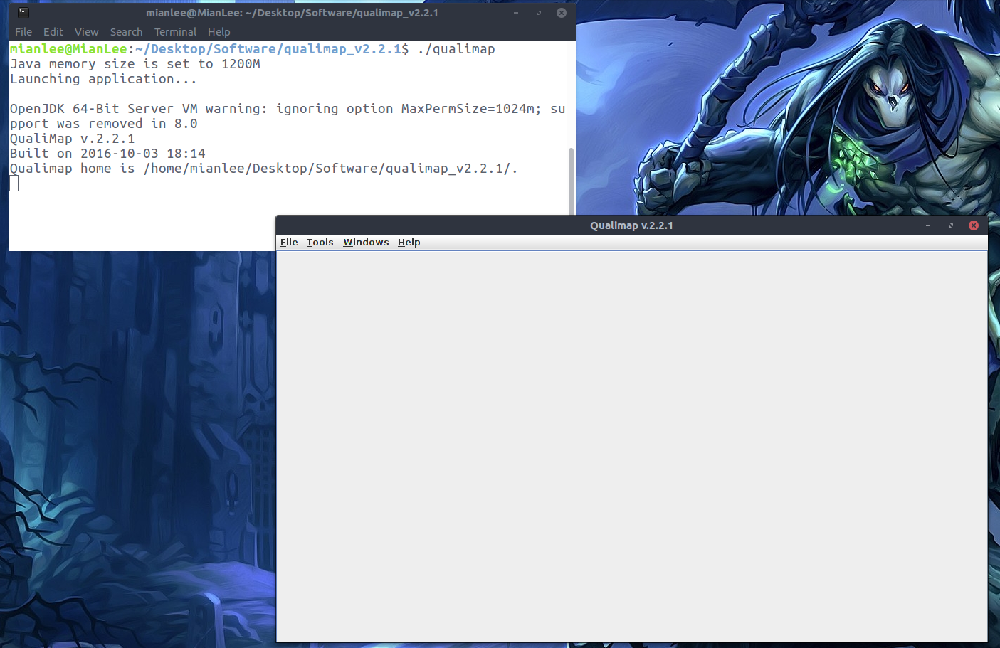

Since raw capture ancient DNA sequences/data are not available publically, some quality control checks on raw sequence data (using [FastQC](https://www.bioinformatics.babraham.ac.uk/projects/fastqc/)), demultiplexing of single or double indexed reads ([AdapterRemoval](https://github.com/MikkelSchubert/adapterremoval)), adapter/sequence trimming and sequence merging (using [AdapterRemoval](https://github.com/MikkelSchubert/adapterremoval), or [SeqPrep](https://github.com/jstjohn/SeqPrep)), map reads to reference genome and filter for quality (using [Bowtie2](http://bowtie-bio.sourceforge.net/bowtie2/index.shtml) or [BWA](http://bio-bwa.sourceforge.net/)) are not showing here. In the near future, I will use my raw data/find some raw data to show you all those analyses mentioned above.

Here, I will repeat analyses about how to assess the quility ancient DNA alignment starting with ```.BAM``` file and how to assess ancient DNA athenticity ( Damgae patterns / Contamination).


I will use ```.BAM``` files provided by Maria Nieves Colón in [her github](https://github.com/mnievesc/ENAH_curso_aDNA_2019/tree/master/Ex1_aDNA_BAM) to get familar with those softwares/programs, and then I will apply the same analyses to [Haak *et.al*. 2015](https://www.nature.com/articles/nature14317) dataset.

### Operating System

```
Ubuntu 16.04.5 LTS-xenial
```

### Input files 

The frist Dataset provided by [Maria Nieves Colón](https://github.com/mnievesc/ENAH_curso_aDNA_2019/tree/master/Ex1_aDNA_BAM), and I downloaded and deposited them in the [Data](Data/) folder.


**Mapped BAM files post mapping and filtering and BAI index files.**

```
IndA.bam
IndA.bam.bai
IndB.bam
IndB.bam.bai
IndC.bam
IndC.bam.bai
```
The BAM files contain ancient DNA read mapped to the mitochondrial human genome (mtDNA). The reads were previously quality filtered and sorted in SAMtools. Duplicate reads and reads with multiple mappings have also been removed. The BAI file was generated using the samtools index command.

**MtDNA reference genome FASTA file:** ```rCRS.fasta``` **and index** ```rCRS.fasta.fai```.

The reference genome has been previously indexed using command samtools index rCRS.fasta


### 1. Visualizing aDNA ```.BAM``` files

There are some popular visualization tools for interactive exploration of genomic datasets as I know of and used before, such [Geneious](https://www.geneious.com/) and [Integrative Genomics Viewer (IGV)](http://software.broadinstitute.org/software/igv/home). Geneious is amazing software to deal with sequences(also sequence management), such as visualization, manipulation and phylogenetic analysis. However, it is a commercial sofeware, you have to pay for it. Instead, IGV is a free software to visualze your ```.BAM``` files. Here, I am going to show you how to use it briefly.

Also, Maria Nieves Colón shows you how to use the [Tablet](https://ics.hutton.ac.uk/tablet/) program to visualze the ```.BAM``` file, [here](https://github.com/mnievesc/ENAH_curso_aDNA_2019/blob/master/Ex1_aDNA_BAM/Exercise1_Tutorial_aDNA_BAM.md).


**Visualizing the BAM alignment in IGV**

1. Download IGV for Linux version, unzip the IGV folder and ```cd``` to the **IGV_Linux_2.5.3** folder in your terminal.

2. Run ``` ./igv.sh ``` to lunch the IGV interface, or you also can read the ```README``` file to customize your setting.


3. Load reference genome files: click ```Genomes``` tab and click ```Load Genome from file...```, choose ```rCRS.fasta``` file and click ```Open``` botton.


4. Load individual ```.bam``` file: click ```File``` tab and click ```Load from File...```, choose ```IndA.bam``` file and click ```Open``` botton.


Once the ```.BAM``` file loads into IGV, you should now be able to see the reads aligned to the reference.


You can explore the alignment with the Zoom option at the top-right corner. You can check certain SNP position, alignment and base coverage in detail.


### 2. Summary statistics for the BAM alignment

Using [Qualimap](http://qualimap.bioinfo.cipf.es/) to generate overall statistics for ```.BAM``` file. Qualimap examines sequencing alignment data in SAM/BAM files according to the features of the mapped reads and provides an overall view of the data that helps to the detect biases in the sequencing
 
**Installing Qualimap on Ubuntu, follow the [manual](http://qualimap.bioinfo.cipf.es/doc_html/intro.html#installing-qualimap-on-ubuntu) to download and install Qualimap on Ubuntu.**

Here, I show how I installed:

**Install Java**

 Update your system.
 ```
 sudo apt-get update && sudo apt-get upgrade
 ```
 Update your apt-get/Install the “Main” repository with apt.
 ```
 sudo apt-get update
 ```
 Install OpenJDK 8
 ```
 sudo apt-get install openjdk-8-jdk
 ```
 This package will run an installer for The OpenJDK 8, which is the latest LTS version available for Ubuntu 16.04 release.
 
 **Install R**
 
 ```
 # Add R repository, Note the “xenial” in the line, indicating Ubuntu 16.04. If you have a different version, just change that.

 sudo echo "deb http://cran.rstudio.com/bin/linux/ubuntu xenial/" | sudo tee -a /etc/apt/sources.list
 
 
 # Add R to Ubuntu Keyring
 
 gpg --keyserver keyserver.ubuntu.com --recv-key E298A3A825C0D65DFD57CBB651716619E084DAB9
 
 gpg -a --export E298A3A825C0D65DFD57CBB651716619E084DAB9 | sudo apt-key add -
 
 
 #Install R Base

 sudo apt-get update
 sudo apt-get install r-base r-base-dev
 
```
More details about installation are available: [Here](https://cran.r-project.org/bin/linux/ubuntu/README).


**Install required R-packages**

Some packages depend on external libraries, so you might need to install them either:

```sudo apt-get install libxml2-dev```

```sudo apt-get install libcurl4-openssl-dev```

**Install some missing R-packages in R**

```
install.packages("XML")
install.packages("optparse")

# install "rtracklayer"
if (!requireNamespace("BiocManager", quietly = TRUE))
  install.packages("BiocManager")

BiocManager::install("rtracklayer")

# install "NOISeq"
BiocManager::install("NOISeq")

# install ""Rsamtools""
BiocManager::install("Rsamtools")

# install ""Repitools""
BiocManager::install("Repitools")

```
It will take a while to install "Repitools" and "rtracklayer", like 10 to 15 mins.


When you installed all dependencies (Java, R, and R libraries), download the ZIP file from the [Qualimap homepage](http://qualimap.bioinfo.cipf.es/), unpack it to desired directory.

```cd``` to the Qulaimap folder in your terminal and run Qualimap from this directory using the prebuilt script:

```
./qualimap
```


Following the Qualimap [Workflow](http://qualimap.bioinfo.cipf.es/doc_html/workflow.html) to finish the analysis. Here I choose **New Analysis** -> **BAM QC** (e.g. IndA.bam) and stay with default and click **>>> Start analysis**.

You can go over all statistics through the Qualimap interface or save output as a PDF file, see [IndA result](Data/qualimapReport_indA.pdf). 


### Summary ancient DNA damage patterns


[mapDamage2](https://ginolhac.github.io/mapDamage/) is a computational framework written in Python and R, which tracks and quantifies DNA damage patterns among ancient DNA sequencing reads generated by Next-Generation Sequencing platforms.

I follwed the [mapDamage2 homepage](https://ginolhac.github.io/mapDamage/) to install Requirements for mapDamage2 and then mapDamage2 itself.

**Requirements**:

- ```Python 3.6.7 ```   

-  Install 'git'   

```sudo apt-get install git-core```

```git-core version: 1:2.7.4-0 ubuntu1.6```

- ``` R version 3.6.1 ``` 

- Install 'pysam'  

``` conda install -c bioconda pysam``` You need to install [miniconda](https://docs.conda.io/en/latest/miniconda.html) first.

```pygame-0.15.2```

- ```gsl 2.1``` 

**Install R libraries in R**

```
install.packages("inline")   # inline v0.3.15

install.packages("gam")      # gam v1.16.1

install.packages("Rcpp")     # Rcpp v1.0.1

install.packages("RcppGSL")  # RcppGSL v0.3.6

install.packages("ggplot2")  # ggplot2 v3.2.0

```

**Install mapDamage2**

Download the mapDamage 2.0.9 to the desired directory, the Source code (tar.gz) can be found [here](https://github.com/ginolhac/mapDamage/releases).

Go into the resulting folder:

```cd mapDamage-2.0.9```

Continue the procedure by running the following command if you have administrator rights

```sudo python setup.py install```


**Generate mapDamage report**

Two PDF mapDamage reports can be generated by runing:

```
mapdamage -i IndA.bam -r rCRS.fasta 
```


### References:

1. Haak, Wolfgang, et al. "Massive migration from the steppe was a source for Indo-European languages in Europe." Nature 522.7555 (2015): 207.
