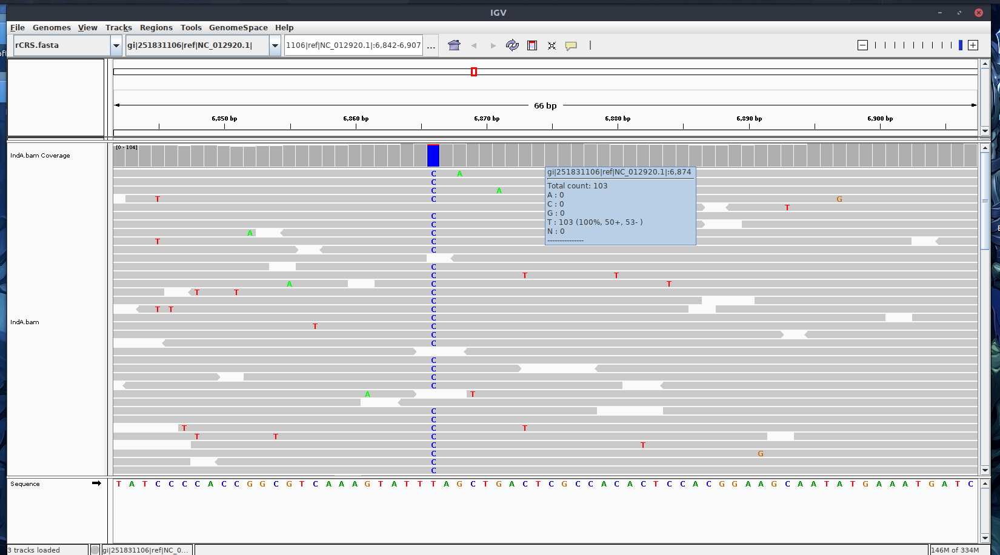

Since raw capture ancient DNA sequences/data are not available publically, some quality control checks on raw sequence data (using [FastQC](https://www.bioinformatics.babraham.ac.uk/projects/fastqc/)), demultiplexing of single or double indexed reads ([AdapterRemoval](https://github.com/MikkelSchubert/adapterremoval)), adapter/sequence trimming and sequence merging (using [AdapterRemoval](https://github.com/MikkelSchubert/adapterremoval), or [SeqPrep](https://github.com/jstjohn/SeqPrep)), map reads to reference genome and filter for quality (using [Bowtie2](http://bowtie-bio.sourceforge.net/bowtie2/index.shtml) or [BWA](http://bio-bwa.sourceforge.net/)) are not showing here. In the near future, I will use my raw data/find some raw data to show you all those analyses mentioned above.

Here, I will repeat analyses about how to assess the quility ancient DNA alignment starting with ```.BAM``` file and how to assess ancient DNA athenticity ( Damgae patterns / Contamination).


I will use ```.BAM``` files provided by Maria Nieves Colón in [her github](https://github.com/mnievesc/ENAH_curso_aDNA_2019/tree/master/Ex1_aDNA_BAM) to get familar with those softwares/programs, and then I will apply the same analyses to [Haak *et.al*. 2015](https://www.nature.com/articles/nature14317) dataset.

### Operating System

```
Ubuntu 16.04.5 LTS-xenial
```

### Input files 

The frist Dataset provided by [Maria Nieves Colón](https://github.com/mnievesc/ENAH_curso_aDNA_2019/tree/master/Ex1_aDNA_BAM), and I downloaded and deposited them in the [Data](Data/) folder.


**Mapped BAM files post mapping and filtering and BAI index files.**

```
IndA.bam
IndA.bam.bai
IndB.bam
IndB.bam.bai
IndC.bam
IndC.bam.bai
```
The BAM files contain ancient DNA read mapped to the mitochondrial human genome (mtDNA). The reads were previously quality filtered and sorted in SAMtools. Duplicate reads and reads with multiple mappings have also been removed. The BAI file was generated using the samtools index command.

**MtDNA reference genome FASTA file:** ```rCRS.fasta``` **and index** ```rCRS.fasta.fai```.

The reference genome has been previously indexed using command samtools index rCRS.fasta


### 1. Visualizing aDNA ```.BAM``` files

There are some popular visualization tools for interactive exploration of genomic datasets as I know of and used before, such [Geneious](https://www.geneious.com/) and [Integrative Genomics Viewer (IGV)](http://software.broadinstitute.org/software/igv/home). Geneious is amazing software to deal with sequences(also sequence management), such as visualization, manipulation and phylogenetic analysis. However, it is a commercial sofeware, you have to pay for it. Instead, IGV is a free software to visualze your ```.BAM``` files. Here, I am going to show you how to use it briefly.

Also, Maria Nieves Colón shows you how to use the [Tablet](https://ics.hutton.ac.uk/tablet/) program to visualze the ```.BAM``` file, [here](https://github.com/mnievesc/ENAH_curso_aDNA_2019/blob/master/Ex1_aDNA_BAM/Exercise1_Tutorial_aDNA_BAM.md).


**Visualizing the BAM alignment in IGV**

1. Download IGV for Linux version, unzip the IGV folder and ```cd``` to the **IGV_Linux_2.5.3** folder in your terminal.

2. Run ``` ./igv.sh ``` to lunch the IGV interface, or you also can read the ```README``` file to customize your setting.


3. Load reference genome files: click ```Genomes``` tab and click ```Load Genome from file...```, choose ```rCRS.fasta``` file and click ```Open``` botton.


4. Load individual ```.bam``` file: click ```File``` tab and click ```Load from File...```, choose ```IndA.bam``` file and click ```Open``` botton.


Once the ```.BAM``` file loads into IGV, you should now be able to see the reads aligned to the reference.


You can explore the alignment with the Zoom option at the top-right corner. You can check certain SNP position, alignment and base coverage in detail.



### 2. Summary statistics for the BAM alignment

Using [Qualimap](http://qualimap.bioinfo.cipf.es/) to generate overall statistics for ```.BAM``` file. Qualimap examines sequencing alignment data in SAM/BAM files according to the features of the mapped reads and provides an overall view of the data that helps to the detect biases in the sequencing
 
**Installing Qualimap on Ubuntu, follow the [manual](http://qualimap.bioinfo.cipf.es/doc_html/intro.html#installing-qualimap-on-ubuntu) to download and install Qualimap on Ubuntu.**

Here, I show how I installed:

**Install Java**

 Update your system.
 ```
 sudo apt-get update && sudo apt-get upgrade
 ```
 Update your apt-get/Install the “Main” repository with apt.
 ```
 sudo apt-get update
 ```
 Install OpenJDK 8
 ```
 sudo apt-get install openjdk-8-jdk
 ```
 This package will run an installer for The OpenJDK 8, which is the latest LTS version available for Ubuntu 16.04 release.
 
 **Install R**
 
 ```
 # Add R repository, Note the “xenial” in the line, indicating Ubuntu 16.04. If you have a different version, just change that.

 sudo echo "deb http://cran.rstudio.com/bin/linux/ubuntu xenial/" | sudo tee -a /etc/apt/sources.list
 
 
 # Add R to Ubuntu Keyring
 
 gpg --keyserver keyserver.ubuntu.com --recv-key E298A3A825C0D65DFD57CBB651716619E084DAB9
 
 gpg -a --export E298A3A825C0D65DFD57CBB651716619E084DAB9 | sudo apt-key add -
 
 
 #Install R Base

 sudo apt-get update
 sudo apt-get install r-base r-base-dev
 
```
More details about installation are available: [Here](https://cran.r-project.org/bin/linux/ubuntu/README).


**Install required R-packages**

Some packages depend on external libraries, so you might need to install them either:

```sudo apt-get install libxml2-dev```

```sudo apt-get install libcurl4-openssl-dev```

**Install some missing R-packages in R**

```
install.packages("XML")
install.packages("optparse")

# install "rtracklayer"
if (!requireNamespace("BiocManager", quietly = TRUE))
  install.packages("BiocManager")

BiocManager::install("rtracklayer")

# install "NOISeq"
BiocManager::install("NOISeq")

# install ""Rsamtools""
BiocManager::install("Rsamtools")

# install ""Repitools""
BiocManager::install("Repitools")

```
It will take a while to install "Repitools" and "rtracklayer", like 10 to 15 mins.


When you installed all dependencies (Java, R, and R libraries), download the ZIP file from the [Qualimap homepage](http://qualimap.bioinfo.cipf.es/), unpack it to desired directory.

```cd``` to the Qulaimap folder in your terminal and run Qualimap from this directory using the prebuilt script:

```
./qualimap
```


Following the Qualimap [Workflow](http://qualimap.bioinfo.cipf.es/doc_html/workflow.html) to finish the analysis. Here I choose **New Analysis** -> **BAM QC** (e.g. IndA.bam) and stay with default and click **>>> Start analysis**.

You can go over all statistics through the Qualimap interface or save output as a PDF file, see [IndA result](Data/qualimapReport_indA.pdf). 


### 3. Summary ancient DNA damage patterns

High nucleotide misincorporation rates can be observed as a result of severe post-mortem DNA damage. Such misincorporation patterns are instrumental to authenticate ancient sequences versus modern contaminants. Inflated cytosine deamination rates at 5′-overhangs, an increase in C -> T substitution rates toward sequencing starts and complementary increase in G -> A rates toward reads ends. Conversely, a novel procedure targeting single-stranded templates has shown elevated C -> T substitution rates at both ends. [Hákon Jónsson *et al*. 2013](https://academic.oup.com/bioinformatics/article/29/13/1682/184965), [Briggs *et al*. (2007)](https://www.pnas.org/content/104/37/14616.long)


**[mapDamage2](https://ginolhac.github.io/mapDamage/)** is a computational framework written in Python and R, which tracks and quantifies DNA damage patterns among ancient DNA sequencing reads generated by Next-Generation Sequencing platforms. [Hákon Jónsson *et al*. 2013](https://academic.oup.com/bioinformatics/article/29/13/1682/184965)

I follwed the [mapDamage2 homepage](https://ginolhac.github.io/mapDamage/) to install Requirements for mapDamage2 and then mapDamage2 itself. And I failed to run the mapDamage2, I think because of my system configuration issue, epecially I have miniconda and python3.6 (installed within miniconda) installed, and I can connect ```pysam ``` to python2.7 (in the root) in my system, even I installed and connected ```pysam``` under phthon3.6 in miniconda. One solution might be uninstall miniconda and install python 2.7 version of miniconda (I haven't try on Ubuntu system, but on my Mac with Miniconda-python2.7 works just fine). I think mapDamage is looking for python2.7, even they claimed that the lastest version is compatible with python3.6.


So I figured out another solution, I created an conda envirment named "mapdamage" ( using Ubuntu system):

```
conda create --name mapdamage
```

And I installed the program ```mapDamage2``` under mapdamage environment using **conda install** (avoiding built the program by myself):

```
conda install -n mapdamage mapDamage2
```

It will install all ```mapDamage2``` dependencies automatically. However, I already had R installed on my computer and had all dependent R libraries listed [here](https://ginolhac.github.io/mapDamage/) installed in R:

```
inline
gam
Rcpp
RcppGSL
ggplot2 (>=0.9.2)
```


If you don't have miniconda installed, you can install Miniconda [available here](https://docs.conda.io/en/latest/miniconda.html), maybe  Python2.7 version is good for installing ```mapDamage2```.


**Generate mapDamage report**

Load your environment and ```cd``` to data folder；

```
source activate mapdamage

cd /PATH/TO/YOUR/Data
```

Two PDF mapDamage reports can be generated by runing:

```
mapDamage -i IndA.bam -r rCRS.fasta 
```


and leave the environment with the command:

```
source deactivate
```

#### Results:

**Fragmisincorporation_plot**

1. It shows that purines (**As** and **Gs**) are overrepresented at positions adjacent to the breaks in the ancient DNA, suggesting that depurination has contributed to its degradation. For IndA for example:


Full results [available here](Data/Fragmisincorporation_plot.pdf).

2. It also displays the patterns of C -> T and G -> A changes across the DNA fragments of a given sample. For IndA for example:


 **T** reprensents by red, and **A** reprensents by blue.
 
The frequencies of the 12 possible mismatches are plotted as a function of distance from 5'-and 3'-ends. At each position, the substitution frequency, e.g., C -> T, is calculated as the proportion of human reference sequence positions carrying C where the sequencing base is T. This means (my understanding) that given the human reference sequence positions carrying C, what is the frequency of C -> T transition? (Other possible events are C -> G, C -> A, and no mismatch C -> C).

Full results [available here](Data/Fragmisincorporation_plot.pdf).
 
**Note**:
The main diagnostic feature documented so far is a pattern of Cytosine (C) → Thymine (T) substitutionsthat increases toward the 5′ end of the sequence reads, which in most applications, results in a complementary Guanine (G) → Adenine (A) pattern in the 3′ end caused by enzymatic repair. This pattern has been attributed to Cytosine deamination at single-stranded ends of the molecules and shows a clear tendency of increase over time in contrast to other potential diagnostic features, such as fragment length and preferential fragmentation at purines. **[Pontus Skoglund *et al*. 2014](https://www.pnas.org/content/111/6/2229)**


**Read Length_plot** 

It displays the distribution of read lengths of a given sample. For IndA for example: 


Full results [available here](Data/Length_plot.pdf).


**Note**:

[Anaconda (conda)](https://conda.io/en/latest/) is an environment and package manager for the programming language Python and it makes installation, environment management, etc. simple without requiring root or administrator privileges.


We'll use Conda and Bioconda to create a controlled environment in which we can manage software specific to this pipeline. When we're done, we can use Conda to print the contents of this environment (every piece of software installed, plus its version and source; [details here](https://conda.io/projects/conda/en/latest/user-guide/tasks/manage-environments.html#sharing-an-environment)) so we can share it. In general, I recommend creating a new Conda environment for every project.

### 4. Evidence of contamination

### 5. Separating endogenous ancient DNA from modern day contamination

**[Pontus Skoglund *et al*. 2014](https://www.pnas.org/content/111/6/2229)**

**Logical behind it**: 

DNA fragments isolated from ancient specimens show a characteristic DNA damage pattern caused by miscoding lesions that differs from present day DNA sequences. The authors developed a framework for evaluating the likelihood of a sequence originating from a model with postmortem degradation—summarized in a postmortem degradation score—which allows the identification of DNA fragments that are unlikely to originate from present day sources.


### References:

1. Haak, Wolfgang, et al. "Massive migration from the steppe was a source for Indo-European languages in Europe." Nature 522.7555 (2015): 207.

2. Andrews, R. M., I. Kubacka, P. F. Chinnery, R. N. Lightowlers, D. M. Turnbull, and N. Howell. 1999. "Reanalysis and revision of the Cambridge reference sequence for human mitochondrial DNA." Nature Genetics 23 (2):147-147.

3. Jónsson, H., A. Gonolhac, M. Schubert, P. Johnson, and L. Orlando. 2013. "mapDamage2.0: fast approximate Bayesian estimates of ancient DNA damage parameters." Bioinformatics 29 (13):1682-1684.

4. Milne, I., G. Stephen, M. Bayer, P. J. A. Cock, L. Pritchard, L. Cardle, P. D. Shaw, and D. Marshall. 2013. "Using Tablet for visual exploration of second-generation sequencing data." Briefings in Bioinformatics 14 (2):193-202.

5. Okonechnikov, K., A. Conesa, and F. García-Alcalde. 2016. "Qualimap 2: advanced multi-sample quality control for high-throughput sequencing data." Bioinformatics 32 (2):292-294.

6. Peltzer, A., G. Jäger, A. Herbig, A. Seitz, C. Kniep, J. Krause, and K. Nieselt. 2016. "EAGER: efficient ancient genome reconstruction." Genome Biology 17 (1):60.

7. Renaud, G., Slon, V., Duggan, A.T. and Kelso J. 2015. "Schmutzi: estimation of contamination and endogenous mitochondrial consensus calling for ancient DNA". Genome Biology 16:224.

8. Robinson, James T., et al. "Integrative genomics viewer." Nature biotechnology 29.1 (2011): 24.

9. Skoglund, Pontus, et al. "Separating endogenous ancient DNA from modern day contamination in a Siberian Neandertal." Proceedings of the National Academy of Sciences 111.6 (2014): 2229-2234.

10. Briggs Adrian W., et al. "Patterns of damage in genomic DNA sequences from a Neandertal." Proceedings of the National Academy of Sciences 104.37 (2007): 14616-14621.
