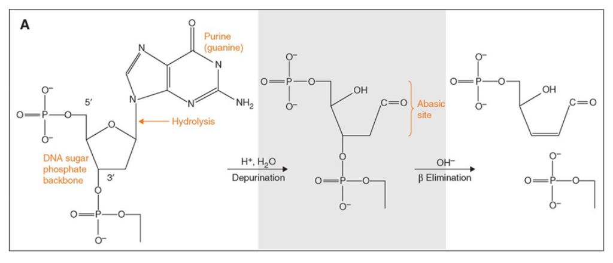
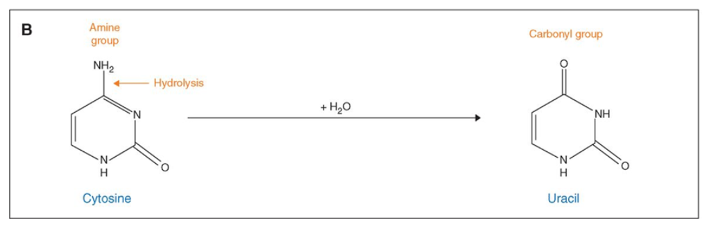

- Degradation
- Deamination of cytosine to uracil
- Other lesions, eg. block the replication of the DNA molecules

### Degradation/Fragmentation

Ancient DNA is expected to be highly fragmented, a reduction in DNA fragment size. In age between 4 and 13,000 years was degraded to freagements fo 40 - 500 bp.

**Cause**: Intracellular nucleases, degradation by microorganisms and other chemical processes.

**Mechnism**: It has been suggested that fragmentation is owing to **hydrolytic depurination** and sunsequent **β elimination**.

[Dabney Jesse *et al*. 2013](https://www.ncbi.nlm.nih.gov/pmc/articles/PMC3685887/), Figure 1 A.

β elimination: the cleavage of the C3'-O-P bond 3' from the apurinic or apyrimidinic site in DNA via beta-elimination reaction.

**Effect**: Apurinization of DNA, strand breaks, decrease of DNA fragment size, decrease of the overall amount of DNA.

**Evidence**: the pruines adenine(A) and guanine(G) are overrepresented next to the 5' ends of DNA fragments, G residues were evern more overrepresented than A residues adjacent to the 5' ends.

### Deamination of cytosine to uracil

**Cause**: Cytosine → uracil 5-methyl-cytosine → thymine.

**Mechnism**: Deamination of cytosine to uracil.

[Dabney Jesse *et al*. 2013](https://www.ncbi.nlm.nih.gov/pmc/articles/PMC3685887/), Figure 1 B.

### Blocking lesions

Some DNA modifications obstruct the movment of DNA polymerases along a template strand, preventing their amplification and sequencing.

eg.  5-hydroxy-5-methylhydantoin and 5-hydroxyhydantoin, which are oxidation products of pyrimidines; cross-links.

**Cause**: Alkylation, Maillard reaction (chemical reaction between a sugar molecule and an amino group of a nucleobase or an amino acid).

**Effect**: Cross-links between DNA strands in a single molecule; cross-links between DNA strands of different molecules; or cross-links between DNA and proteins.

**[Dabney Jesse *et al*. 2013](https://www.ncbi.nlm.nih.gov/pmc/articles/PMC3685887/), Ancient DNA Damage.**

Two important aspects of ancient DNA sequenceing:

1. Obtaining enough molecules to permit whole genome analysis /  maximizing the number of molecules that are extracted from ancient remains.

2. Minimizing artefacts owing to contamination and damage

## Reference:

1. Dabney, Jesse, Matthias Meyer, and Svante Pääbo. "Ancient DNA damage." Cold Spring Harbor perspectives in biology 5.7 (2013): a
