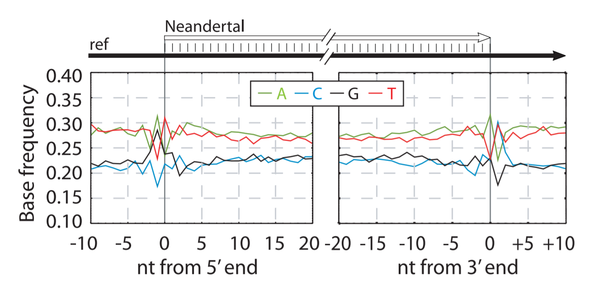
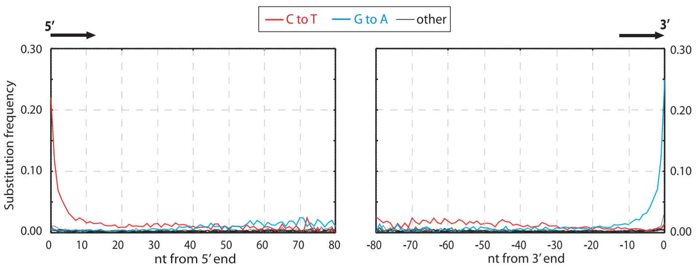

## [Briggs *et al*. (2007)](https://www.pnas.org/content/104/37/14616.long), Patterns of damage in genomic DNA sequences from a Neandertal.

Three main technical challenges affect ancient DNA studies: 

1. when DNA is preserved in ancient specimens, it is invariably degraded to a small average size. 

2. Chemical damage is present in ancient DNA that may cause incorrect DNA sequences to be determined. 

3. Because ancient DNA is present in low amounts or absent in many specimens, traces of modern DNA from extraneous sources may cause modern DNA sequences to be mistaken for endogenous ancient DNA sequences.

### Ancient DNA Fragmentation

Purines are overrepresented at positions adjacent to the breaks in the ancient DNA, suggesting that depurination has contributed to its degradation. 

**Figure 2**. Base composition at ends of Neandertal DNA sequences. The base composition of the human reference sequence is plotted as a function of distance from 5- and 3-ends of Neandertal sequences.

Strikingly, at the -1 position of the 5'-ends, i.e., the first position upstream of the 5'-most base sequenced, the frequency of G is elevated from ~22% seen across all Neandertal reads analyzed to ~29% , and the frequency of A is elevated from ~28% to ~31%, whereas C and T are depressed. Conversely, at the position +1 downstream of 3'-ends, thefrequency of C as well as T  is elevated to ~30%, whereas G and A are depressed.

A mechanism that is likely to be responsible for this is depurination, i.e., the hydrolysis of purine bases from the deoxyribose-phosphate backbone of DNA. After depurination events, the sugar phosphate backbone is susceptible to hydrolysis 3' to the depurinated
site. DNA is affected by depurination under many conditions, and baseless sites have been shown to occur in ancient DNA. It should be noticed, however, that this appears to explain only in the order of **10% of all strand breaks** in the directly sequenced Neandertal sample.

It should also be noted that, in addition to an elevation of purines adjacent to breaks, other base compositional aberrations
close to ends of molecules are seen in some specimens.

### Nucleotide Misincorporations

Substitutions resulting from miscoding cytosine residues are vastly overrepresented in the DNA sequences and drastically clustered in the ends of the molecules, whereas other substitutions are rare.

**Figure 3**. Misincorporation patterns in Neandertal DNA sequences.

The frequencies of the 12 possible mismatches are plotted as a function of distance from 5'-and 3'-ends. At each position, the substitution frequency, e.g., C-T, is calculated as the proportion of human reference sequence positions carrying C where the sequencing base is T. **This means (my understanding) that given the human reference sequence positions carrying C, what is the frequency of C -> T transition? (Other possible events are C -> G, C -> A, and no mismatch C -> C)

## [Dabney Jesse *et al*. 2013](https://www.ncbi.nlm.nih.gov/pmc/articles/PMC3685887/), Ancient DNA Damage.

- Degradation
- Deamination of cytosine to uracil
- Other lesions, eg. block the replication of the DNA molecules

### Degradation/Fragmentation

Ancient DNA is expected to be highly fragmented, a reduction in DNA fragment size. In age between 4 and 13,000 years was degraded to freagements fo 40 - 500 bp.

**Cause**: Intracellular nucleases, degradation by microorganisms and other chemical processes.

**Mechnism**: It has been suggested that fragmentation is owing to **hydrolytic depurination** and sunsequent **β elimination**.

[Dabney Jesse *et al*. 2013](https://www.ncbi.nlm.nih.gov/pmc/articles/PMC3685887/), Figure 1 A.

β elimination: the cleavage of the C3'-O-P bond 3' from the apurinic or apyrimidinic site in DNA via beta-elimination reaction.

**Effect**: Apurinization of DNA, strand breaks, decrease of DNA fragment size, decrease of the overall amount of DNA.

**Evidence**: the pruines adenine(A) and guanine(G) are overrepresented next to the 5' ends of DNA fragments, G residues were evern more overrepresented than A residues adjacent to the 5' ends.

### Deamination of cytosine to uracil

Nucleotide bases are susceptible to hydrolytic deamination, resulting in modifications that cause them to be misread by DNA polymerases. A primary target of deamination is cytosine. Its product, uracil will direct the incorporation of adenine (A) during DNA replication. These substitutions are primarily localized to fragment ends, followed by an exponential decrease of such substitutions along the DNA molecule.

Notably, blunt-end repair by T4 DNA polymerase used to prepare the DNA sequencing libraires results in the elimination of overhanging 3' ends, whereas overhanging 5' ends are filled in. Consequently, toward the 5′ ends of the sequenced molecules, deaminated cytosine residues result in apparent C to T substitutions, and toward the 3′ ends of the sequenced molecules, deaminated cytosine residues result in apparent G to A substitutions.

**Cause**: Cytosine → uracil 5-methyl-cytosine → thymine.

**Mechnism**: Deamination of cytosine to uracil.

[Dabney Jesse *et al*. 2013](https://www.ncbi.nlm.nih.gov/pmc/articles/PMC3685887/), Figure 1 B.

**Solution**: Treatment by DNA uracil-N-glycosylase, which removes cytosine deamination products. 

DNA glycosylase that removes the target base by N-glycosidic bond hydrolysis and generates an apurinic/apyrimidinic (AP) site, which is recognized by an AP endonuclease that hydrolyzes the phosphodiester bond 5′ to the lesion. The complete restoration of DNA integrity requires DNA polymerase, DNA ligase

### Blocking lesions

Some DNA modifications obstruct the movment of DNA polymerases along a template strand, preventing their amplification and sequencing.

eg.  5-hydroxy-5-methylhydantoin and 5-hydroxyhydantoin, which are oxidation products of pyrimidines; cross-links.

**Cause**: Alkylation, Maillard reaction (chemical reaction between a sugar molecule and an amino group of a nucleobase or an amino acid).

**Effect**: Cross-links between DNA strands in a single molecule; cross-links between DNA strands of different molecules; or cross-links between DNA and proteins.

### Using damage pattern to indentify authetic ancient molecules

Cytosine deamination, manifested by an elevated C to T substitution frequency, can therefore be used as an indication that DNA molecules are indeed ancient.

#### Reference:

Briggs Adrian W., et al. "Patterns of damage in genomic DNA sequences from a Neandertal." Proceedings of the National Academy of Sciences 104.37 (2007): 14616-14621. [Full PDF Here](Patterns_of_damage_in_genomic_DNA_sequences.pdf)

Dabney Jesse, Matthias Meyer, and Svante Pääbo. "Ancient DNA damage." Cold Spring Harbor perspectives in biology 5.7 (2013): a012567. [Full PDF Here](Ancient_DNA_Damage.pdf)

