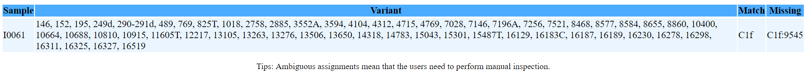

**Here I am trying to repeat all analyses related to mitochondrial DNA in [Haak *et al*. (2015)](https://www.nature.com/articles/nature14317) paper.**

1. Assessment of ancient DNA authenticity, search for evidence of contamination in the mitochondrial DNA.

2. Assignning mtDNA haplogroup from NGS data.

3. Population genetic analysis using mtDNA. 


**Goals**:

- Know how to estimate contamination rate using mitochondrial DNA

- Understand the basic workflow for determining human mtDNA lineages from NGS data.

- Be familiar with available online resources for researching human mtDNA haplogroup diversity and finding comparative datasets.

- Understand how ancient mtDNA results are interpreted and contextualized with other lines of evidence.


## 1. mtDNA damage pattern

Here, I used NGS data from sample I0061, [here](https://www.ebi.ac.uk/ena/data/view/SAMEA3270053). I checked ancient DNA damage pattern for library **S0061** (non-UDG), **S0670** (half-UDG) and **S0230** (full-UDG) using [mapDamage2](https://ginolhac.github.io/mapDamage/). You can also download ```.bam``` file from here: [S0061](Data/S0061.bam), [S0670](Data/S0670.bam), [S0230](Data/S0230.bam).


If you use ```samtools view -h  *.bam``` to check thoe three files, you will find out **S0061.bam** contains both shallow shotgun sequences and mtDNA capture sequences, and **S0670** and **S0230** only contains capture mtDNA sequences.

I will extract all mtDNA capture sequences from ```S0061.bam``` file:

```
# sorting
samtools sort S0061.bam -o S0061.sorted.bam 

# indexing
samtools index S0061.sorted.bam

# sorted and indexed file need to be co-existed to be able to extract mtDNA alignments

samtools view -h S0061.sorted.bam MT > S0061.mt.bam

```

Then indexing mitochondral DNA reference using bwa:

Download the ```.fasta``` file of the revised Cambridge Reference Sequence (rCRS) for mtDNA: [rCRS-fasta](https://www.ncbi.nlm.nih.gov/nuccore/251831106?report=fasta&log$=seqview) and save as ```rCRS.fa```.


```
cat rCRS.f

>rCRS
GATCACAGGTCTATCACCCTATTAACCACTCACGGGAGCTCTCCATGCATTTGGTATTTTCGTCTGGGGG
GTATGCACGCGATAGCATTGCGAGACGCTGGAGCCGGAGCACCCTATGTCGCAGTATCTGTCTTTGATTC
CTGCCTCATCCTATTATTTATCGCACCTACGTTCAATATTACAGGCGAACATACTTACTAAAGTGTGTTA
ATTAATTAATGCTTGTAGGACATAATAATAACAATTGAATGTCTGCACAGCCACTTTCCACACAGACATC
ATAACAAAAAATTTCCACCAAACCCCCCCTCCCCCGCTTCTGGCCACAGCACTTAAACACATCTCTGCCA
AACCCCAAAAACAAAGAACCCTAACACCAGCCTAACCAGATTTCAAATTTTATCTTTTGGCGGTATGCAC
TTTTAACAGTCACCCCCCAACTAACACATTATTTTCCCCTCCCACTCCCATACTACTAATCTCATCAATA
CAACCCCCGCCCATCCTACCCAGCACACACACACCGCTGCTAACCCCATACCCCGAACCAACCAAACCCC
AAAGACACCCCCCACAGTTTATGTAGCTTACCTCCTCAAAGCAATACACTGAAAATGTTTAGACGGGCTC


bwa index rCRS.fa

```

I run the mapDamage with following command:

```
mapDamage -i S0061.mt.bam -r rCRS.fa
```

I receive the error: "FATAL ERROR: No sequences in common!". I think some information do not match between ```.bam ``` and newly indexed rCRS mtDNA reference. In oder to use [mapDamage2](https://ginolhac.github.io/mapDamage/), I have to convert ```.bam``` to ```.fastq``` and re-map those sequnce to rCRS mtDNA reference to generate new ```.sam``` file and finally convert ```.sam``` to ```.bam``` file.


```
# For library S0230.

bedtools bamtofastq -i S0230.bam -fq S0230.fq  # .bam to .fastq

bwa mem rCRS.fa S0230.fq > S0230.re.sam        # re-map fastq sequences to rCRS to get .sam file

samtools view -bS S0230.re.sam > S0230.re.bam   # .sam to .bam file.  

# -b: output a bam file; -S: input is a sam file, now it has autodection, so you can only use -b; > : redirect to a file.

mapDamage -i S0230.re.bam -r rCRS.fa              # run mapDamage 


# For library S0061, use different program to achieve the same goal.

samtools fastq S0061.mt.bam > S0061.mt.fq       # .bam to .fastq

bowtie2-build -f rCRS.fa rCRS.bowtie            # bulit bowtie rCRS index

bowtie2 -x rCRS.bowtie -U S0061.mt.fq -S S0061.mt.sam   # re-map fastq sequences to rCRS to get .sam file, -U for Unpaired

samtools view -b S0061.mt.sam > S0061.mt.re.bam  # .sam to .bam file

mapDamage -i S0061.mt.re.bam -r rCRS.fa          # run mapDamage


# For library S0670.

bedtools bamtofastq -i S0670.bam -fq S0670.fq  # .bam to .fastq

bwa mem rCRS.fa S0670.fq > S0670.re.sam        # re-map fastq sequences to rCRS to get .sam file

samtools fixmate -O bam S0670.re.sam S0670.re.bam   # .sam to .bam file

mapDamage -i S0670.re.bam -r rCRS.fa              # run mapDamage 

```

After I run all of these, I finally found out the mismatch is the header of the mtDNA refecence. In the ```.bam``` file, the sequences denoted as **MT**. So what you should do is just change the header of mtDNA reference to **>MT**, like: 

```
cat rCRS.fa

>MT
GATCACAGGTCTATCACCCTATTAACCACTCACGGGAGCTCTCCATGCATTTGGTATTTTCGTCTGGGGG
GTATGCACGCGATAGCATTGCGAGACGCTGGAGCCGGAGCACCCTATGTCGCAGTATCTGTCTTTGATTC
CTGCCTCATCCTATTATTTATCGCACCTACGTTCAATATTACAGGCGAACATACTTACTAAAGTGTGTTA
ATTAATTAATGCTTGTAGGACATAATAATAACAATTGAATGTCTGCACAGCCACTTTCCACACAGACATC
ATAACAAAAAATTTCCACCAAACCCCCCCTCCCCCGCTTCTGGCCACAGCACTTAAACACATCTCTGCCA
AACCCCAAAAACAAAGAACCCTAACACCAGCCTAACCAGATTTCAAATTTTATCTTTTGGCGGTATGCAC
TTTTAACAGTCACCCCCCAACTAACACATTATTTTCCCCTCCCACTCCCATACTACTAATCTCATCAATA
CAACCCCCGCCCATCCTACCCAGCACACACACACCGCTGCTAACCCCATACCCCGAACCAACCAAACCCC
AAAGACACCCCCCACAGTTTATGTAGCTTACCTCCTCAAAGCAATACACTGAAAATGTTTAGACGGGCTC

```
And then run:

```
bwa index rCRS.fa

mapDamage -i S0670.bam -r rCRS.fa
mapDamage -i S0230.bam -r rCRS.fa
mapDamage -i S0061.bam -r rCRS.fa
```

**Results**:

**S0061**, no UDG treatment library, [full plot](Data/S0061_DamagePattern.pdf).


**S0670**, partial UDG treatment library, [full plot](Data/S0670_DamagePattern.pdf).


**S0230**, full UDG treatment library, [full plot](Data/S0230_DamagePattern.pdf).


Those results match the ancient DNA dagamge pattern (no UDG treatment; partial UDG treatment; full UDG treatment), which mentioned in [Nadin Rohland et al. (2013)](https://www.ncbi.nlm.nih.gov/pmc/articles/PMC4275898/), Partial uracil–DNA–glycosylase treatment for screening of ancient DNA.

**Note**: 

See my protocal How to install and use mapDamage, [here](https://github.com/mianlee/Fu-s-test/tree/master/Ancient_DNA_Assessment).

See my notes on ancient DNA damage pattern, [here](https://github.com/mianlee/Fu-s-test/tree/master/Ancient_DNA_Damage).

## 2. Evidence of contamination 

To quantify possible contamination / search fro evidence of contamination, [Haak Wolfgang,*et al*. (2015)](https://www.nature.com/articles/nature14317) used ```contamMix-1.0.9```. But I can't find the ```contamMix-1.0.9``` program online, so I emailed the author and waiting for his reply.

 
 
## 3. Getting full mtDNA sequence from **```sampleID.390k.bam```** file


The sequencing data is available through the European Nucleotide Archive under accession number [PRJEB8448](https://www.ebi.ac.uk/ena/data/view/PRJEB8448). Here, I only use in the form of ```.bam``` file.

For each ancient sample, it includes the aligned sequences for different libraries (different extractions, different UDG treatment) and a final combined aligned sequences (autosomal + mitochondrial DNA), named ```sampleID.390k.bam```.

The ```sampleID.390k.bam``` file includes autosomal, Y and mitochondral DNA alignments. I am only extracting mtDNA alignments from ```sampleID.390k.bam``` file.


### 1. Download the ```*.390k.bam``` (FTP) file, for example [```I0061.390k.bam```](https://www.ebi.ac.uk/ena/data/view/SAMEA3270053).

### 2. Sorting and indexing the ```.bam``` file.

```
# sorting
samtools sort I0061.390k.bam -o I0061.390k.sorted.bam #[-o out.bam]

# indexing
samtools index I0061.390k.sorted.bam

# sorted and indexed file need to be co-existed to be able to extract mtDNA alignments
```

### 3. Extracting only mtDNA alignments ```.bam```.

```
samtools view -h I0061.390k.sorted.bam MT > I0061.390k.mt.bam

# -h, include the header in the output.
# output all alignments mapped to the reference sequence named `MT' (i.e. @SQ SN:MT).
# MT: reference for mitochondral DNA.

# sorting
samtools sort I0061.390k.mt.bam -o I0061.390k.mt.sorted.bam 

# indexing
samtools index I0061.390k.mt.sorted.bam

```

### 4. Check the damage pattern of those mtDNA sequences.

You don't have to do this step. I am just curious about which library they used for mtDNA sequnces(non-UDG treatment, half or full) base on damage pattern.

```
samtools fastq I0061.390k.mt.bam > I0061.mt.fq

bwa mem rCRS.fa I0061.mt.fq > I0061.mt.sam

samtools view -b I0061.mt.sam > I0061.mt.bam

mapDamage -i I0061.mt.bam -r rCRS.fa
```


**I0061 mtDNA damage pattern**, [full plot](Data/I0061.mt.damage.pattern.pdf).


This damage pattern consistent with in the paper Methods ( Mitochondrial sequence analyisis and assessment of ancient DNA authenticity): " For population genetic analysis, we only used partially UDG-treated libraries with a minimum of 3% C -> T substitutions as recommended by [Nadin Rohland et al. (2013)](https://www.ncbi.nlm.nih.gov/pmc/articles/PMC4275898/)."


### 5. Exploring **```.bam```** file


We can view BAM files using ```samtools view```, but there are usually millions of sequencing reads. How can we efficiently summarize a BAM file?

Samtools offers tools to calculate summary statistics. Today,I'll calculate stats using ```samtools stats``` because it provides a bit more detail, but you should have a look at ```samtools flagstat``` as well.

```
samtools stats I0061.390k.mt.bam | grep ^SN | cut -f 2-

```

Because samtools stats offers a huge range of statistics including a number of very big tables in our output, we'll just grab the summary statistics. This is what ```grep ^SN | cut -f 2-``` in our command does.


```
raw total sequences:	5955
filtered sequences:	0
sequences:	5955
is sorted:	1
1st fragments:	5955
last fragments:	0
reads mapped:	5955
reads mapped and paired:	0	# paired-end technology bit set + both mates mapped
reads unmapped:	0
reads properly paired:	0	# proper-pair bit set
reads paired:	0	# paired-end technology bit set
reads duplicated:	0	# PCR or optical duplicate bit set
reads MQ0:	641	# mapped and MQ=0
reads QC failed:	0
non-primary alignments:	0
total length:	406097	# ignores clipping
total first fragment length:	406097	# ignores clipping
total last fragment length:	0	# ignores clipping
bases mapped:	406097	# ignores clipping
bases trimmed:	0
bases duplicated:	0
mismatches:	1530	# from NM fields
error rate:	3.767573e-03	# mismatches / bases mapped (cigar)
average length:	68
average first fragment length:	68
average last fragment length:	0
maximum length:	170
maximum first fragment length:	0
average quality:	37.0
insert size average:	0.0
insert size standard deviation:	0.0
inward oriented pairs:	0
outward oriented pairs:	0
pairs with other orientation:	0
pairs on different chromosomes:	0
percentage of properly paired reads (%):	0.0
```

### 6. Variant calling

By "call variants", I mean statistically infer genotypes. There are a few tools that do this, here I am  going to use the [Genome Analysis Toolkit's (GATK's)](https://software.broadinstitute.org/gatk/) and [BCFtools](https://samtools.github.io/bcftools/howtos/index.html). 

**Indexing mitochondral DNA reference using ```bamtools```**:

Download the ```.fasta``` file of the revised Cambridge Reference Sequence (rCRS) for mtDNA: [rCRS-fasta](https://www.ncbi.nlm.nih.gov/nuccore/251831106?report=fasta&log$=seqview) and save as ```rCRS.fa```. Change the name header ">NC_012920.1 Homo sapiens mitochondrion, complete genome" to ">MT".


```
samtools faidx rCRS.fa
```


**Genome Analysis Toolkit's (GATK's)**, [HaplotypeCaller](https://software.broadinstitute.org/gatk/documentation/tooldocs/current/org_broadinstitute_hellbender_tools_walkers_haplotypecaller_HaplotypeCaller.php):


Creating the fasta sequence dictionary file for your reference, using ```CreateSequenceDictionary.jar``` from ```Picard``` to create a ```.dict``` file from the ```rCRS.fa``` file.

```
java -jar $picard CreateSequenceDictionary \
    R=rCRS.fa \ 
    O=rCRS.dict 

# $picard, see note below
```

Generating ```vcf``` file.

```
gatk --java-options "-Xmx4g" HaplotypeCaller  \
   -R rCRS.fa \
   -I I0061.390k.mt.sorted.bam  \
   -O I0061.390k.mt.sorted.bam.vcf.gz
```


Keep SNPs with a minimum coverage of 2 (DP) and a minimum variant frequency of 0.7 (AF).

```
gatk --java-options "-Xmx4g" SelectVariants \
 -R rCRS.fa  \
 -V I0061.390k.mt.sorted.bam.vcf.gz \
 -O I0061.390k.mt.sorted.bam.filter.vcf.gz \
 --selectExpressions "DP > 2 || AF > 70.0"
 
 
 # DP: read depth; AF: Allele Frequency.
```

Getting a ```.fasta``` from filtered ```.vcf``` file.

```
cat rCRS.fa | bcftools consensus I0061.390k.mt.sorted.bam.filter.vcf > I0061.mt.gatk.fa
```

[I0061.390k.mt.sorted.bam.filter.vcf.gz](Data/I0061.390k.mt.sorted.bam.filter.vcf.gz)

[I0061.mt.gatk.fa](Data/I0061.mt.gatk.fa)


**Samtools and Bcftools**:

The Bcftools generated ```.vcf``` file don't have AF tag, so I can't filter SNPs based no allele frequency....

```
bwa index rCRS.fa

bcftools mpileup -f rCRS.fa I0061.390k.mt.sorted.bam | bcftools filter -i 'DP>1' | bcftools call -mv -Oz -o I0061.filter.vcf.gz

bcftools index I0061.filter.vcf.gz

cat rCRS.fa | bcftools consensus I0061.filter.vcf.gz > I0061.mt.bcftools.fa
```


[I0061.filter.vcf.gz](Data/I0061.filter.vcf.gz)

[I0061.mt.bcftools.fa](Data/I0061.mt.bcftools.fa)


The first mpileup part generates genotype likelihoods at each genomic position with coverage: 

**-f**, the faidx-indexed reference file in the FASTA format The second call part makes the actual calls. 

**-m** switch tells the program to use the default calling method.

**-v** option asks to output only variant sites.

**-O** option selects the output format. In this example we chosen compressed VCF (z), **-Oz**.

```bcftools filter -i```, i means include.

See detailed Bcftools manual, [here](https://samtools.github.io/bcftools/howtos/consensus-sequence.html).


**Note**:

1. Install GATK:

Download the [gatk package](https://software.broadinstitute.org/gatk/download/) and upzip it. There is no installation necessary in the traditional sense. Although the jars themselves cannot simply be added to your PATH, you can do so with the gatk wrapper script. Please look up instructions depending on the terminal shell you use; in bash the typical syntax is ```export PATH=$PATH:/path/to/gatk-package/gatk``` where ```path/to/gatk-package/``` is the path to the location of the gatk executable.

2. Install Picart

Download [Picart](https://broadinstitute.github.io/picard/). Note that it is not possible to add jar files to your path to make the tools available on the command line; you have to specify the full path to the jar file in your java command, which would look like this:

```
java -jar ~/my_tools/jars/picard.jar <Toolname> [options]
```

However, you can set up a shortcut called an "environment variable" in your shell profile configuration to make this easier. The idea is that you create a variable that tells your system where to find a given jar, like this:

```
export picard=/home/mianlee/Desktop/Software/gatk-4.1.2.0/picard.jar

#Ubuntu 16.04
```

So then when you want to run a Picard tool, you just need to call the jar by its shortcut, like this:

```
java -jar $picard <Toolname> [options]
```

See details about install software for GATK and picard, [avaiable here](https://software.broadinstitute.org/gatk/documentation/article?id=7098).


The option ```-ERC GVCF```, which outputs confidence that an invariant site (homozygous and matches reference genome) is a reference allele. This is important for the joint genotyping.

```--java-options "-Xmx4g"``` Specify the maximum size, in bytes, of the memory allocation pool. So, in simple words, you are setting Java heap memory to a maximum of 4G from the available memory, not more.

[GATK command-line syntax](https://software.broadinstitute.org/gatk/documentation/article?id=11050). 

## 4. mtDNA haplogroup prediction


**[HaploGrep2](http://haplogrep.uibk.ac.at/)**

HaploGrep is an algorithm which automatizes the process of human mtDNA haplogroup classification. The program works by considering the mtDNA variants present in a given sample in relation to the rCRS complete mtDNA genome reference. HaploGrep scans the latest version of the human mtDNA phylogenetic tree listed in Phylotree (currently build 17) and estimates the most likely haplogroup assignment for the sample given the provided variants. [Maria A. Nieves Colon](https://github.com/mnievesc/ENAH_curso_aDNA_2019/blob/master/Ex2_MThaplogroups/Exercise2_Tutorial_MT_haplogroups.MD)


Here, I am going to show how to predict mtDNA haplgroup using Haplogrep2 from ```.vcf``` and ```.fasta``` format.

**Using ```.vcf```**:

From last step, I generated two ```.vcf``` files from sample **I0061** using GATK and bcftools separately: [I0061.390k.mt.sorted.bam.filter.vcf.gz](Data/I0061.390k.mt.sorted.bam.filter.vcf.gz) and [I0061.filter.vcf.gz](Data/I0061.filter.vcf.gz).

I unzipped the ```.vcf.gz``` file and opened with Haplogrep2 directely.

1. On the [HaploGrep](http://haplogrep.uibk.ac.at/) home page, click on the prompt (right top) that says **Run**. Next, click on the Open button on the top left of the screen and choose ```.vcf``` files as input.


2. After the file loads, in the top window you will see a list of all the polymorphisms present in the sample. This list is taken directly from the input file, in our case the coverage filtered VCF. You will also see that HaploGrep presents the most probably haplogroup assignment and the quality of the estimation.


Lastly, the center window displays a graph showing the lineage path from the rCRS reference to the currently selected haplogroup. Details see the [Haplogrep manual](http://HaploGrep.uibk.ac.at/docs/UserManual-HaploGrep.pdf).

The Haplogrep2 predict the most possible mtDNA haplogroup for individual I0061 is haplogroup **C**.


**Using ```.fasta```**:

You can convert ```.fasta``` to ```.hsd``` format, and Haplogrep will take ```.hsd```.

1. You can go mtDNAprofiler [mtDNA nomenclature tool](http://mtprofiler.yonsei.ac.kr/index.php?cat=2) and load your sequences in ```.fasta``` format. Or you also can copy your sequence to the white box area.


2. You will get SNPs information comparing to rCRS devided into control and coding region. 


3. Click ```profile in a new window``` and download  mtSNP profiles in  "Tab-deliminated format ". You will get ```.hsd``` file.


4. Load the ```.hsd``` file to Haplogrep and you will get the same result like I showed above.


**[Mitotool](http://www.mitotool.org/index.html)**

Since [Haak *et al*. (2015)](https://www.nature.com/articles/nature14317) used RCRS reference genome to predict mtDNA haplogroup, so I used [Mitotool](http://www.mitotool.org/index.html) to call haplogroup using RCRS as reference.

1. Go to mitotool and upload your ```.fasta``` file, choose "Phylotree 16 RCRS" as standard and submit.


2. You will get all SNPs comparing to RCRS reference genome and predicted mtDNA haplogroup.



Surprisingly, mitotool + RCRS reference give you higher resolution, the predicted mtDNA haplogroup is **C1f**, which is consistent with [Haak *et al*. (2015)](https://www.nature.com/articles/nature14317) prediction in his paper, I0061 is predicted as C1g (old C1f).


**Online resources for mtDNA haplogroup prediction**:

[HaploGrep 2](http://HaploGrep.uibk.ac.at/), automatic mtDNA haplogroup classification using PhyloTree 17 (supporting rCRS & RSRS). However, HaploGrep works with rCRS only – in the new version it will accept RSRS and Yoruba based profiles – however converting them to the rCRS.

[Phylotree](http://www.phylotree.org/), this website provides a comprehensive phylogenetic tree of worldwide human mitochondrial DNA variation

[MITOMAP](https://www.mitomap.org/foswiki/bin/view/MITOMAP/WebHome), my favourite/the most comprehensive tool for exploring human mtDNA variation.

[MITOMASTER](https://www.mitomap.org/foswiki/bin/view/MITOMASTER/WebHome), part of MITOMAP for mtDNA haplogroup assignment.

[Mitomap GB database](https://www.mitomap.org/foswiki/bin/view/MITOMAP/GBFreqInfo), a searchable database of mtDNA genomes submitted to Genbank (organized by haplogroup).

[mtProfiler](http://mtprofiler.yonsei.ac.kr/index.php?cat=5), I use "mtDNA nomenclature" tool to call mtDNA SNPs and also convert ```.fasta``` sequences to ```.hsd``` format for haplogroup prediction in HaploGreop.

[Mitotool](http://www.mitotool.org/index.html), for assigning mtDNA haplogroups using FASTA and polymorphism data, also has a searchable Genbank database.

[AmtDB](https://amtdb.org/), ancient mtDNA gneome database (mostly from Europe).

### Reference:

1. Haak, Wolfgang, et al. "Massive migration from the steppe was a source for Indo-European languages in Europe." Nature 522.7555 (2015): 207.

2. Rohland, Nadin, et al. "Partial uracil–DNA–glycosylase treatment for screening of ancient DNA." Philosophical Transactions of the Royal Society B: Biological Sciences 370.1660 (2015): 20130624.
