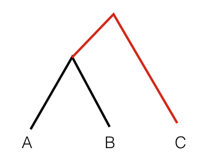

F-statistics (not Wright’s fixation indexes, Fst), a simple and intuitive approach to decipher more detailed and complex questions about our history, has quickly gained in popularity. It is fist time introduced by [Reich et al. (2009)](https://www.nature.com/articles/nature08365) and summarized in [Patterson et al. (2012)](https://www.genetics.org/content/192/3/1065). In that framework, inference is based on “shared genetic drift” between sets ofpopulations, under the premise that shared drift implies a
shared evolutionary history. -- [Peter,BM. (2016)](https://www.genetics.org/content/202/4/1485.abstract)


The “drift” is defined as the frequency change of an allele along a graph edge (hence drift between two populations A and B is a function of the difference in the allele frequency of polymorphisms in A and B), [Patterson et al. (2012)](https://www.genetics.org/content/192/3/1065).


F3 statistics are used for two purposes:

1. F3 Admixture Analysis, to look for significant evidence of admixture, as a test whether a target population (C) is admixed between two source populations (A and B). Theory shows that given allele frequencies at a given SNP for three populations, A, B and C, the F3 statistic [(C-A)(C-B)] is only negative if a target population (C) was the product of admixture between two source populations A and B (or their ancestors). [AAAGs_2018_Session8](https://github.com/Sagui-omics/AAAGs_2018/tree/master/Session8_Admixture_Introgression), [GAWorkshop](https://gaworkshop.readthedocs.io/en/latest/contents/06_f3/f3.html).

2. Outgroup F3 statistics, to measure shared genetic drift between two test populations (A and B) from an outgroup (C).


F3 statistics are in both cases defined as the product of allele frequency differences between population C to A and B, respectively:

```F3(C;A,B) = E[(c−a)(c−b)].```

Here, E[ ] denotes the average over all genotyped sites, and a, b and c denote the allele frequency in the three populations. Outgroup F3 statistics measure the amount of shared genetic drift between two populations from a common ancestor. In a phylogenetic tree connecting A, B and C, Outgroup F3 statistics measure the common branch length from the outgroup, here indicated in red:



[GAWorkshop](https://gaworkshop.readthedocs.io/en/latest/contents/06_f3/f3.html)


### Exctract all 92 ancient individuals and Yoruba population as outgroup

Files:

[ancient_Yoruba_list.txt](ancient_Yoruba_list.txt)

```
data.bed
data.bim
data.fam
```


```
plink --bfile data --keep ancient_Yoruba_list.txt --make-bed --out ancient_92_Yoruba

# Log file
PLINK v1.90b4 64-bit (20 Mar 2017)             www.cog-genomics.org/plink/1.9/
(C) 2005-2017 Shaun Purcell, Christopher Chang   GNU General Public License v3
Logging to ancient_92_Yoruba.log.
Options in effect:
  --bfile data
  --keep ancient_Yoruba_list.txt
  --make-bed
  --out ancient_92_Yoruba

8703 MB RAM detected; reserving 4351 MB for main workspace.
354212 variants loaded from .bim file.
2071 people (1307 males, 764 females) loaded from .fam.
2071 phenotype values loaded from .fam.
--keep: 162 people remaining.
Using 1 thread (no multithreaded calculations invoked).
Before main variant filters, 162 founders and 0 nonfounders present.
Calculating allele frequencies... done.
Total genotyping rate in remaining samples is 0.773673.
354212 variants and 162 people pass filters and QC.
Among remaining phenotypes, 0 are cases and 162 are controls.
--make-bed to ancient_92_Yoruba.bed + ancient_92_Yoruba.bim +
ancient_92_Yoruba.fam ... done.
```


**Reference**:
1.Reich, D., Thangaraj, K., Patterson, N., Price, A. L., & Singh, L. (2009). Reconstructing Indian population history. Nature, 461(7263), 489.

2.Patterson, N., Moorjani, P., Luo, Y., Mallick, S., Rohland, N., Zhan, Y., ... & Reich, D. (2012). Ancient admixture in human history. Genetics, 192(3), 1065-1093.

3.Peter, B. M. (2016). Admixture, population structure, and F-statistics. Genetics, 202(4), 1485-1501.
