# Preparing for the Dateset

The dataset I used here is the same dataset used to do the [Admxiture Analysis](https://github.com/mianlee/Fu-s-test/tree/master/Admixture).The dataset contains 2013 individuals (92 ancient + 1921 modern) from 193 population categories, each represented by 354,212 autosomal single nucleotide polymorphisms (SNPs), see the [**```.ind```**](data/Haak_2013.ind) file. This dataset is originally from [Haak *et al*. Nature (2015)](https://www.nature.com/articles/nature14317), [available here](https://reich.hms.harvard.edu/datasets).

1. Because I used ```Plink``` to filter out some individuals, so I will start with the ```Plink``` file format after filteration:

```
Haak.admxi.bed
Haak.admxi.bim
Haak.admxi.fam
```
If you want to see how I did this, please refer to the [Admxiture section](https://github.com/mianlee/Fu-s-test/tree/master/Admixture).

2. Converting ```.bed``` format to ```packedancestrymap``` format using ```convertf``` program in [ADMIXTOOLS](https://github.com/DReichLab/AdmixTools) package.

```
# Using nano in the terminal creat a par file named par.packedped.PACKEDANCESTRYMAP. 
nano par.packedped.PACKEDANCESTRYMAP 
 

#Type the follwing:

genotypename: Haak.admxi.bed
snpname: Haak.admxi.bim
indivname: Haak.admxi.fam
outputformat: PACKEDANCESTRYMAP
genotypeoutname: Haak_2013.geno
snpoutname: Haak_2013.snp
indivoutname: Haak_2013.ind
 
```
3. Running ```convertf``` program.

```
convertf -p par.packedped.PACKEDANCESTRYMAP 

# log.out
parameter file: par.packedped.PACKEDANCESTRYMAP
genotypename: Haak.admxi.bed
snpname: Haak.admxi.bim
indivname: Haak.admxi.fam
outputformat: PACKEDANCESTRYMAP
genotypeoutname: Haak_2013.geno
snpoutname: Haak_2013.snp
indivoutname: Haak_2013.ind
genotype file processed
numvalidind:   2013  maxmiss: 2013001
packedancestrymap output
##end of convertf run
```

4. Fixing the ```*.ind``` file.

```
awk -F ":" '{print $1 "\t" $2}' Haak_2013.ind | awk '{print $1":"$2 "\t" $3 "\t" $1}' > fixed.ind

mv fixed.ind Haak_2013.ind
```

When you are converting ```.bed``` format to ```packedancestrymap```format, you need to change **'Control'** to **'Population/group information'** in the third column of ```.ind``` file. 

See the difference between the **old** [```Haak_2013.ind```](data/Old_Haak_2013.ind) and the **new** [```Haak_2013.ind```](data/Haak_2013.ind).

5. Now you have three files to work with.

```
Haak_2013.geno
Haak_2013.snp
Haak_2013.ind
```
6. Making a population list file.

```
awk '{print$3}' Haak_2013.ind | sort | uniq > pop.list.txt
```

Here is the population list file: [pop.list.txt](data/pop.list.txt). 193 population categories: 33 ancient + 163 modern.


# Running Outgroup_f3_Test

For the first test, I am going to show how I did it using both [ADMIXTOOLS](https://github.com/DReichLab/AdmixTools) package and an R package [**```admixr```**](https://github.com/bodkan/admixr).

**f3(Yoruba; X, Y)**

## Western European hunter-gatherers

**Figure S7.3** in [Haak *et al*. (2015)](https://www.nature.com/articles/nature14317).

Three Western European hunter-gatherers (WHG):

**Loschbour** (n=1) [Iosif Lazaridis *et al*. (2014)](https://www.nature.com/articles/nature13673), **LaBrana1** (n=1) [Iñigo Olalde *et al*.(2014)](https://www.nature.com/articles/nature12960), **HungaryGamba_HG** or KO1 (n=1) [Cristina Gamba *et al*. (2014)](https://www.nature.com/articles/ncomms6257#t1).


### 1. ADMIXTOOLS Package

**In oder to run ```qp3Pop```, you neeed three parameter files ```.par``` and three ```popfilename``` files for each WHG.**

```
nano par.f3.Loschbour


genotypename: Haak_2013.geno
snpname: Haak_2013.snp
indivname: Haak_2013.ind
popfilename: Loschbour.txt
```


```
nano par.f3.LaBrana


genotypename: Haak_2013.geno
snpname: Haak_2013.snp
indivname: Haak_2013.ind
popfilename: LaBrana.txt
```


```
nano par.f3.HungaryGamba_HG


genotypename: Haak_2013.geno
snpname: Haak_2013.snp
indivname: Haak_2013.ind
popfilename: HungaryGamba_HG.txt
```

```
awk '{print "Loschbour" "\t" $1 "\t" "Yoruba"}' pop.list.txt > Loschbour.txt
```

```
awk '{print "LaBrana1" "\t" $1 "\t" "Yoruba"}' pop.list.txt > LaBrana.txt
```

```
awk '{print "HungaryGamba_HG" "\t" $1 "\t" "Yoruba"}' pop.list.txt > HungaryGamba_HG.txt
```

**Running ```qp3Pop```:**

```
qp3Pop -p par.f3.Loschbour > Loschbour.f3.results

qp3Pop -p par.f3.LaBrana > LaBrana.f3.results

qp3Pop -p par.f3.HungaryGamba_HG > HungaryGamba_HG.f3.results
```
**Then you will have three files:**

[Loschbour.f3.results](data/Loschbour.f3.results), [LaBrana.f3.results](data/LaBrana.f3.results) and [HungaryGamba_HG.f3.results](data/HungaryGamba_HG.f3.results).

When you check the ```*.f3.results``` files, as you see, we don’t want comment/log rows in the beginning and columns 1. You can use ```awk``` in the terminal to keep only columns 2, 3, 4, 5, 6, 7, 8:

```
grep "result:" Loschbour.f3.results | awk '{print$2 "\t" $3 "\t" $4 "\t" $5"\t" $6 "\t" $7 "\t" $8}' > Loschbour.f3

grep "result:" LaBrana.f3.results | awk '{print$2 "\t" $3 "\t" $4 "\t" $5"\t" $6 "\t" $7 "\t" $8}' > LaBrana.f3

grep "result:" HungaryGamba_HG.f3.results | awk '{print$2 "\t" $3 "\t" $4 "\t" $5"\t" $6 "\t" $7 "\t" $8}' > HungaryGamba_HG.f3
```

[Loschbour.f3](data/Loschbour.f3), [LaBrana.f3](data/LaBrana.f3) and [HungaryGamba_HG.f3](data/HungaryGamba_HG.f3).

**Plot the f3 results in R:**

There is no need to plot all comparision, so I only plotted the first 30 after sorting from highest f3 value to the lowest.


```
library(ggplot2)

Loschbourf3data <- read.table("Loschbour.f3", col.names=c("PopA", "PopB", "Outgroup", "F3", "StdErr", "Z", "SNPs"))

attach(Loschbourf3data)

Loschbour <- Loschbourf3data[PopA == "Loschbour", ]   # Loschbour vs other populations

Odered_Loschbour <- Loschbour[order(Loschbour$F3),]  # $F3 means by f3 values

Loschbour_30 <- Odered_Loschbour[162:191,]

ggplot(Loschbour_30, aes(y = F3, x = factor(Loschbour_30$PopB, levels = Loschbour_30$PopB))) +
  geom_errorbar(aes(ymin = F3-3*StdErr, ymax = F3+3*StdErr), width = 0.0, size = 0.5, color = "grey") +
  geom_point(size = 2) +
  ylim(0.11, 0.225)+
  coord_flip() +
  theme_bw() +
  theme(panel.grid.major = element_blank(),
        panel.grid.minor = element_blank(),
        panel.border = element_blank(),
        axis.line.x = element_line(colour = "black"),
        axis.title = element_blank(),
        axis.text.y = element_blank(),
        axis.text.x = element_text(size =12, margin = margin (t = 9) ),
        axis.ticks.y = element_blank(),
        axis.ticks.length = unit(0.2, "cm")) +
  geom_text(aes(y = F3-3*StdErr,label=PopB), hjust =1.1)
```
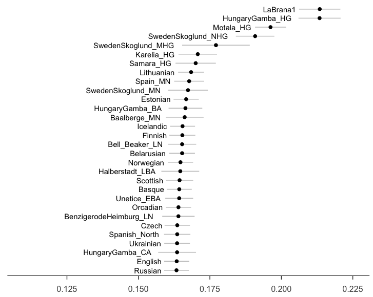

**Figure 1**: Outgroup-f3(Yoruba; Loschbour, Y).

```
library(ggplot2)

LaBranaf3data <- read.table("LaBrana.f3", col.names=c("PopA", "PopB", "Outgroup", "F3", "StdErr", "Z", "SNPs"))

attach(LaBranaf3data)

LaBrana <- LaBranaf3data[PopA == "LaBrana1", ]   # Loschbour vs other populations

Odered_LaBrana <- LaBrana[order(LaBrana$F3),]  # $F3 means by f3 values

LaBrana_30 <- Odered_LaBrana[162:191,]

ggplot(LaBrana_30, aes(y = F3, x = factor(LaBrana_30$PopB, levels = LaBrana_30$PopB))) +
  geom_errorbar(aes(ymin = F3-3*StdErr, ymax = F3+3*StdErr), width = 0.0, size = 0.5, color = "grey") +
  geom_point(size = 2) +
  ylim(0.11, 0.225)+
  coord_flip() +
  theme_bw() +
  theme(panel.grid.major = element_blank(),
        panel.grid.minor = element_blank(),
        panel.border = element_blank(),
        axis.line.x = element_line(colour = "black"),
        axis.title = element_blank(),
        axis.text.y = element_blank(),
        axis.text.x = element_text(size =12, margin = margin (t = 9) ),
        axis.ticks.y = element_blank(),
        axis.ticks.length = unit(0.2, "cm")) +
  geom_text(aes(y = F3-3*StdErr,label=PopB), hjust =1.1)
```
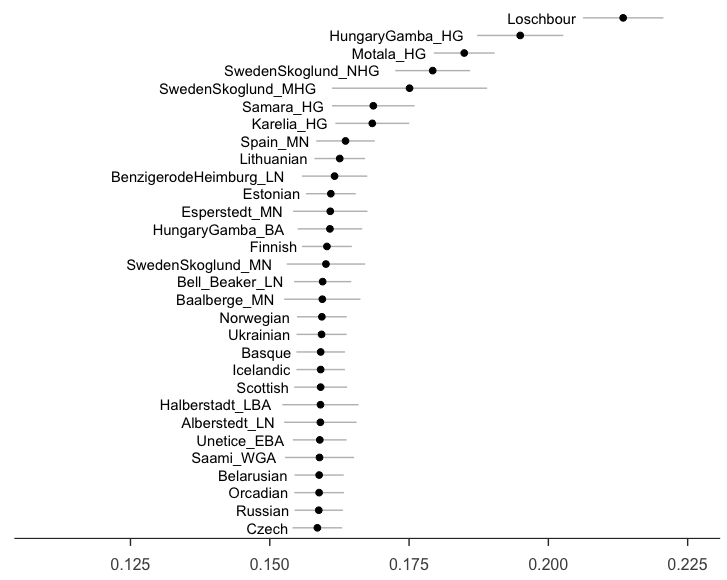

**Figure 2**: Outgroup-f3(Yoruba; LaBrana1, Y).

```
library(ggplot2)

HungaryGamba_HG_f3data <- read.table("HungaryGamba_HG.f3", col.names=c("PopA", "PopB", "Outgroup", "F3", "StdErr", "Z", "SNPs"))

attach(HungaryGamba_HG_f3data)

HungaryGamba_HG <- HungaryGamba_HG_f3data[PopA == "HungaryGamba_HG", ]   # Loschbour vs other populations

Odered_HungaryGamba_HG <- HungaryGamba_HG[order(HungaryGamba_HG$F3),]  # $F3 means by f3 values

HungaryGamba_HG_30 <- Odered_HungaryGamba_HG[162:191,]

ggplot(HungaryGamba_HG_30, aes(y = F3, x = factor(HungaryGamba_HG_30$PopB, levels = HungaryGamba_HG_30$PopB))) +
  geom_errorbar(aes(ymin = F3-3*StdErr, ymax = F3+3*StdErr), width = 0.0, size = 0.5, color = "grey") +
  geom_point(size = 2) +
  ylim(0.11, 0.225)+
  coord_flip() +
  theme_bw() +
  theme(panel.grid.major = element_blank(),
        panel.grid.minor = element_blank(),
        panel.border = element_blank(),
        axis.line.x = element_line(colour = "black"),
        axis.title = element_blank(),
        axis.text.y = element_blank(),
        axis.text.x = element_text(size =12, margin = margin (t = 9) ),
        axis.ticks.y = element_blank(),
        axis.ticks.length = unit(0.2, "cm")) +
  geom_text(aes(y = F3-3*StdErr,label=PopB), hjust =1.1)
```
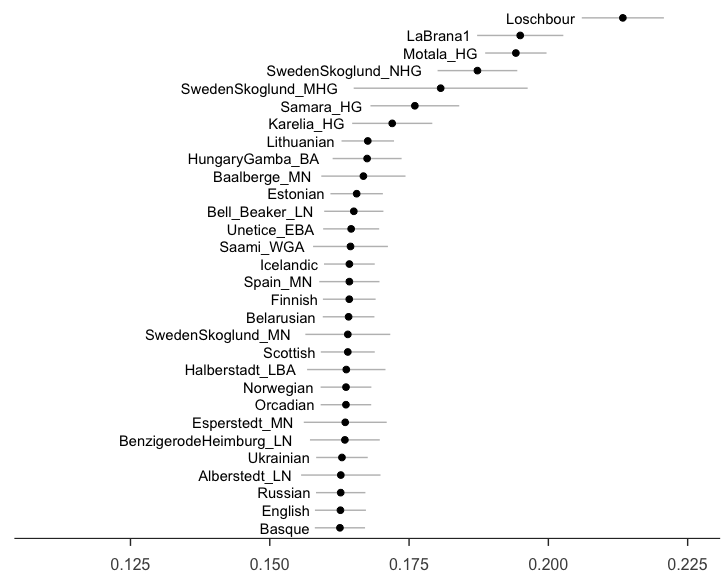

**Figure 3**: Outgroup-f3(Yoruba; HungaryGamba_HG, Y).

### 2. R package ```admixr``` 

```
# Load the admixr package
library(admixr)
library(tidyverse)

# Read in genotyping dataset: Haak_2013.geno, Haak_2013.snps, Haak_2013.ind.
f3data <- eigenstrat("/Users/LeeMian/Desktop/Fu/f3_test/Haak_2013")

# Assign population B
pops <- c("AA","Abkhasian","Adygei","Albanian","Alberstedt_LN",
          "Aleut","Algerian","Altaian","Ami","Armenian","Ashkenazi_Jew",
          "Atayal","Australian","Baalberge_MN","Balkar","Balochi","BantuKenya",
          "BantuSA","Basque","BedouinA","BedouinB","Belarusian","Bell_Beaker_LN",
          "Bengali","BenzigerodeHeimburg_LN","Bergamo","Biaka","Bolivian",
          "Bougainville","Brahui","Bulgarian","Burusho","Cambodian",
          "Canary_Islanders","Chechen","Chukchi","Chuvash",
          "Cochin_Jew","Corded_Ware_LN","Croatian", "Cypriot","Czech","Dai",
          "Datog","Daur","Dolgan","Druze","Egyptian","English","Esan","Eskimo",
          "Esperstedt_MN","Estonian","Ethiopian_Jew","Even","Finnish","French",
          "French_South","Gambian","Georgian","Georgian_Jew","Greek","GujaratiA",
          "GujaratiB","GujaratiC","GujaratiD","Hadza","Halberstadt_LBA","Han",
          "Han_NChina","Hazara","Hezhen","Hungarian","HungaryGamba_BA",
          "HungaryGamba_CA","HungaryGamba_EN","HungaryGamba_HG","HungaryGamba_IA",
          "Icelandic","Iceman","Iranian","Iranian_Jew","Iraqi_Jew","Italian_South",
          "Itelmen","Japanese","Jordanian","Ju_hoan_North","Kalash","Karelia_HG",
          "Karitiana","Karsdorf_LN","Khomani","Kikuyu","Kinh","Korean","Koryak",
          "Kostenki14","Kumyk","Kusunda","Kyrgyz","LBKT_EN","LBK_EN","LaBrana1",
          "Lahu","Lebanese","Lezgin","Libyan_Jew","Lithuanian","Loschbour","Luhya",
          "Luo","MA1","Makrani","Maltese","Mandenka","Mansi","Masai","Mayan","Mbuti",
          "Mende","Miao","Mixe","Mixtec","Mongola","Mordovian","Moroccan_Jew","Motala_HG",
          "Mozabite","Naxi","Nganasan","Nogai","North_Ossetian","Norwegian","Orcadian","Oroqen",
          "Palestinian","Papuan","Pathan","Piapoco","Pima","Punjabi","Quechua","Russian",
          "Saami_WGA","Saharawi","Samara_HG","Sardinian","Saudi","Scottish","Selkup","She",
          "Sicilian","Sindhi","Somali","Spain_EN","Spain_MN","Spanish","Spanish_North",
          "Starcevo_EN","Stuttgart","Surui","SwedenSkoglund_MHG","SwedenSkoglund_MN",
          "SwedenSkoglund_NHG","Syrian","Tajik_Pomiri","Thai","Tlingit","Tu","Tubalar",
          "Tujia","Tunisian","Tunisian_Jew","Turkish","Turkish_Jew","Turkmen","Tuscan",
          "Ukrainian","Ulchi","Unetice_EBA","Ust_Ishim","Uygur","Uzbek","Xibo","Yakut",
          "Yamnaya","Yemen","Yemenite_Jew","Yi","Yoruba","Yukagir","Zapotec")
          
# Run the outgroup-f3 test.
Loschbour.results <- f3(A = "Loschbour", B = pops, C = "Yoruba", data = f3data)
LaBrana.results <- f3(A = "LaBrana1", B = pops, C = "Yoruba", data = f3data)
HungaryGamba_HG.results <- f3(A = "HungaryGamba_HG", B = pops, C = "Yoruba", data = f3data)

# PLot Loschbour.results in R

attach(Loschbour.results)
Odered_Loschbour <- Loschbour.results[order(Loschbour.results$f3),]
Loschbour_30 <- Odered_Loschbour[164:193,]

ggplot(Loschbour_30, aes(y = f3, x = factor(Loschbour_30$B, levels = Loschbour_30$B))) +
  geom_errorbar(aes(ymin = f3-3*stderr, ymax = f3+3*stderr), width = 0.0, size = 0.5, color = "grey") +
  geom_point(size = 2) +
  ylim(0.11, 0.225)+
  coord_flip() +
  theme_bw() +
  theme(panel.grid.major = element_blank(),
        panel.grid.minor = element_blank(),
        panel.border = element_blank(),
        axis.line.x = element_line(colour = "black"),
        axis.title = element_blank(),
        axis.text.y = element_blank(),
        axis.text.x = element_text(size =12, margin = margin (t = 9) ),
        axis.ticks.y = element_blank(),
        axis.ticks.length = unit(0.2, "cm")) +
  geom_text(aes(y = f3-3*stderr,label=B), hjust =1.1)

```


**Figure 4**: Outgroup-f3(Yoruba; Loschbour, Y) using ```admixR```.


When you are comparing the outgroup-f3 test results from ```ADMIXTOOLS``` and ```AdmixR```, the results are exactly the same. This makes sence because the ```AdmixR``` is just R package that using ```ADMIXTOOLS``` as a core. However, ```AdmixR``` is more convenient (you don't have to make ```.par``` files and poplist files) and easy to work with. The graph plot were all conducted in ```R``` using ```ggplot2``` package. 

### 3. Results interpretation

**Based on outgroup-f3 test, three Western European hunter-gatherers (WHG)(Loschbour, LaBrana1 and HungaryGamba_HG) are sharing more genetic drift with each other than other populations/groups, which is consistent with PCA analysis(they form a WHG cluster).**

**And, they are also sharing more genetic drift to other hunter-gatherers in Sweden, Karelia and Samara, which you can see from the admxiture plot the 'hunter-gatherers ancestry' as a whole.**


## Eearly Neolithic Europeans

Early Neolithic(EN): **Starcevo** (n=1), **LBK** (n=12), **LBKT** (n=1), **Spain_EN** (Els Trocs) (n=5).


**Running the outgroup-f3 tests**:
```
# Load the admixr package.
library(admixr)

# The same dataset (f3data) and population list (pops).
EN.results <- f3(A = c("LBK_EN","LBKT_EN","Starcevo_EN","Spain_EN"), B = pops, C = "Yoruba", data = f3data)

attach(EN.results)
```
**LBK_EN**

```
LBK_EN <- EN.results[A == "LBK_EN", ]
Odered_LBK_EN <- LBK_EN[order(LBK_EN$f3),]
LBK_EN_30 <- Odered_LBK_EN[164:193,]

ggplot(LBK_EN_30, aes(y = f3, x = factor(LBK_EN_30$B, levels = LBK_EN_30$B))) +
  geom_errorbar(aes(ymin = f3-3*stderr, ymax = f3+3*stderr), width = 0.0, size = 0.5, color = "grey") +
  geom_point(size = 2) +
  ylim(0.11, 0.225)+
  coord_flip() +
  theme_bw() +
  theme(panel.grid.major = element_blank(),
        panel.grid.minor = element_blank(),
        panel.border = element_blank(),
        axis.line.x = element_line(colour = "black"),
        axis.title = element_blank(),
        axis.text.y = element_blank(),
        axis.text.x = element_text(size =12, margin = margin (t = 9) ),
        axis.ticks.y = element_blank(),
        axis.ticks.length = unit(0.2, "cm")) +
  geom_text(aes(y = f3-3*stderr,label=B), hjust =1.1)
```
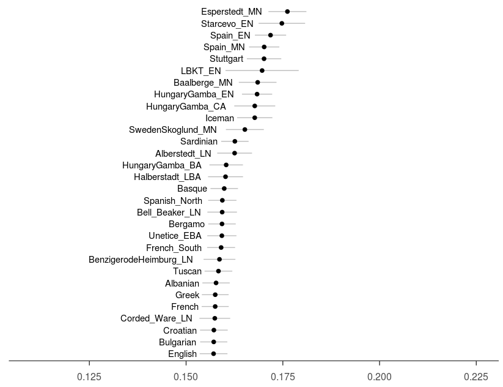

**Figure 5**: Outgroup-f3(Yoruba; LBK_EN, Y).

**LBKT_EN**

```
LBKT_EN <- EN.results[A == "LBKT_EN", ]
Odered_LBKT_EN <- LBKT_EN[order(LBKT_EN$f3),]
LBKT_EN_30 <- Odered_LBKT_EN[164:193,]

ggplot(LBKT_EN_30, aes(y = f3, x = factor(LBKT_EN_30$B, levels = LBKT_EN_30$B))) +
  geom_errorbar(aes(ymin = f3-3*stderr, ymax = f3+3*stderr), width = 0.0, size = 0.5, color = "grey") +
  geom_point(size = 2) +
  ylim(0.11, 0.225)+
  coord_flip() +
  theme_bw() +
  theme(panel.grid.major = element_blank(),
        panel.grid.minor = element_blank(),
        panel.border = element_blank(),
        axis.line.x = element_line(colour = "black"),
        axis.title = element_blank(),
        axis.text.y = element_blank(),
        axis.text.x = element_text(size =12, margin = margin (t = 9) ),
        axis.ticks.y = element_blank(),
        axis.ticks.length = unit(0.2, "cm")) +
  geom_text(aes(y = f3-3*stderr,label=B), hjust =1.1)

```

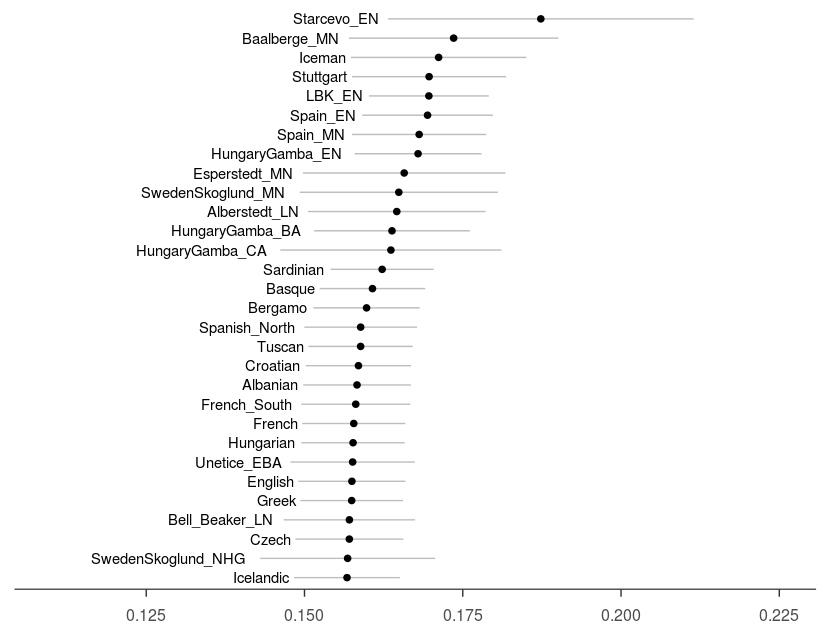

**Figure 6**: Outgroup-f3(Yoruba; LBKT_EN, Y).

**Starcevo_EN**
```
Starcevo_EN <- EN.results[A == "Starcevo_EN", ]
Odered_Starcevo_EN <- Starcevo_EN[order(Starcevo_EN$f3),]
Starcevo_EN_30 <- Odered_Starcevo_EN[164:193,]

ggplot(Starcevo_EN_30, aes(y = f3, x = factor(Starcevo_EN_30$B, levels = Starcevo_EN_30$B))) +
  geom_errorbar(aes(ymin = f3-3*stderr, ymax = f3+3*stderr), width = 0.0, size = 0.5, color = "grey") +
  geom_point(size = 2) +
  ylim(0.11, 0.225)+
  coord_flip() +
  theme_bw() +
  theme(panel.grid.major = element_blank(),
        panel.grid.minor = element_blank(),
        panel.border = element_blank(),
        axis.line.x = element_line(colour = "black"),
        axis.title = element_blank(),
        axis.text.y = element_blank(),
        axis.text.x = element_text(size =12, margin = margin (t = 9) ),
        axis.ticks.y = element_blank(),
        axis.ticks.length = unit(0.2, "cm")) +
  geom_text(aes(y = f3-3*stderr,label=B), hjust =1.1)

```

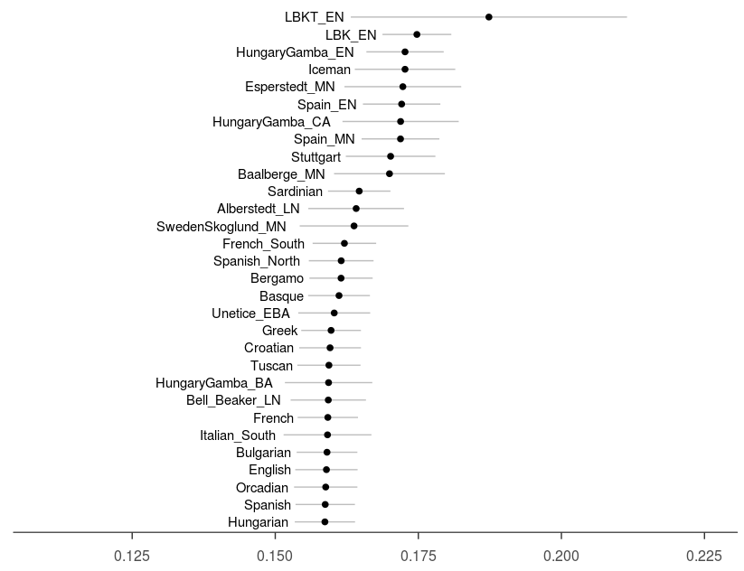

**Figure 7**: Outgroup-f3(Yoruba; Starcevo_EN, Y).

**Spain_EN**

```
Spain_EN <- EN.results[A == "Spain_EN", ]
Odered_Spain_EN <- Spain_EN[order(Spain_EN$f3),]
Spain_EN_30 <- Odered_Spain_EN[164:193,]

ggplot(Spain_EN_30 , aes(y = f3, x = factor(Spain_EN_30 $B, levels = Spain_EN_30$B))) +
  geom_errorbar(aes(ymin = f3-3*stderr, ymax = f3+3*stderr), width = 0.0, size = 0.5, color = "grey") +
  geom_point(size = 2) +
  ylim(0.11, 0.225)+
  coord_flip() +
  theme_bw() +
  theme(panel.grid.major = element_blank(),
        panel.grid.minor = element_blank(),
        panel.border = element_blank(),
        axis.line.x = element_line(colour = "black"),
        axis.title = element_blank(),
        axis.text.y = element_blank(),
        axis.text.x = element_text(size =12, margin = margin (t = 9) ),
        axis.ticks.y = element_blank(),
        axis.ticks.length = unit(0.2, "cm")) +
  geom_text(aes(y = f3-3*stderr,label=B), hjust =1.1)

```
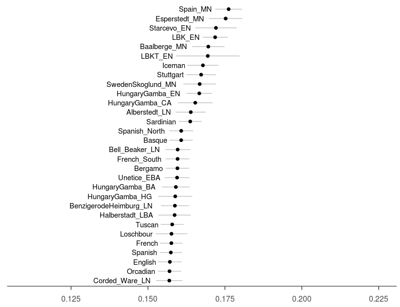

**Figure 8**: Outgroup-f3(Yoruba; Spain_EN, Y).


### Results interpretation

The **maximizing outgroup-f3 value** is between Early Neolithic farmer and the Middle Neolithic populations that succeed them:

**LBK_EN** vs **Esperstedt MN**

**Starcevo_EN** vs **LBKT_EN**

**Spain_EN** vs **Spain_MN**

The **maximizing outgroup-f3 value** is also between Early Neolithic farmer and the culture that before them:

**LBKT_EN** vs **Starcevo_EN** 

Overall, Early Neolithic farmer share more genetic drift with other Early Neolithic populations, or the Middle Neolithic populatiions that succeed them.


## Middle Neolithic Europeans

Middle Neolithic(MN): **Esperstedt** (n=1), **Spain_MN** (La Mina) (n=4), **SwedenSkoglund_MN** (n=1), **HugaryGamba_CA** (n=1).


**Running the outgroup-f3 tests**:
```
MN.results <- f3(A = c("Esperstedt_MN","HungaryGamba_CA","Spain_MN","SwedenSkoglund_MN"), B = pops, C = "Yoruba", data = f3data)

attach(MN.results)
```

```
# Esperstedt_MN
Esperstedt_MN <- MN.results[A == "Esperstedt_MN", ]
Odered_Esperstedt_MN <- Esperstedt_MN[order(Esperstedt_MN$f3),]
Esperstedt_MN_30 <- Odered_Esperstedt_MN[164:193,]

ggplot(Esperstedt_MN_30 , aes(y = f3, x = factor(Esperstedt_MN_30$B, levels = Esperstedt_MN_30$B))) +
  geom_errorbar(aes(ymin = f3-3*stderr, ymax = f3+3*stderr), width = 0.0, size = 0.5, color = "grey") +
  geom_point(size = 2) +
  ylim(0.11, 0.225)+
  coord_flip() +
  theme_bw() +
  theme(panel.grid.major = element_blank(),
        panel.grid.minor = element_blank(),
        panel.border = element_blank(),
        axis.line.x = element_line(colour = "black"),
        axis.title = element_blank(),
        axis.text.y = element_blank(),
        axis.text.x = element_text(size =12, margin = margin (t = 9) ),
        axis.ticks.y = element_blank(),
        axis.ticks.length = unit(0.2, "cm")) +
  geom_text(aes(y = f3-3*stderr,label=B), hjust =1.1)


# HungaryGamba_CA
HungaryGamba_CA <- MN.results[A == "HungaryGamba_CA", ]
Odered_HungaryGamba_CA <- HungaryGamba_CA[order(HungaryGamba_CA$f3),]
HungaryGamba_CA_30 <- Odered_HungaryGamba_CA[164:193,]

ggplot(HungaryGamba_CA_30 , aes(y = f3, x = factor(HungaryGamba_CA_30$B, levels = HungaryGamba_CA_30$B))) +
  geom_errorbar(aes(ymin = f3-3*stderr, ymax = f3+3*stderr), width = 0.0, size = 0.5, color = "grey") +
  geom_point(size = 2) +
  ylim(0.11, 0.225)+
  coord_flip() +
  theme_bw() +
  theme(panel.grid.major = element_blank(),
        panel.grid.minor = element_blank(),
        panel.border = element_blank(),
        axis.line.x = element_line(colour = "black"),
        axis.title = element_blank(),
        axis.text.y = element_blank(),
        axis.text.x = element_text(size =12, margin = margin (t = 9) ),
        axis.ticks.y = element_blank(),
        axis.ticks.length = unit(0.2, "cm")) +
  geom_text(aes(y = f3-3*stderr,label=B), hjust =1.1)


# Spain_MN
Spain_MN <- MN.results[A == "Spain_MN", ]
Odered_Spain_MN <- Spain_MN[order(Spain_MN$f3),]
Spain_MN_30 <- Odered_Spain_MN[164:193,]

ggplot(Spain_MN_30 , aes(y = f3, x = factor(Spain_MN_30$B, levels = Spain_MN_30$B))) +
  geom_errorbar(aes(ymin = f3-3*stderr, ymax = f3+3*stderr), width = 0.0, size = 0.5, color = "grey") +
  geom_point(size = 2) +
  ylim(0.11, 0.225)+
  coord_flip() +
  theme_bw() +
  theme(panel.grid.major = element_blank(),
        panel.grid.minor = element_blank(),
        panel.border = element_blank(),
        axis.line.x = element_line(colour = "black"),
        axis.title = element_blank(),
        axis.text.y = element_blank(),
        axis.text.x = element_text(size =12, margin = margin (t = 9) ),
        axis.ticks.y = element_blank(),
        axis.ticks.length = unit(0.2, "cm")) +
  geom_text(aes(y = f3-3*stderr,label=B), hjust =1.1)


# SwedenSkoglund_MN
SwedenSkoglund_MN <- MN.results[A == "SwedenSkoglund_MN", ]
Odered_SwedenSkoglund_MN <- SwedenSkoglund_MN[order(SwedenSkoglund_MN$f3),]
SwedenSkoglund_MN_30 <- Odered_SwedenSkoglund_MN[164:193,]

ggplot(SwedenSkoglund_MN_30, aes(y = f3, x = factor(SwedenSkoglund_MN_30$B, levels = SwedenSkoglund_MN_30$B))) +
  geom_errorbar(aes(ymin = f3-3*stderr, ymax = f3+3*stderr), width = 0.0, size = 0.5, color = "grey") +
  geom_point(size = 2) +
  ylim(0.11, 0.225)+
  coord_flip() +
  theme_bw() +
  theme(panel.grid.major = element_blank(),
        panel.grid.minor = element_blank(),
        panel.border = element_blank(),
        axis.line.x = element_line(colour = "black"),
        axis.title = element_blank(),
        axis.text.y = element_blank(),
        axis.text.x = element_text(size =12, margin = margin (t = 9) ),
        axis.ticks.y = element_blank(),
        axis.ticks.length = unit(0.2, "cm")) +
  geom_text(aes(y = f3-3*stderr,label=B), hjust =1.1)
```

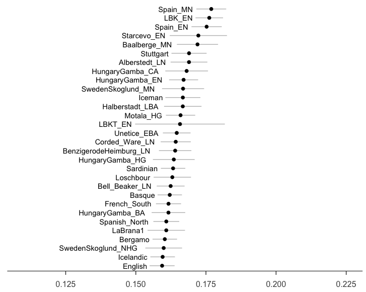

**Figure 9**: Outgroup-f3(Yoruba; Esperstedt_MN, Y).

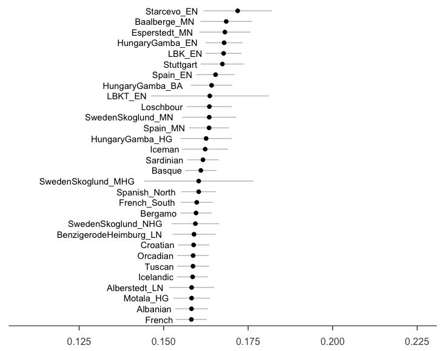

**Figure 10**: Outgroup-f3(Yoruba; HungaryGamba_CA, Y).

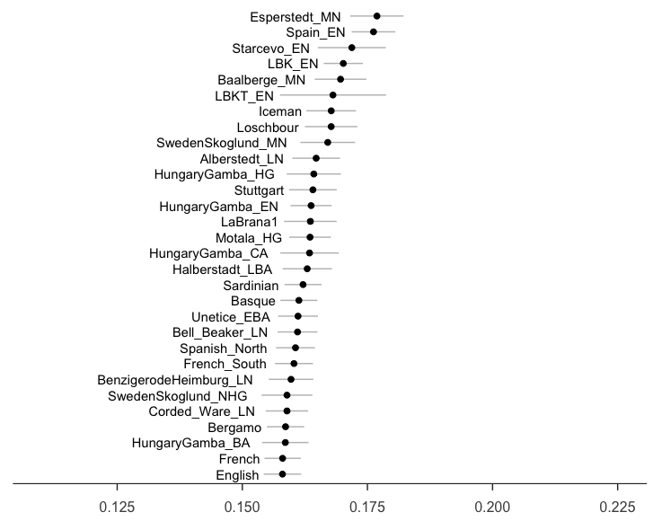

**Figure 11**: Outgroup-f3(Yoruba; Spain_MN, Y).

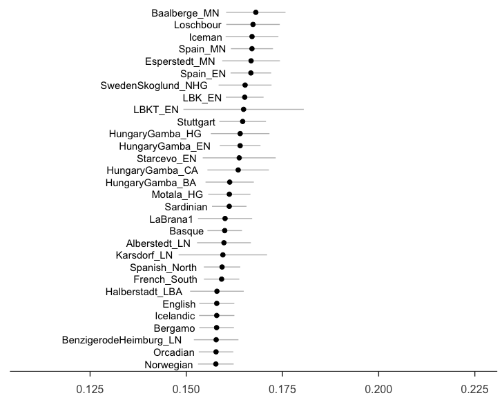

**Figure 12**: Outgroup-f3(Yoruba; SwedenSkoglund_MN, Y).


### Results interpretation


Similar as Early Neolithic farmers, Middle Neolithic Europeans share more genetic drift either with other MN populations, or the Eealy Neolithi farmers that precede them.


## Late Neolithic / Bronze Age Europeans

Late Neolithic / Bronze Age:  **Corded Ware**(n=4), **Bell Beaker**(n=6), **Unetice**(n=8), **Halberstadt**(n=1).


```
LN.results <- f3(A = c("Corded_Ware_LN","Bell_Beaker_LN","Unetice_EBA","Halberstadt_LBA"), B = pops, C = "Yoruba", data = f3data)

attach(MN.results)
```

```
# Corded_Ware_LN
Corded_Ware_LN <- LN.results[A == "Corded_Ware_LN", ]
Odered_Corded_Ware_LN <- Corded_Ware_LN[order(Corded_Ware_LN$f3),]
Corded_Ware_LN_30 <- Odered_Corded_Ware_LN[164:193,]

ggplot(Corded_Ware_LN_30 , aes(y = f3, x = factor(Corded_Ware_LN_30$B, levels = Corded_Ware_LN_30$B))) +
  geom_errorbar(aes(ymin = f3-3*stderr, ymax = f3+3*stderr), width = 0.0, size = 0.5, color = "grey") +
  geom_point(size = 2) +
  ylim(0.11, 0.225)+
  coord_flip() +
  theme_bw() +
  theme(panel.grid.major = element_blank(),
        panel.grid.minor = element_blank(),
        panel.border = element_blank(),
        axis.line.x = element_line(colour = "black"),
        axis.title = element_blank(),
        axis.text.y = element_blank(),
        axis.text.x = element_text(size =12, margin = margin (t = 9) ),
        axis.ticks.y = element_blank(),
        axis.ticks.length = unit(0.2, "cm")) +
  geom_text(aes(y = f3-3*stderr,label=B), hjust =1.1)


# Bell_Beaker_LN
Bell_Beaker_LN <- LN.results[A == "Bell_Beaker_LN", ]
Odered_Bell_Beaker_LN <- Bell_Beaker_LN[order(Bell_Beaker_LN$f3),]
Bell_Beaker_LN_30 <- Odered_Bell_Beaker_LN[164:193,]

ggplot(Bell_Beaker_LN_30 , aes(y = f3, x = factor(Bell_Beaker_LN_30$B, levels = Bell_Beaker_LN_30$B))) +
  geom_errorbar(aes(ymin = f3-3*stderr, ymax = f3+3*stderr), width = 0.0, size = 0.5, color = "grey") +
  geom_point(size = 2) +
  ylim(0.11, 0.225)+
  coord_flip() +
  theme_bw() +
  theme(panel.grid.major = element_blank(),
        panel.grid.minor = element_blank(),
        panel.border = element_blank(),
        axis.line.x = element_line(colour = "black"),
        axis.title = element_blank(),
        axis.text.y = element_blank(),
        axis.text.x = element_text(size =12, margin = margin (t = 9) ),
        axis.ticks.y = element_blank(),
        axis.ticks.length = unit(0.2, "cm")) +
  geom_text(aes(y = f3-3*stderr,label=B), hjust =1.1)


# Unetice_EBA
Unetice_EBA <- LN.results[A == "Unetice_EBA", ]
Odered_Unetice_EBA <- Unetice_EBA[order(Unetice_EBA$f3),]
Unetice_EBA_30 <- Odered_Unetice_EBA[164:193,]

ggplot(Unetice_EBA_30 , aes(y = f3, x = factor(Unetice_EBA_30$B, levels = Unetice_EBA_30$B))) +
  geom_errorbar(aes(ymin = f3-3*stderr, ymax = f3+3*stderr), width = 0.0, size = 0.5, color = "grey") +
  geom_point(size = 2) +
  ylim(0.11, 0.225)+
  coord_flip() +
  theme_bw() +
  theme(panel.grid.major = element_blank(),
        panel.grid.minor = element_blank(),
        panel.border = element_blank(),
        axis.line.x = element_line(colour = "black"),
        axis.title = element_blank(),
        axis.text.y = element_blank(),
        axis.text.x = element_text(size =12, margin = margin (t = 9) ),
        axis.ticks.y = element_blank(),
        axis.ticks.length = unit(0.2, "cm")) +
  geom_text(aes(y = f3-3*stderr,label=B), hjust =1.1)


# Halberstadt_LBA
Halberstadt_LBA <- LN.results[A == "Halberstadt_LBA", ]
Odered_Halberstadt_LBA <- Halberstadt_LBA[order(Halberstadt_LBA$f3),]
Halberstadt_LBA_30 <- Odered_Halberstadt_LBA[164:193,]

ggplot(Halberstadt_LBA_30 , aes(y = f3, x = factor(Halberstadt_LBA_30$B, levels = Halberstadt_LBA_30$B))) +
  geom_errorbar(aes(ymin = f3-3*stderr, ymax = f3+3*stderr), width = 0.0, size = 0.5, color = "grey") +
  geom_point(size = 2) +
  ylim(0.11, 0.225)+
  coord_flip() +
  theme_bw() +
  theme(panel.grid.major = element_blank(),
        panel.grid.minor = element_blank(),
        panel.border = element_blank(),
        axis.line.x = element_line(colour = "black"),
        axis.title = element_blank(),
        axis.text.y = element_blank(),
        axis.text.x = element_text(size =12, margin = margin (t = 9) ),
        axis.ticks.y = element_blank(),
        axis.ticks.length = unit(0.2, "cm")) +
  geom_text(aes(y = f3-3*stderr,label=B), hjust =1.1)

```


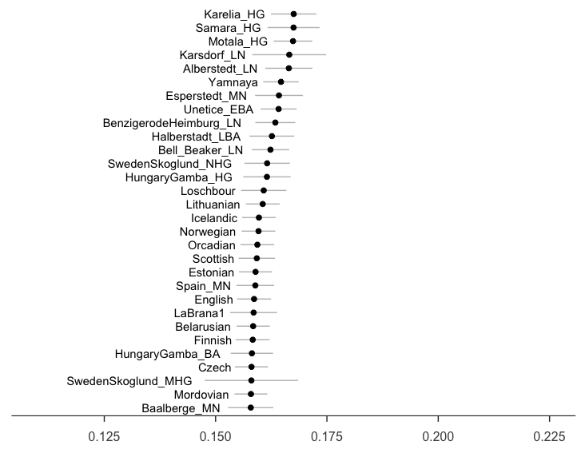

**Figure 13**: Outgroup-f3(Yoruba; Corded_Ware_LN, Y).

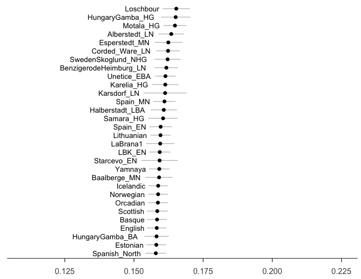

**Figure 14**: Outgroup-f3(Yoruba; Bell_Beaker_LN, Y).

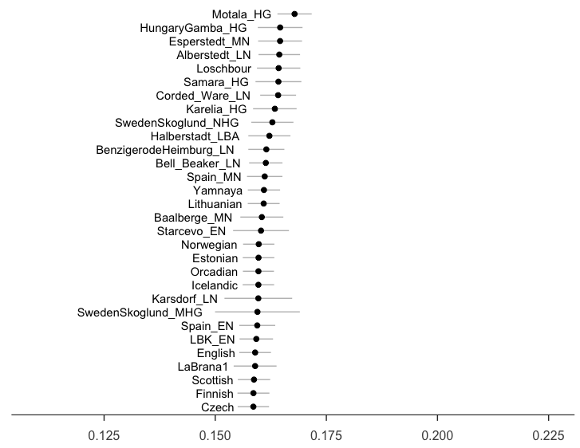

**Figure 15**: Outgroup-f3(Yoruba; Unetice_EBA, Y).

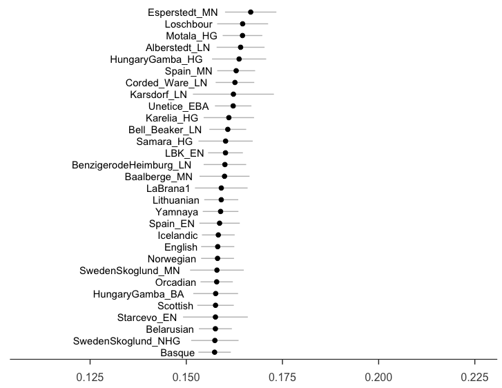

**Figure 16**: Outgroup-f3(Yoruba; Halberstadt_LBA, Y).


### Results interpretation

Most LN/BA populations share most genetic drift with hunter-gatherers, and then other LN/BA populations, Yamnaya. It kind of make sense, but why on the PCA plot, they cluster with most present-day Europeans.


## Ancient North Eurasians and Eastern European hunter-gatherers


Ancient North Eurasians and Eastern European hunter-gatherers: **MA1** (n=1), **Karelia** (n=1) and **Samara_HG** (n=1).


```
AncientHG.results <- f3(A = c("MA1","Karelia_HG","Samara_HG"), B = pops, C = "Yoruba", data = f3data)

attach(AncientHG.results)
```


```
# MA1
MA1 <- AncientHG.results[A == "MA1", ]
Odered_MA1 <- MA1[order(MA1$f3),]
MA1_30 <- Odered_MA1[164:193,]

ggplot(MA1_30 , aes(y = f3, x = factor(MA1_30$B, levels = MA1_30$B))) +
  geom_errorbar(aes(ymin = f3-3*stderr, ymax = f3+3*stderr), width = 0.0, size = 0.5, color = "grey") +
  geom_point(size = 2) +
  ylim(0.11, 0.225)+
  coord_flip() +
  theme_bw() +
  theme(panel.grid.major = element_blank(),
        panel.grid.minor = element_blank(),
        panel.border = element_blank(),
        axis.line.x = element_line(colour = "black"),
        axis.title = element_blank(),
        axis.text.y = element_blank(),
        axis.text.x = element_text(size =12, margin = margin (t = 9) ),
        axis.ticks.y = element_blank(),
        axis.ticks.length = unit(0.2, "cm")) +
  geom_text(aes(y = f3-3*stderr,label=B), hjust =1.1)
  
  
# Karelia_HG
Karelia_HG <- AncientHG.results[A == "Karelia_HG", ]
Odered_Karelia_HG <- Karelia_HG[order(Karelia_HG$f3),]
Karelia_HG_30 <- Odered_Karelia_HG[164:193,]

ggplot(Karelia_HG_30 , aes(y = f3, x = factor(Karelia_HG_30$B, levels = Karelia_HG_30$B))) +
  geom_errorbar(aes(ymin = f3-3*stderr, ymax = f3+3*stderr), width = 0.0, size = 0.5, color = "grey") +
  geom_point(size = 2) +
  ylim(0.11, 0.225)+
  coord_flip() +
  theme_bw() +
  theme(panel.grid.major = element_blank(),
        panel.grid.minor = element_blank(),
        panel.border = element_blank(),
        axis.line.x = element_line(colour = "black"),
        axis.title = element_blank(),
        axis.text.y = element_blank(),
        axis.text.x = element_text(size =12, margin = margin (t = 9) ),
        axis.ticks.y = element_blank(),
        axis.ticks.length = unit(0.2, "cm")) +
  geom_text(aes(y = f3-3*stderr,label=B), hjust =1.1)
  
  
# Samara_HG
Samara_HG <- AncientHG.results[A == "Samara_HG", ]
Odered_Samara_HG <- Samara_HG[order(Samara_HG$f3),]
Samara_HG_30 <- Odered_Samara_HG[164:193,]

ggplot(Samara_HG_30 , aes(y = f3, x = factor(Samara_HG_30$B, levels = Samara_HG_30$B))) +
  geom_errorbar(aes(ymin = f3-3*stderr, ymax = f3+3*stderr), width = 0.0, size = 0.5, color = "grey") +
  geom_point(size = 2) +
  ylim(0.11, 0.225)+
  coord_flip() +
  theme_bw() +
  theme(panel.grid.major = element_blank(),
        panel.grid.minor = element_blank(),
        panel.border = element_blank(),
        axis.line.x = element_line(colour = "black"),
        axis.title = element_blank(),
        axis.text.y = element_blank(),
        axis.text.x = element_text(size =12, margin = margin (t = 9) ),
        axis.ticks.y = element_blank(),
        axis.ticks.length = unit(0.2, "cm")) +
  geom_text(aes(y = f3-3*stderr,label=B), hjust =1.1)
  ````

## Late Copper/Early Bronze Age steppe chronology: Yamnaya (n=9).


Late Copper/Early Bronze Age steppe chronology: **Yamnaya** (n=9).


```
Yamnaya.results <- f3(A = c("Yamnaya"), B = pops, C = "Yoruba", data = f3data)

attach(Yamnaya.results)
```


```
# Yamnaya

Yamnaya <- Yamnaya.results[A == "Yamnaya", ]
Odered_Yamnaya<- Yamnaya[order(Yamnaya_HG$f3),]
Yamnaya_30 <- Odered_Yamnaya[164:193,]

ggplot(Yamnaya_30 , aes(y = f3, x = factor(Yamnaya_30$B, levels = Yamnaya_30$B))) +
  geom_errorbar(aes(ymin = f3-3*stderr, ymax = f3+3*stderr), width = 0.0, size = 0.5, color = "grey") +
  geom_point(size = 2) +
  ylim(0.11, 0.225)+
  coord_flip() +
  theme_bw() +
  theme(panel.grid.major = element_blank(),
        panel.grid.minor = element_blank(),
        panel.border = element_blank(),
        axis.line.x = element_line(colour = "black"),
        axis.title = element_blank(),
        axis.text.y = element_blank(),
        axis.text.x = element_text(size =12, margin = margin (t = 9) ),
        axis.ticks.y = element_blank(),
        axis.ticks.length = unit(0.2, "cm")) +
  geom_text(aes(y = f3-3*stderr,label=B), hjust =1.1)
```


### Note：

**[Writing data from R to Excel files (xls|xlsx)](http://www.sthda.com/english/wiki/exporting-data-from-r)** 

- Installing xlsx package: install.packages(“xlsx”)

In oder to install ```xlsx``` package in ```Ubuntu 16.04```, you need to install ```rJava``` package first.


1. Install the Java Runtime Environment (JRE).

```sudo apt-get install -y default-jre```

2. Install the Java Development Kit (JDK).

```sudo apt-get install -y default-jdk```

3. Update where R expects to find various Java files.

```sudo R CMD javareconf```

4. Install the package in R

```install.packages("rJava")```


```install.packages("xlsx")```


- Using xlsx package: write.xlsx()

```
library("xlsx")
# Write the first data set in a new workbook
write.xlsx(USArrests, file = "myworkbook.xlsx",
      sheetName = "USA-ARRESTS", append = FALSE)
# Add a second data set in a new worksheet
write.xlsx(mtcars, file = "myworkbook.xlsx", 
           sheetName="MTCARS", append=TRUE)
```

**[Writing data from R to a txt|csv file: R base functions](http://www.sthda.com/english/wiki/exporting-data-from-r)**

- R base functions for writing data: write.table(), write.csv(), write.csv2()

- Writing data to a file

```
# Write data to csv files:  
# decimal point = "." and value separators = comma (",")
write.csv(MN.results, file = "MN.results.csv)
```

### Reference:

1. Haak, Wolfgang, et al. "Massive migration from the steppe was a source for Indo-European languages in Europe." Nature 522.7555 (2015): 207.

2. Lazaridis, Iosif, et al. "Ancient human genomes suggest three ancestral populations for present-day Europeans." Nature 513.7518 (2014): 409.

3. Gamba, Cristina, et al. "Genome flux and stasis in a five millennium transect of European prehistory." Nature communications 5 (2014): 5257.

4. Olalde, Inigo, et al. "Derived immune and ancestral pigmentation alleles in a 7,000-year-old Mesolithic European." Nature 507.7491 (2014): 225.

