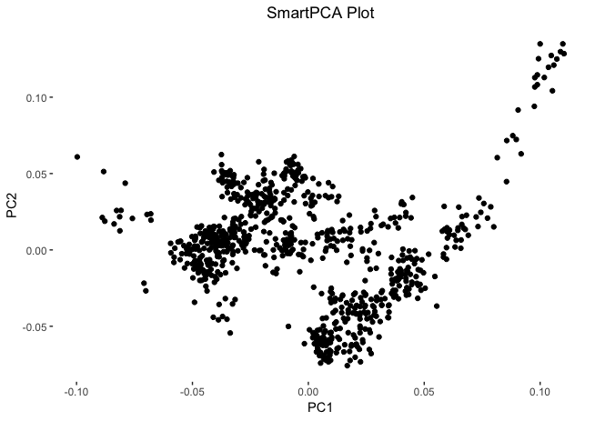
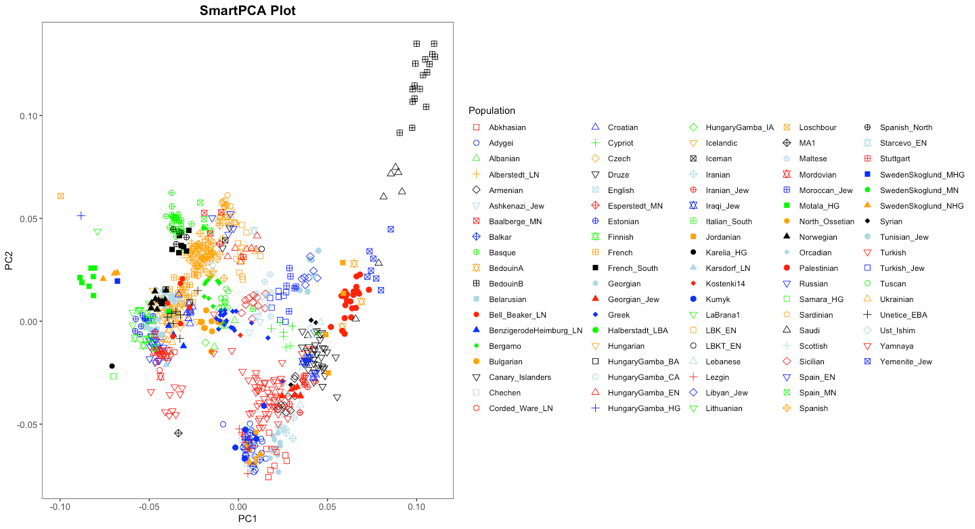
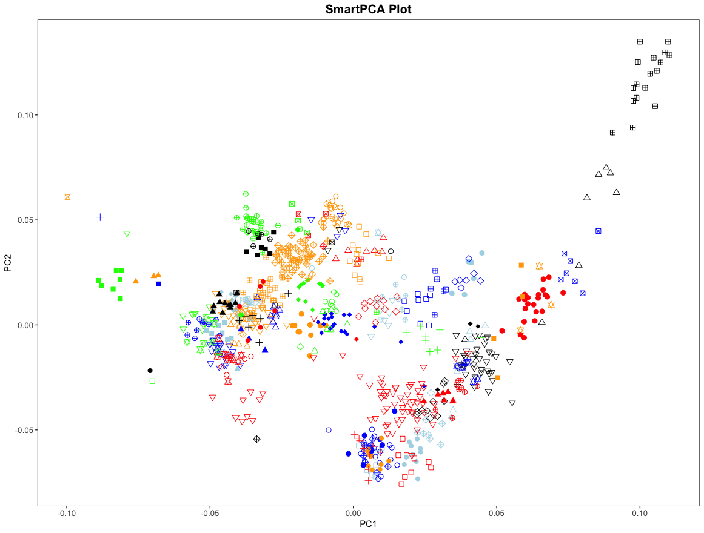
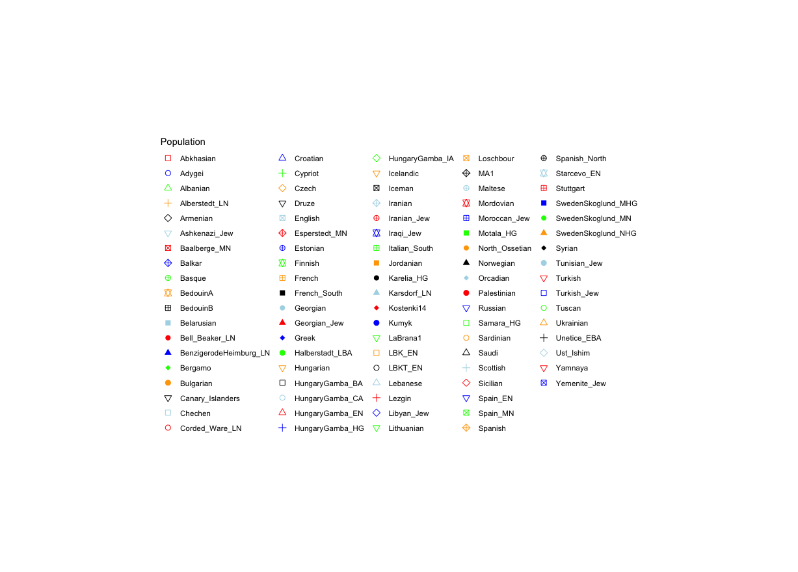
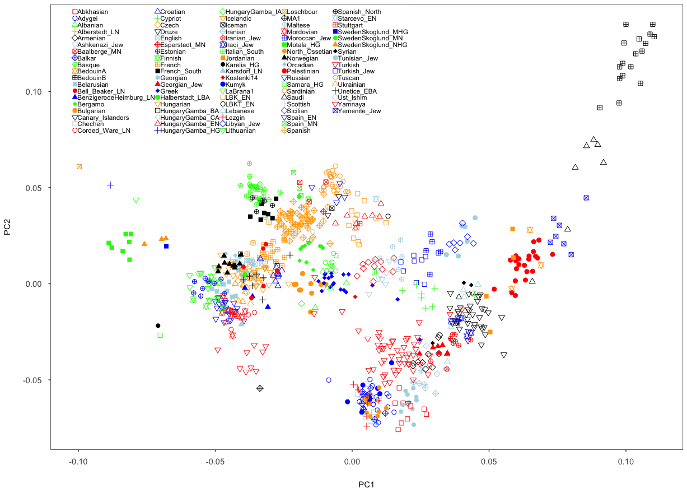
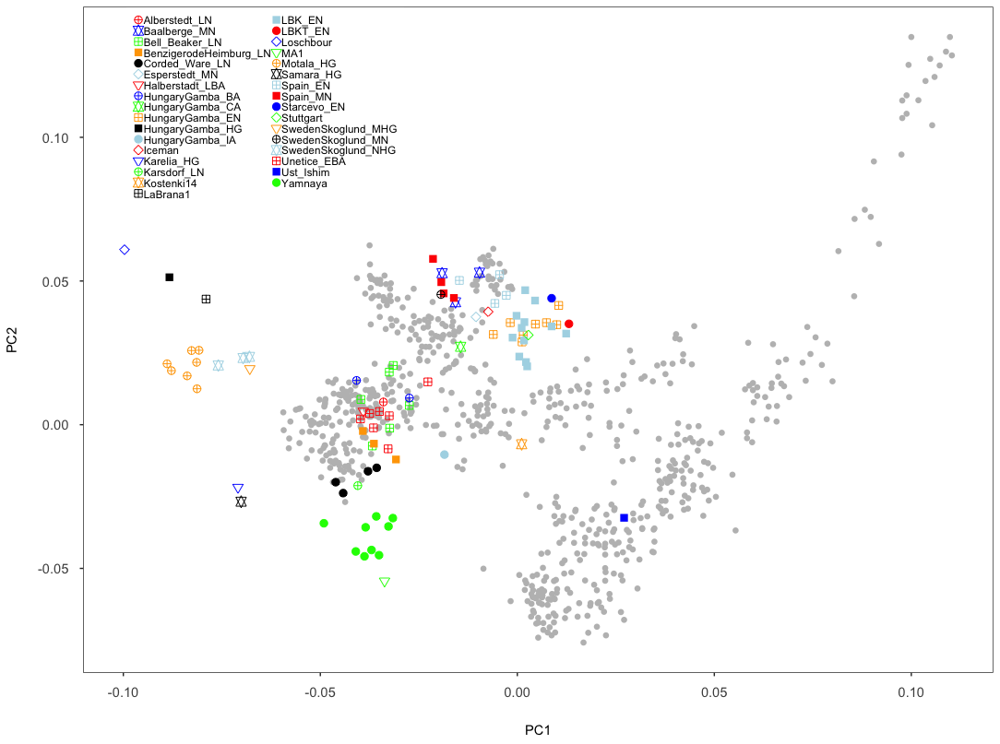
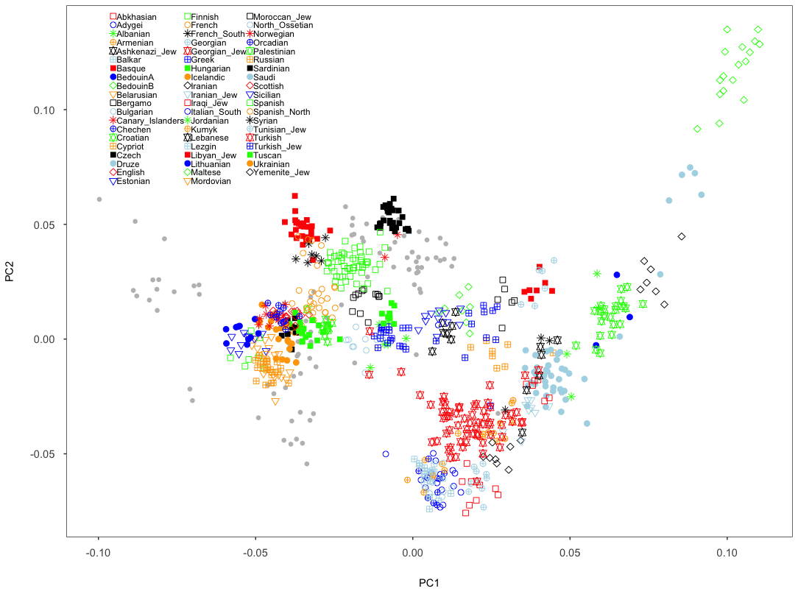
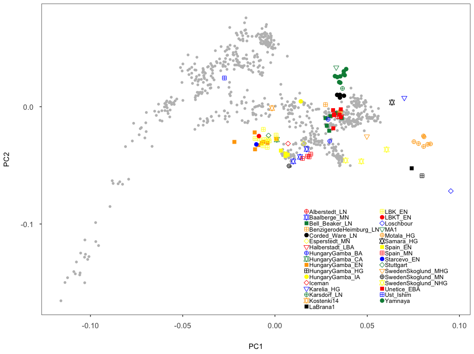

## Principal Components Analysis (PCA)
Principal components analysis, PCA, is a one of the most useful statistical method used in population genetics to identify and visualize population structure in the distribution of genetic variation across geographical location and ethic backgroud, and genetic variation over time. In general, it allows breaking down high-dimensional datasets to two or more dimensions for visualisation in a two-dimensional space. 

### SmartPCA
The smartpca program uses a combination of Principal Component Analysis (PCA; a standard statistical method) and new statistics designed specifically for genomic data. The methods are described in detail in an excellent and accessible [article](https://journals.plos.org/plosgenetics/article?id=10.1371/journal.pgen.0020190), and [github manual](https://github.com/chrchang/eigensoft/blob/master/POPGEN/%23README%23)  under [Eigensoft package](https://github.com/chrchang/eigensoft) by the authors of the program.

### Genotype data
The dataset that I will work with is the [Fully public genotype dataset (354,212 SNPs)](https://reich.hms.harvard.edu/datasets) described in [Haak et al. Nature 2015](https://www.nature.com/articles/nature14317). 

The dataset contains **2,071** individuals, each represented by **354,212 autosomal*** single nucleotide polymorphisms (SNPs). Those SNPs have exactly two different alleles, and each individual has one of four possible values at each genotype: homozygous reference, heterozygous, homozygous alternative, or missing. Those four values are encoded 2, 1, 0 and 9 respectively.

1. Downlaod the genotype data from [David Reich Lab Dataset](https://reich.hms.harvard.edu/datasets) webpage. 

2. You will get a zip file named : ***Haak2015PublicData.tar.gz***.
    ```
    # Move to the folder that contains the downloaded genotype data file, and type 'ls' commmand to display the file name.
    
    ls
    Haak2015PublicData.tar.gz
    ```
3. Unzip and extract a ***.tar.gz*** file in the terminal.

   ```
   tar -xvzf Haak2015PublicData.tar.gz
   
   # The followings will show on your screen.
   data.geno
   data.ind
   data.pops
   data.snp
   README
   ```
   To explain a little further, ```tar``` collected all the files into one package, ***.tar*** file. The gzip program applied compression, hence the ***.gz*** extension. So the command does a couple things:

   - ```f```: this must be the last flag of the command, and the tar file must be immediately after. It tells tar the name and path of the compressed file.
   - ```z```: tells tar to decompress the archive using gzip
   - ```x```: tar can collect files or extract them. x does the latter.
   - ```v```: makes tar talk a lot. Verbose output shows you all the files being extracted.
4. You will end up having five files: ***data.geno***, ***data.ind***, ***data.snp***, ***data pops*** and ***README***.

   The data itself comes in the so-called "PACKEDANCESTRYMAP" format, which is defined in the [Eigensoft package](https://github.com/DReichLab/EIG) used by many tools. The "PACKEDANCESTRYMAP" format can be also converted to other formats using the ["convertf"](https://github.com/chrchang/eigensoft/tree/master/CONVERTF) utility of the EIGENSOFT software package: [see details](https://reich.hms.harvard.edu/software/InputFileFormats).
   
   
   In this format, a genotype dataset consists of three files, usually with the following file endings:

   ***```*.snp```***
   
   The file containing the SNP positions. It consists of six columns: SNP-name, chromosome, genetic positions, physical position, reference allele, alternative allele.

   ***```*.ind```***
   
   The file containing the names of the individuals. It consists of three columns: Individual Name, Sex (encoded as M(ale), F(emale), or U(nknown)), and population name.

   ***```*.geno```***
   
   The file containing the genotype matrix, with individuals laid out from left to right, and SNP positions laid out from top to bottom.

  
   ***```README```***
    ```
    cat README
   
    # This genotype dataset includes present-day humans published by Lazaridis et al. (2014), 
     69 ancient humans by Haak et al. (2015), 
     other ancient humans from the literature included in the analysis by Haak et al. (2015), 
     and other ancient individuals (e.g., archaics).

    ```
   
   ***```data.pops```***
  
   This file was made by the authors and containing sample size (1st column) and the name of each population group (2rd column).
   
   ```
   head data.pops 
   
   # Result.
   12 AA
    9 Abkhasian 
   17 Adygei
    1 AG2 
    6 Albanian 
    1 Alberstedt_LN 
    7 Aleut 
    1 Aleutian 
    7 Algerian 
    1 Altai
    ```
      
      
  
   ***Calculating the total number of indivduals by add the first column up***
   ```
   awk '{sum += $1} END {print sum}' data.pops
     
   2071  # There are 2071 individuals in this dataset in total.
   ```
     
### How PCA analysis works

To understand how PCA works, consider a single individual and its representation by its 354,212 markers. Formally, each individual is a point in a 354,212-dimensional space, where each dimension can take only the three possible genotypes indicated above, or have missing data. To visualise this high-dimensional dataset, we would like to project it down to two dimensions. But as there are many ways to project the shadow of a three-dimensional object on a two dimensional plane, there are many (and even more) ways to project a 354,212-dimensional cloud of points to two dimensions. What PCA does is figuring out the "best" way to do this project in order to visualise the major components of variance in the data.

**Reference**: Stephan Schiffels, [compPopGenWorkshop2019](https://github.com/stschiff/compPopGenWorkshop2019_docs): [PCA](https://github.com/stschiff/compPopGenWorkshop2019_docs/tree/master/contents/03_pca). I quoted here with slightly change.


### Preparing the file for SmartPCA analysis

According to the paper [(Haak et al, 2015)](https://www.nature.com/articles/nature14317), - supplementary information 5 -, the PCAanalysis was conducted using ```smartpca``` on 777 present-day West Eurasians and 92 ancient individuals.


As I mentioned above, the genotype dataset itself from [(Haak et al, 2015)](https://www.nature.com/articles/nature14317) contains **2,071** individuals, which belong to **224** population groups/catergories. I need to figure out which 777 present-day West Eurasians and 92 ancient individuals were used by the authors for the PCA analysis.

Based on the Figure lengends of Figure 2a and Figure S5.1, I found out/identified those 777 West Eurasians ( from 59 population) and 92 ancient individuals (from 33 population), the details were summarized in the ***SampleInformation.xlsx*** under this folder.


**1. Figure 2a and Figure S5.1**

  The first PCA analysis was conducted on 777 presnet-day West Eurasians and 92 ancient individuals only at **66,225 transversion SNPs**. 


  **A word about DNA damage**

  If the samples you are analysing are ancient samples, the DNA will likely contain DNA damage, so C->T changes which are seen as C->T and G->A substitutions. There are two ways how to deal with that. First, if your data is not UDG-treated, so if it contains the full damage, you should restrict your analysis to Transversion SNPs only. If your data is UDG-treated, you will have much less damage, but you can still see damaged sites in particular in the boundary of the reads in your BAM-file. In that case, you probably want to make a modified bam file for each sample, where the first 2 bases on each end of the read are clipped. [Reference and See details](https://gaworkshop.readthedocs.io/en/latest/contents/04_genotyping/genotyping.html)

  ***Haak et al.*** claimed that I quoate here: "We excluded tranmsition SNPs in this analysis as non-UDG-treated ancient DNA libraries from the literature had high rates of damage causing apparent C->T and G->A substitutions,which potentially leads to misleading results, for example by causing ancient DNA samples to apper aas extreme outliers, dominating one the first two pricipal components."


  Finding transversion SNPs in ***data.snp***:

  ```
  cat data.snp | grep -v -E  "G A|A G|C T|T C" | wc -l

  66,225

  cat data.snp | grep -v -E  "G A|A G|C T|T C" | head
  
  
  Affx-4690339      1         0.029735         1205155  A  C
  Affx-5354053      1         0.032495         1519068  A  C
  Affx-6395872      1         0.040110         1942033  C  A
  Affx-6411981      1         0.040627         1948400  C  A
  Affx-7257140      1         0.044968         2164935  G  T
  Affx-50018429     1         0.046476         2223669  G  T
   .
   .
   .
   .
  ```


  ```
  cat data.snp | grep -v -E  "G A|A G|C T|T C" > transversionSNP.txt
   
  # The 'transversionSNP.txt' will be used to extract all transversion SNPs using PLINK later.
  ```
   
   **Now we can extract those 869 individuals (777 present-day West Eurasians and 92 ancient individuals), and 66,225 transvrsion SNPs from the full genotype dataset**. 
   
   In order to extract certain individuals and/or SNPs from the full dataset, you need to convert 'PACKEDANCESTRYMAP' format (or any other [EIGENSOFT](https://github.com/chrchang/eigensoft/tree/master/CONVERTF) format, such as ANCESTRYMAP, EIGENSTRAT, PED) to 'PACKEDPED' format cause the [PLINK](https://www.cog-genomics.org/plink2) program will do and does a better job. 
   
   Note: The EIGENSOFT [PED](https://github.com/chrchang/eigensoft/tree/master/CONVERTF) format is equivalent to PLINK [PED](http://zzz.bwh.harvard.edu/plink/data.shtml#ped) format. The EIGENSOFT [PACKEDPED](https://github.com/chrchang/eigensoft/tree/master/CONVERTF) format is equivalent to PLINK [BED](http://zzz.bwh.harvard.edu/plink/data.shtml#bed) format, as known as Binary PED files. To do individual and SNPs extraction, you need to provide Binary PED files (*.bed, *.bim, *.fam) to the PLINK.
   
   
   ***EIGENSOFT 6.1.4***
   
   ***PLINK 1.9***
   
   ```
   # Convert the PACKEDANCESTRYMAP format to PACKEDPED.
   # Use nano text editor in the terminal to make the par file named: " par.PACKEDANCESTRYMAP.PACKEDPED ".
   
   nano par.PACKEDANCESTRYMAP.PACKEDPED
   
   # And type the following in the text editor and save it.
   
   
   genotypename: data.geno
   snpname: data.snp
   indivname: data.ind
   outputformat: PACKEDPED
   genotypeoutname: WestEuroTransver.bed
   snpoutname: WestEuroTransver.bim
   indivoutname: WestEuroTransver.fam

   ```
   
   ```
   cat par.PACKEDANCESTRYMAP.PACKEDPED
    
   genotypename: data.geno
   snpname: data.snp
   indivname: data.ind
   outputformat: PACKEDPED
   genotypeoutname: data.bed
   snpoutname: data.bim
   indivoutname: data.fam
   
   ```
   
   I used EIGENSOFT 6.1.4, you can download it [here](https://data.broadinstitute.org/alkesgroup/EIGENSOFT/).  ```convertf``` is a program in the EIGENSOFT package, see [the manual](https://github.com/chrchang/eigensoft/tree/master/CONVERTF) in github.
   
   ```
   /Path/To/EIG-6.1.4/bin/convertf -p par.PACKEDANCESTRYMAP.PACKEDPED 
   
   
   packed geno read OK
   numvalidind:   2071  maxmiss: 2071001
   packedped output
   ##end of convertf run.
   ```
   
  You will get three Binary PED files ***data.bed, data.bim, data.fam***. If you check the ***data.fam*** file, I noticed that the family/population group information (the first column, showing only numbers) were lost during the format conversion. I found the population group information in the ***data.ind*** file, and updated the ***data.fam*** file in excel manually. I also uploaded the modified ***data.fam*** file in the folder.
  
  ```
  # The original data.fam file.
  
  head data.fam
  
  1 SA1004 0 0 2 1
  2 SA063 0 0 2 1
  3 SA010 0 0 2 1
  4 SA064 0 0 1 1
  5 SA073 0 0 2 1
  6 SA1025 0 0 2 1
  7 SA078 0 0 2 1
  8 SA083 0 0 2 1
  9 Yuk_009 0 0 1 1
  10 Yuk_025 0 0 2 1

  # The updated data.fam file.
  
  head data.fam
  
  Khomani	SA1004	0	0	2	1
  Khomani	SA063	0	0	2	1
  Khomani	SA010	0	0	2	1
  Khomani	SA064	0	0	1	1
  Khomani	SA073	0	0	2	1
  Khomani	SA1025	0	0	2	1
  Khomani	SA078	0	0	2	1
  Khomani	SA083	0	0	2	1
  Yukagir	Yuk_009	0	0	1	1
  Yukagir	Yuk_025	0	0	2	1

  ```
  
  
  
Extract a subset of SNPs: file-list options.

To extract only a subset of SNPs, it is possible to specify a list of required SNPs and make a new set of Binary PED files by using the following PLINK command.

```plink --bfile data --extract mysnps.txt --make-bed --out newdata```

where the file is just a list of SNPs, one per line, e.g.

```
snp005
snp008
snp101
```
As shown above, the list of SNPs file I made is called 'transversionSNP.txt'

```
 cat data.snp | grep -v -E  "G A|A G|C T|T C" > transversionSNP.txt
```
 
 
   
 Making a list file of individuals you want to keep. 
 
 To keep only certain individuals in a file, use the option:
 
```plink --bfile data --keep mylist.txt --make-bed --out newdata```

 where the file mylist.txt is, as for the --remove command, just a list of Family ID / Individual ID
pairs, one set per line, i.e. one person per line. (fields can occur after the 2nd column but they will be
ignored – i.e. you could use a FAM file as the parameter of the --keep command, or have comments in the
file. 

For example:
```
F101    1
F1001   2 
F3033   1 
F4442   22

# The space between the first column and the second column is a tab.
```
 
 I made a list of family IDs/population groups called [WE_An_Family.txt](WE_An_Family.txt), which including 92 family groups (59 West Eurosian groups + 33 ancient groups). I need to extract all individuals (n=869) from those 92 family groups (from 'transverSNPs_allind.fam')  to make the inviduals list file.

 ```
 # Here, I used a while loop.
 # -w grep exact match
 
 cat WE_An_Family.txt | while read line
 >do 
 >grep -w "$line" transverSNPs_allind.fam | awk '{print$1 "\t" $2}' >> WE_An_ind_list.txt
 >done

 # or you can type: 
 
 cat WE_An_Family.txt | while read line ; do grep -w "$line" transverSNPs_allind.fam | awk '{print$1 "\t" $2}' >> WE_An_ind_list.txt; done


 # What 'WE_An_ind_list.txt' looks like.
 # A tab between two columns.

 head WE_An_ind_list.txt

 Abkhasian	abh27
 Abkhasian	abh107
 Abkhasian	abh41
 Abkhasian	abh119
 Abkhasian	abh122
 Abkhasian	abh133
 Abkhasian	abh147
 Abkhasian	abh154
 Abkhasian	abh24
 Adygei  HGDP01381

 ```
 
 
 
 **Extract 66,225 transvrsion SNPs, and keep 777 present-day West Eurasians and 92 ancient individuals.**

 ```
 # Keep/Extract 66,225 transvrsion SNPs only and make new bed files called 'transverSNPs_allind'.
 # 'allind' means that still keeping all individuals (n = 2071).
  
 plink --bfile data --extract transversionSNP.txt --make-bed --out transverSNPs_allind
  
  
   
 # Log results
 PLINK v1.90b4 64-bit (20 Mar 2017)             www.cog-genomics.org/plink/1.9/
 (C) 2005-2017 Shaun Purcell, Christopher Chang   GNU General Public License v3
 Logging to transverSNPs_allind.log.
 Options in effect:
 --bfile data
 --extract transversionSNP.txt
 --make-bed
 --out transverSNPs_allind

 8703 MB RAM detected; reserving 4351 MB for main workspace.
 354212 variants loaded from .bim file.
 2071 people (1307 males, 764 females) loaded from .fam.
 2071 phenotype values loaded from .fam.
 --extract: 66225 variants remaining.
 Using 1 thread (no multithreaded calculations invoked).
 Before main variant filters, 2071 founders and 0 nonfounders present.
 Calculating allele frequencies... done.
 Total genotyping rate is 0.972329.
 66225 variants and 2071 people pass filters and QC.
 Among remaining phenotypes, 0 are cases and 2071 are controls.
 --make-bed to transverSNPs_allind.bed + transverSNPs_allind.bim + transverSNPs_allind.fam ... done.
 ```
  
   

 
 
 ```
 # Keep 777 present-day West Eurasians and 92 ancient individuals, n= 869.
 # WE - West Eurasians; An - Ancient individuals; ind - individuals; transverSNPs - 66,225 transversion SNPs
 
 plink --bfile transverSNPs_allind --keep WE_An_ind_list.txt --make-bed --out WE_An_ind_transverSNPs
 
 
 
 # Log results
 PLINK v1.90b4 64-bit (20 Mar 2017)             www.cog-genomics.org/plink/1.9/
 (C) 2005-2017 Shaun Purcell, Christopher Chang   GNU General Public License v3
 Logging to WE_An_ind_transverSNPs.log.
 Options in effect:
  --bfile transverSNPs_allind
  --keep WE_An_ind_list.txt
  --make-bed
  --out WE_An_ind_transverSNPs

 8703 MB RAM detected; reserving 4351 MB for main workspace.
 66225 variants loaded from .bim file.
 2071 people (1307 males, 764 females) loaded from .fam.
 2071 phenotype values loaded from .fam.
 --keep: 869 people remaining.
 Using 1 thread (no multithreaded calculations invoked).
 Before main variant filters, 869 founders and 0 nonfounders present.
 Calculating allele frequencies... done.
 Total genotyping rate in remaining samples is 0.955644.
 66225 variants and 869 people pass filters and QC.
 Among remaining phenotypes, 0 are cases and 869 are controls.
 --make-bed to WE_An_ind_transverSNPs.bed + WE_An_ind_transverSNPs.bim + WE_An_ind_transverSNPs.fam ... done.
 ```

    
### Population lists vs. Projection

*"The parameter named **poplistname** in smartpca is a very crucial one. It specifies the populations whose individuals are used to calculate the principal components. Why not just all of them you ask?*

*For two reasons: First, there are simply too many of them, and we don't want to use all of them, since the computation would take too long (this is not our case here). More importantly, however, we generally try to avoid using ancient samples to compute principal components, to avoid specific ancient-DNA related artefacts affecting the computation.*

*So what happens to individuals that are not in populations listed in the population list? Well, fortunately, they are not just ignored, but "projected". This means that after the principal components have been computed, all individuals (not just the one in the list) are projected onto these principal components. That way, we can visualise ancient populations in the context of modern genetic variation. While that may sound a bit problematic at first (surely there must be variation in ancient populations that is not represented well by modern populations), but it turns out to be nevertheless one of the most useful tools for this purpose. The advantage of avoiding ancient-DNA artefacts and batch effects to affect the visualisation outweighs the disadvantage of missing some private genetic variation components in the ancient populations themselves. Of course, that argument breaks down once the analysed populations become too ancient and detached from modern genetic variation. But for our purposes it will work just fine."* I quoted from Stephan Schiffels whith slightly changes.

**Reference**: Stephan Schiffels, [compPopGenWorkshop2019](https://github.com/stschiff/compPopGenWorkshop2019_docs): [PCA](https://github.com/stschiff/compPopGenWorkshop2019_docs/tree/master/contents/03_pca).

Here are two scenarios that you should use ```lsqproject: YES``` for smartpca analysis, as mentioned in the [manual](https://github.com/chrchang/eigensoft/blob/master/POPGEN/lsqproject.pdf) and I quote here:

1. One situation in which this occurs is that s is admixed and we wish to analyze only SNPs where we believe that the sample is homozygous for one ancestry. For instance in ["Reconstructing Native American population history"](https://www.nature.com/articles/nature11258) sections of European ancestry in Native Americans were masked out as the primary interest was in indigenous genetics.

2. Another situation is analysis of ancient DNA where poor preservation may mean that coverage is poor, with many SNPs having missing data.


To repeat the analysis, I prepared one population list: [WestEurasia.poplist.txt](WestEurasia.poplist.txt), which only contains 59 present-day West Eurasian groups. So, 777 present-day West Eurasian individuals are used to calculate the principal components, and 92 ancient individuals will be projected onto the PCA axes.


```poplistname: yourfile```

***yourfile*** should consist of a list of populations (1/line) where populations are the labels in the last column of the input .ind file (eigenstrat or packedped format).Only the samples with listed labels will be output.

```
# Here is what poplistname file looks like.

head WestEurasia.poplist.txt 


Abkhasian
Adygei
Albanian
Armenian
Ashkenazi_Jew
Balkar
Basque
BedouinA
BedouinB
Belarusian
```


For actually running the analysis, I used a software called [smartPCA](https://github.com/chrchang/eigensoft/tree/master/POPGEN) from the [Eigensoft](https://github.com/chrchang/eigensoft) package. As many other tools from this and related packages, smartPCA reads in a parameter file which specifies its input and output files and options. The basic format of the parameter file with one extra option (lsqproject) looks like this:


```
genotypename: <GENOTYPE_DATA>.geno
snpname: <GENOTYPE_DATA>.snp
indivname: <GENOTYPE_DATA>.ind
evecoutname: <OUT_FILE>.evec
evaloutname: <OUT_FILE>.eval
poplistname: <POPULATION_LIST_FILE>.txt
lsqproject: YES
numoutevec: 4
numthreads: 2
```

Here, the first three parameters specify the input genotype files. The next two rows specify two output file names, typically with ending ```*.evec``` and ```*.eval```. The parameter line beginning with ```poplistname``` contains a file with a list of populations used for calculating the principal components. The option ```lsqproject``` is important for applications including ancient DNA with lots of missing data. For the analysis, I used ```lsqproject: YES```. The option ```numoutevec``` specifies the number of principal components that we compute.The option ```numthreads``` specifies the number of threads your computer will use. Each core has/equals two threads, my computer has one CPU with quad-cores, so I have 8 threads to use theoretically. Here I used two threads.


```
# I made the parmeter file using nano texteditor in the terminal and typed the following contents.

cat par.smartPCA.WE_An_ind_transverSNPs


genotypename: WE_An_ind_transverSNPs.bed
snpname: WE_An_ind_transverSNPs.bim
indivname: WE_An_ind_transverSNPs.fam
evecoutname: WE_An_ind_transverSNPs.evec
evaloutname: WE_An_ind_transverSNPs.eval
poplistname: WestEurasia.poplist.txt
lsqproject: YES
numoutevec: 4
numthreads: 2

```

And then I run this code: 

```
/PATH/TO/bin/smartpca -p par.smartPCA.WE_An_ind_transverSNPs

```

It was not running through......


After several trials, I was wondering PACKEDPED file won't work for ```poplistname``` and ```lsqproject``` commmands because the format of ```*.ind``` file. So, I converted the PACKEDPED format back to PACKEDANCESTRYMAP by making ```par``` file and runing ```covertf```.


```
cat par.PACKEDPED.PACKEDANCESTRYMAP 

genotypename: WE_An_ind_transverSNPs.bed
snpname: WE_An_ind_transverSNPs.bim
indivname: WE_An_ind_transverSNPs.fam
outputformat: PACKEDANCESTRYMAP
genooutfilename: WE_An_ind_transverSNPs.geno
snpoutfilename: WE_An_ind_transverSNPs.snp
indoutfilename: WE_An_ind_transverSNPs.ind


/PATH/TO/bin/convertf -p par.PACKEDPED.PACKEDANCESTRYMAP

```

I checked the ```*.ind``` file, and it looks like this following...which the third column is not family/population groups, whereas all labeled with 'Control'. The family/population groups labels are in the first columnm, followed by colon and individual ID...


```
head WE_An_ind_transverSNPs.ind 


French:HGDP00511 M    Control
French:HGDP00512 M    Control
French:HGDP00513 F    Control
French:HGDP00514 F    Control
French:HGDP00515 M    Control
French:HGDP00516 F    Control
French:HGDP00517 F    Control
French:HGDP00518 M    Control
French:HGDP00519 M    Control
French:HGDP00522 M    Control


```

I fixed the ```*.ind``` file by runing: 


```
awk -F ":" '{print $2 "\t" $1}' WE_An_ind_transverSNPs.ind | awk '{print $4":"$1 "\t" $2 "\t" $4}' > new.ind

mv new.ind WE_An_ind_transverSNPs.ind

# Now the new 'WE_An_ind_transverSNPs.ind' file should look like this:

head WE_An_ind_transverSNPs.ind

French:HGDP00511	M	French
French:HGDP00512	M	French
French:HGDP00513	F	French
French:HGDP00514	F	French
French:HGDP00515	M	French
French:HGDP00516	F	French
French:HGDP00517	F	French
French:HGDP00518	M	French
French:HGDP00519	M	French
French:HGDP00522	M	French
```

Don't change the names in the first column, otherwise they won't match with the ```*.geno``` file.

### Running smartPCA

Remake ```par``` file:

```
nano par.smartPCA.WE_An_ind_transverSNPs

genotypename: WE_An_ind_transverSNPs.geno
snpname: WE_An_ind_transverSNPs.snp
indivname: WE_An_ind_transverSNPs.ind
evecoutname: WE_An_ind_transverSNPs.evec
evaloutname: WE_An_ind_transverSNPs.eval
poplistname: WestEurasia.poplist.txt
lsqproject: YES
numoutevec: 4
numthreads: 1


```


Now we have five files: 

**'WE_An_ind_transverSNPs.geno'**

**'WE_An_ind_transverSNPs.snp'**

**'WE_An_ind_transverSNPs.ind'**

**'WestEurasia.poplist.txt'**

**'par.smartPCA.WE_An_ind_transverSNPs'**. 

Put all filenames with their absolute path into the parameter file. And run smartPCA using the command: 

```/PATH/TO/bin/smartpca -p par.smartPCA.WE_An_ind_transverSNPs > smartpca.log```

Here, I'm using bash redirection of the log output of smartpca into a log file called smartpca.log, which may be useful for trouble shooting.

### Plot PCA in R studio 

```
R version 3.5.1
RStudio Desktop 1.2.1335
ggplot2 3.0.0
macOS Mojave v10.14.4
```

**1. Simply Version**

```
library(ggplot2)

# Read data, the .evec file, and assgin column names to each column by using col.names().
# Since we calculated four components, this first column is going to be Sample ID, and followd by four columns of coordinates of four components.
# The last column is always the name of family/population group.


evecData <- read.table("WE_An_ind_transverSNPs.evec", col.names=c("SampleID", "PC1", "PC2", "PC3", "PC4","Population"))


# plot the first and second components


ggplot(evecData, aes(x = PC1,y = PC2)) +
  geom_point() +
  ggtitle("SmartPCA Plot") + theme(panel.background = element_blank())


```



**2. Refined/Advanced Version**

```
# Load ggplot2 package
library(ggplot2)
# Read in the data
evecData <- read.table("WE_An_ind_transverSNPs.evec", col.names=c("SampleID", "PC1", "PC2", "PC3", "PC4","Population"))

# Plot the graph
ggplot(evecData, aes(x = PC1,y = PC2)) +
  geom_point(aes(shape = Population, color = Population), size = 2.5) +
  ggtitle("SmartPCA Plot") + 
  theme_bw() +
  theme(panel.grid.major = element_blank(),
        panel.grid.minor = element_blank(),
        plot.title = element_text(hjust = 0.5, size =15, face ="bold"),
        axis.text.x = element_text(size =10),
        axis.text.y = element_text(size=10)) +
  scale_shape_manual(values = rep(c(0:3,5:7,9:12,15:19,25), len = 92)) +
  scale_colour_manual(values = rep(c("red", "blue", "green", "orange","black","lightblue"), len = 92))
  
  # There are 92 population groups, so len = 92. You need to change this number based on how many populations you have
```


```scale_shape_manual(values = rep(1:17, len = 92)``` will choose shape 1 to 17 and loop through till 92.

```scale_shape_manual(values = rep(c(1,3,4,6,7), len = 92))``` will use shape 1, 3 ,4 ,6 , 7,and loop through till 92, so you can pick a shape/multiple shapes you want to use.

3. Plot the data and legend separately

Since the data points are too many, the legend will take large space. So it is hard to see those data points itself. Here I will plot those data points and display the legend separately.

**Only data points**

```
# By adding '  legend.position="none" ' argument, we can get rid of the legend.

ggplot(evecData, aes(x = PC1,y = PC2)) +
  geom_point(aes(shape = Population, color = Population), size = 2.5) +
  ggtitle("SmartPCA Plot") + 
  theme_bw() +
  theme(panel.grid.major = element_blank(),
        panel.grid.minor = element_blank(),
        plot.title = element_text(hjust = 0.5, size =15, face ="bold"),
        axis.text.x = element_text(size =10),
        axis.text.y = element_text(size=10),
        legend.position="none"
        ) +
  scale_shape_manual(values = rep(c(0:3,5:7,9:12,15:19,25), len = 92)) +
  scale_colour_manual(values = rep(c("red", "blue", "green", "orange","black","lightblue"), len = 92))

```


**Only legend**

```
library(ggplot2)
library(ggpubr)


P<- ggplot(evecData, aes(x = PC1,y = PC2)) +
  geom_point(aes(shape = Population, color = Population), size = 2.5) +
  ggtitle("SmartPCA Plot") + 
  theme_bw() +
  theme(panel.grid.major = element_blank(),
        panel.grid.minor = element_blank(),
        plot.title = element_text(hjust = 0.5, size =15, face ="bold"),
        axis.text.x = element_text(size =10),
        axis.text.y = element_text(size=10)
  ) +
  scale_shape_manual(values = rep(c(0:3,5:7,9:12,15:19,25), len = 92)) +
  scale_colour_manual(values = rep(c("red", "blue", "green", "orange","black","lightblue"), len = 92))

# Extract the legend. Returns a gtable
leg <- get_legend(P)

# Convert to a ggplot and print
as_ggplot(leg)
```




**4. Final Version**

Based on my aesthetic preference and publications, here I present the R code for my final version.

- I moved the legend inside the plot on the top left corner. You can adjust the legend postion by changeing the parameter 'x' and 'y' in the ```legend.position = c(x,y)``` argument according to your own plot. The value range of x and y is [0,1].
- I adjusted the legend key size through the ```legend.key.size = unit(0.20, "cm")``` argument, so the legend can fit the plot. 
- Their are a lot of aspects you can adjust and change. I tried many times and did a lot of google searches to meet my stardard and aesthetic preference.
- The good thing about ggplot2 is that you can custormize your plot relative easy.

```
# Load ggplot2 package
library(ggplot2)
# Read in the data
evecData <- read.table("WE_An_ind_transverSNPs.evec", col.names=c("SampleID", "PC1", "PC2", "PC3", "PC4","Population"))


# Plot the graph
ggplot(evecData, aes(x = PC1,y = PC2)) +
  geom_point(aes(shape = Population, color = Population), size = 2.5) +
  theme_bw() +
  theme(panel.grid.major = element_blank(),
        panel.grid.minor = element_blank(),
        axis.text.x = element_text(size =11, margin = margin (t = 9) ),
        axis.text.y = element_text(size=11, margin = margin (r = 9) ),
        legend.position = c(0.3, 0.85),        # adjust legend relative poition with the plot
        legend.key.size = unit(0.20, "cm"),   # the size of legend
        legend.title = element_blank(),       # get rid of legend title
        axis.title.x = element_text (margin = margin (t = 20) ),  # X title distance to the x axis
        axis.title.y = element_text (margin = margin (r = 15) )
  ) +
  scale_shape_manual(values = rep(c(0:3,5:7,9:12,15:19,25), len = 92)) +
  scale_colour_manual(values = rep(c("red", "blue", "green", "orange", "black", "lightblue"), len = 92))

```



**5. Only color-coded ancient individuals and Only color-coded modern West Euroaisans**

In Figure 2a, to avoid visual clutter, the authors represented modern individuals as grey dots, and used colored and labeled symbols to represent the ancient individuals.

In Figure S5.1. the authors showed the completment of Figure 2a by color coding modern individuals and representing ancient ones as grey dots.

Here, I separated ancient individuals from modern West Eroaisans in [WE_An_ind_transverSNPs.evec](WE_An_ind_transverSNPs.evec), named [Ancient_PCA.txt](Ancient_PCA.txt) and [WestEurasians_PCA.txt](WestEurasians_PCA.txt) respectively.

```
# Loading ggplot2 package
library(ggplot2)

# Read in both ancient and modern data
Ancient <- read.table("Ancient_PCA.txt", col.names=c("SampleID", "PC1", "PC2", "PC3", "PC4","Population"))
WE <- read.table("WestEurasians_PCA.txt", col.names=c("SampleID", "PC1", "PC2", "PC3", "PC4","Population"))

# Color-coded ancient individuals, and leave modern individuals as grey solid cycles.

ggplot(Ancient, aes(x = PC1,y = PC2)) +     # read ancient data
  geom_point(data = WE, aes(x = PC1,y = PC2), shape = 16, color = "grey", size = 2) +  # read modern data, and plot modern individuals
  geom_point(aes(shape = Population, color = Population), size = 2.6) +             # then plot ancient individuals on top of modern ones
  theme_bw() +
  theme(panel.grid.major = element_blank(),
        panel.grid.minor = element_blank(),
        axis.text.x = element_text(size =11, margin = margin (t = 9) ),
        axis.text.y = element_text(size=11, margin = margin (r = 9) ),
        legend.position = c(0.2, 0.85),        
        legend.key.size = unit(0.30, "cm"),   
        legend.title = element_blank(),       
        axis.title.x = element_text (margin = margin (t = 20) ),  
        axis.title.y = element_text (margin = margin (r = 15) )
  ) +
  scale_shape_manual(values = rep(c(10,11,12,15,19,23,25), len = 33)) +   # len = 33, cause there 33 groups of ancient individuals
  scale_colour_manual(values = rep(c("red", "blue", "green", "orange", "black", "lightblue"), len = 33))
  
 ```
 


```
# Loading ggplot2 package
library(ggplot2)

# Read in both ancient and modern data
Ancient <- read.table("Ancient_PCA.txt", col.names=c("SampleID", "PC1", "PC2", "PC3", "PC4","Population"))
WE <- read.table("WestEurasians_PCA.txt", col.names=c("SampleID", "PC1", "PC2", "PC3", "PC4","Population"))

# Color-coded modern West Euroaisans, and leave ancient individuals as grey solid cycles.

ggplot(WE, aes(x = PC1,y = PC2)) +
  geom_point(data = Ancient, aes(x = PC1,y = PC2), shape = 16, color = "grey", size = 2) +
  geom_point(aes(shape = Population, color = Population), size = 2.4) +
  theme_bw() +
  theme(panel.grid.major = element_blank(),
        panel.grid.minor = element_blank(),
        axis.text.x = element_text(size =11, margin = margin (t = 9) ),
        axis.text.y = element_text(size=11, margin = margin (r = 9) ),
        legend.position = c(0.2, 0.825),        #adjust legend relative poition with the plot
        legend.key.size = unit(0.20, "cm"),   #the size of legend
        legend.title = element_blank(),       #get rid of legend title
        axis.title.x = element_text (margin = margin (t = 20) ),  # X title position to the x axis
        axis.title.y = element_text (margin = margin (r = 15) )
  ) +
  scale_shape_manual(values = rep(c(0,1,8,10,11,12,15,19,23,25), len = 59)) +   # len = 33, cause there 33 groups of modern individuals
  scale_colour_manual(values = rep(c("red", "blue", "green", "orange", "black", "lightblue"), len = 59))
 
```




**R codes**: I put all my R codes here in .R file, [SmartPCA.R](SmartPCA.R). 

#### Note:

Margins can be specified for top (t), right (r), bottom (b), and left (l) to position text vertically and horizontally. So to move X-axis title down you would use ```theme(axis.title.x = element_text(margin = margin(t = 20))``` and move Y-axis title to the left you would use ```theme(axis.title.x = element_text(margin = margin(l = 20))```.

[Difference between geom_point() and geom_jitter() in ggplot2 in R?](https://stackoverflow.com/questions/39255781/what-is-difference-between-geom-point-and-geom-jitter-in-simple-language-in-r)

[ggplot2 point shapes](http://www.sthda.com/english/wiki/ggplot2-point-shapes)

[ggplot2 legend](http://www.sthda.com/english/wiki/ggplot2-legend-easy-steps-to-change-the-position-and-the-appearance-of-a-graph-legend-in-r-software)

The names of different color: [Color Palette Cheatsheet](colorPaletteCheatsheet.pdf)


### PCA over all 354.212 SNPs 

In FIgure S5.2, the authors show a PCA over all 354,212 SNPs, with ancient individuals projected onto the variation of the modern ones (West Euroasians).

**Format the data, and extract ancient individuals/west Euroasians 

I have the following files in my folder:

```data.bed```
```data.bim```
```data.fam```
[WE_An_ind_list.txt](WE_An_ind_list.txt)

```
plink --bfile data --keep WE_An_ind_list.txt --make-bed --out WE_AN_ind


# Results:

8703 MB RAM detected; reserving 4351 MB for main workspace.
354212 variants loaded from .bim file.
2071 people (1307 males, 764 females) loaded from .fam.
2071 phenotype values loaded from .fam.
--keep: 869 people remaining.
Using 1 thread (no multithreaded calculations invoked).
Before main variant filters, 869 founders and 0 nonfounders present.
Calculating allele frequencies... done.
Total genotyping rate in remaining samples is 0.956065.
354212 variants and 869 people pass filters and QC.
Among remaining phenotypes, 0 are cases and 869 are controls.
--make-bed to WE_AN_ind.bed + WE_AN_ind.bim + WE_AN_ind.fam ... done.

```

```
cat par.PACKEDPED.PACKEDANCESTRYMAP


genotypename: WE_AN_ind.bed
snpname: WE_AN_ind.bim
indivname: WE_AN_ind.fam
outputformat: PACKEDANCESTRYMAP
genooutfilename: WE_AN_ind.geno 
snpoutfilename: WE_AN_ind.snp
indoutfilename: WE_AN_ind.ind


/PATH/TO/bin/convertf -p par.PACKEDPED.PACKEDANCESTRYMAP

```

I fixed the ***.ind*** file by running:

```
awk -F ":" '{print $2 "\t" $1}' WE_AN_ind.ind | awk '{print $4":"$1 "\t" $2 "\t" $4}' > new.ind

mv new.ind WE_AN_ind.ind
```

**Running SmartPCA**

```
nano par.smartPCA.WE_AN_ind


genotypename: WE_AN_ind.geno
snpname: WE_AN_ind.snp
indivname: WE_AN_ind.ind
evecoutname: WE_AN_ind.evec
evaloutname: WE_AN_ind.eval
poplistname: WestEurasia.poplist.txt
lsqproject: YES
numoutevec: 4
numthreads: 1


/PATH/TO/bin/smartpca -p par.smartPCA.WE_AN_ind > smartpca.log

```
**Plot in R**

Again, I separated ancient individuals from modern West Eroaisans in [WE_AN_ind.evec](WE_AN_ind.evec), named [Ancient_allSNPs_PCA.txt](Ancient_allSNPs_PCA.txt) and [Modern_allSNPs_PCA.txt](Modern_allSNPs_PCA.txt) respectively.

```
# All 354,212 SNPs PCA 
library(ggplot2)


Ancient <- read.table("Ancient_allSNPs_PCA.txt", col.names=c("SampleID", "PC1", "PC2", "PC3", "PC4","Population"))
WE <- read.table("Modern_allSNPs_PCA.txt", col.names=c("SampleID", "PC1", "PC2", "PC3", "PC4","Population"))


#Ancient color
ggplot(Ancient, aes(x = PC1,y = PC2)) +
  geom_point(data = WE, aes(x = PC1,y = PC2), shape = 16, color = "grey", size = 1.6) +
  geom_point(aes(shape = Population, color = Population), size = 2.4) +
  theme_bw() +
  theme(panel.grid.major = element_blank(),
        panel.grid.minor = element_blank(),
        axis.text.x = element_text(size =11, margin = margin (t = 9) ),
        axis.text.y = element_text(size=11, margin = margin (r = 9) ),
        legend.position = c(0.78,0.18),        #adjust legend relative poition with the plot
        legend.key.size = unit(0.30, "cm"),   #the size of legend
        legend.title = element_blank(),       #get rid of legend title
        axis.title.x = element_text (margin = margin (t = 20) ),  # X title position to the x axis
        axis.title.y = element_text (margin = margin (r = 15) )
  ) +
  scale_shape_manual(values = rep(c(10,11,15,12,19,23,25), len = 33)) +
  scale_colour_manual(values = rep(c("red", "blue", "springgreen4", "orange2", "black", "yellow2"),len = 33))
  ```




**R codes**: I put all my R codes here in .R file, [SmartPCA.R](SmartPCA.R). 
     
### Operating System and Program Version

I did data formating, SmartPCA analyses under Ubuntu 16.04.5 LTS-xenial, lunched through [VirtualBox](https://www.virtualbox.org/) on a Window 10 PC.
   
```
EIGENSOFT 6.1.4
PLINK 1.9
```

I plotted the PCA results in R on a Macbook.

```
R version 3.5.1
RStudio Desktop 1.2.1335
ggplot2 3.0.0
macOS Mojave v10.14.4
```

**Reference**: 

1. Stephan Schiffels, [compPopGenWorkshop2019](https://github.com/stschiff/compPopGenWorkshop2019_docs): [PCA](https://github.com/stschiff/compPopGenWorkshop2019_docs/tree/master/contents/03_pca).
2. [EVOLUTION AND GENOMICS](http://evomics.org/learning/population-and-speciation-genomics/2016-population-and-speciation-genomics/pca-exercise/).
3. Haak, W., Lazaridis, I., Patterson, N., Rohland, N., Mallick, S., Llamas, B., ... & Fu, Q. (2015). Massive migration from the steppe was a source for Indo-European languages in Europe. Nature, 522(7555), 207.
4. Lazaridis, I., Patterson, N., Mittnik, A., Renaud, G., Mallick, S., Kirsanow, K., ... & Berger, B. (2014). Ancient human genomes suggest three ancestral populations for present-day Europeans. Nature, 513(7518), 409.
5. Purcell, S., Neale, B., Todd-Brown, K., Thomas, L., Ferreira, M. A., Bender, D., ... & Sham, P. C. (2007). PLINK: a tool set for whole-genome association and population-based linkage analyses. The American journal of human genetics, 81(3), 559-575.
6. Reich, D., Patterson, N., Campbell, D., Tandon, A., Mazieres, S., Ray, N., ... & García, L. F. (2012). Reconstructing native American population history. Nature, 488(7411), 370.
