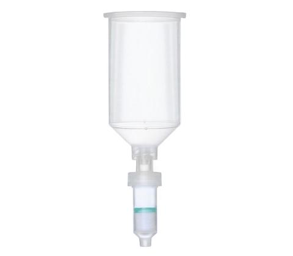
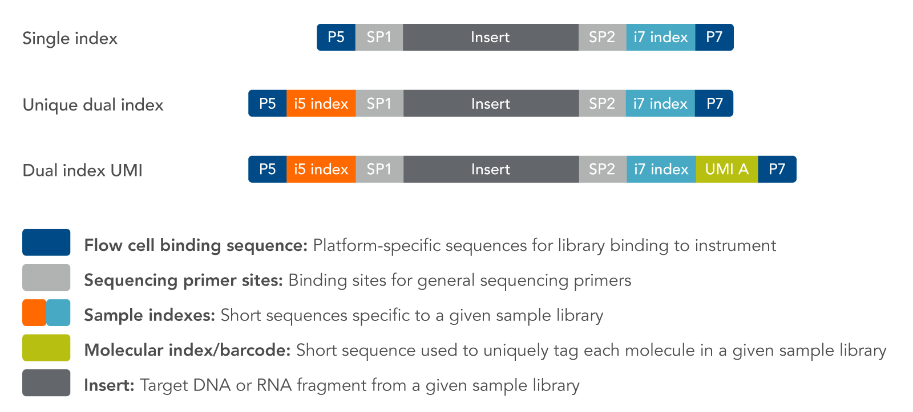

##  Samples

Originally, the authors have 119 samples and with corresponding 212 libraries. Finally, 69 samples (from 95 ancient DNA libraries) were used in their study after screening and quality control. [Online Table 1](OnlineTable1)

Ancient DNA were extracted and libraries were prepared in three different labs: 

1. The adelaide lab, the University of Adelaide's [Australian Centre for Ancient DNA (ACAD)](https://www.adelaide.edu.au/acad/about/). n = 151 libraires.

2. The Tubingen lab, the [Institute for Archaeological Sciences at the University of Tübingen](https://uni-tuebingen.de/en/faculties/faculty-of-science/departments/interfaculty-facilities/tza/tza/), Germany. The 9 Stuttgart *Linienbandkeramik*(LBK) samples, n = 16 libraries.

3. The Boston lab, the Harvard Medical School, Boston, USA, [David Reich's lab](https://reich.hms.harvard.edu/). n =45 libraries.

## Protocols for DNA extraction

DNA extraction was carried out in the clean-room facilities, using Silica-based DNA extraction method/protocal by [Jesse Dabney *et al*. (2013)](https://www.pnas.org/content/110/39/15758#sec-8)(Tubingen lab & Boston lab) and [Brotherton *et al*. (2013)](https://www.nature.com/articles/ncomms2656#s1)(Adelaide lab).

Here is summary of ancient DNA extraction protocal used by other papers:

- "Ancient human genomes suggest three ancestral populations for present-day Europeans" [Iosif Lazaridi *et al*. (2014)](https://www.nature.com/articles/nature13673) uses [Jesse Dabney *et al*. (2013)](https://www.pnas.org/content/110/39/15758#sec-8).

- "Genomic insights into the origin of farming in the ancient Near East" [Iosif Lazaridi *et al*. (2016)](https://www.nature.com/articles/nature19310) uses [Jesse Dabney *et al*. (2013)](https://www.pnas.org/content/110/39/15758#sec-8), but replaced the assembly of Qiagen MinElute columns and extension reservoirs from Zymo Research with a High Pure Extender Assembly from the High Pure Viral Nucleic Acid Large Volume Kit (Roche Applied Science).

- "The Genomic Formation of South and Central Asia" [Vagheesh Narasimhan *et al*. (2018)](https://www.biorxiv.org/content/10.1101/292581v1) uses [Dabney *et al*. (2013)](https://www.pnas.org/content/110/39/15758#sec-8) and [Petra Korlević *et al.* (2015)](https://www.ncbi.nlm.nih.gov/pubmed/26260087).

- "Reconstructing the Deep Population History of Central and South America" [Cosimo Posth   *et al*. (2018)](https://www.sciencedirect.com/science/article/pii/S0092867418313801) uses [Jesse Dabney *et al*. (2013)](https://www.pnas.org/content/110/39/15758#sec-8).

**Recent new protocal for ancient DNA extraction**： 

**“Extraction of highly degraded DNA from ancient bones, teeth and sediments for high-throughput sequencing”**, [Nadin Rohland *et al*. (2018)](https://www.nature.com/articles/s41596-018-0050-5).

This protocol update above replaces a now-outdated version that was published 11 years ago, before high-throughput sequencing technologies became widely available. [Nadin Rohland *et al*. (2007)](https://www.nature.com/articles/nprot.2007.247), "Ancient DNA extraction from bones and teeth."

Jesse Dabney also updated his 2013 ancient DNA extraction protocal in 2019 March: **"Extraction of Highly Degraded DNA from Ancient Bones and Teeth"**, [Jesse Dabney *et al*. (2019)](https://link.springer.com/protocol/10.1007/978-1-4939-9176-1_4).

## Prepare Samples, DNA Binding, Wash, and Elution

Extracting ancient is not an easy task: 

1. In ancient specimens, usually no or little cell structures are preserved, and, owing to as yet uncharacterized chemical modifications, it may even be difficult to get the DNA into aqueous solution.

2. Ancient DNA is damaged in various ways, so extraction methods also have to avoid overly aggressive treatments, such as high temperatures or use of strong detergents.

3. Ancient bones and teeth often contain large amounts of PCR inhibitors13,14,15 that interfere with DNA amplification and are co-purified with ancient DNA.

[Nadin Rohland *et al*. (2018)](https://www.nature.com/articles/s41596-018-0050-5)

In general, ancient DNA is first released from a pulverized sample by dissolving the bone/ tooth matrix in a minimal extraction buffer containing EDTA and Proteinase K. DNA is then bound to silica in the presence of guanidine hydrochloride and isopropanol, purified, and eluted in a low-salt buffer.

The first step in this process is DNA extraction. Lysis of bone or tooth powder is usually performed using an EDTA/proteinase K buffer, which degrades hydroxyapatite and collagen (the two major components of the bone or tooth matrix), releasing DNA from the sample. The DNA then needs to be purified from the lysis buffer reagents and substances that can inhibit downstream enzymatic reactions—for example humic and fulvic acids, tannins, porphyrin products, phenolic compounds, collagen type I, and Maillard products.
[Glocke Isabelle and Matthias Meyer (2017)](https://www.ncbi.nlm.nih.gov/pmc/articles/PMC5495074/).

The following steps are from [Jesse Dabney *et al*. (2019)](https://link.springer.com/protocol/10.1007/978-1-4939-9176-1_4), I think they are good for ancient bone and teeth samples. I also did some researches for each step and wrote in my notes. For other ancient samples, such as feces, you may check the paper from [Nadin Rohland *et al*. (2018)](https://www.nature.com/articles/s41596-018-0050-5), Nadin gave a lot of suggestions in her paper.
 
**1. Prepare Samples**

 Extraction Buffer (0.45 M EDTA, 0.25 mg/mL Proteinase K, 0.05% Tween-20 [final concentrations]).
 
 - Collect 10–150 mg powderized sample in a 2 mL tube.
 
 - Add 1 mL of extraction buffer. Mix well by vortexing.
 
 - Incubate 16–24 h, rotating at 37 Celsius.
 
 **Note**: 
 
Decalcification of Bone: A chelator, such as EDTA, tetra sodium at various concentrations and varying pH is, EDTA tetra sodium, a chelating agent, remove calcium’s, magnesium, and iron from bone and calcified cartilage. EDTA takes longer to decalcifying compared to acid decalcifying agents. However, it’s much gentler on the tissue; Proteinase K will degrade and digest all proteins and enzymes; Tween-20 prevent DNA binding to the inner wall of tube.
 
**2. DNA Binding**

Binding Buffer (5 M GuHCl, 40% Isopropanol [finalconcentrations]), 3 M sodium acetate pH 5.2

 - For each sample and control, transfer ~10 mL of binding buffer to a labeled 15 mL tube, and add 400 μL 3M sodium acetate.
 
 - Centrifuge samples from step 1 (after 24h extraction buffer incubation) for 2 min at maximum speed in a benchtop centrifuge to pellet residual solid.
 
 - Transfer supernatant to the 15 mL tube containing binding buffer. Mix gently by shaking. The pellet can be saved for future use.
 
 - Pour the sample/binding buffer mixture into the reservoir of the spin-column assembly, and close the 50 mL tube with a screw cap. Centrifuge for 4 min at 400 g. Rotate tubes 90 degree and centrifuge for another 2 min at 400 g.
 
 
 
 Zymo-Spin V Columns w/ Reservoir
 
 - Remove the screw cap from the 50 mL tube, and transfer the spin-column assembly to a clean 2 mL collection tube. Carefully remove and discard the extension reservoir. If desired, the 50 mL tube with flow-through can be stored at -20 Celsius.

- Close and label the spin-column cap.

- Perform a dry spin for 1 min at 3000  g in a benchtop centrifuge. Discard any flow-through.

**Note**:

These days, most labs use commercial DNA extraction kits based on spin column technology. Silica spin column contains a **silica resin** that selectively binds DNA, depending on salt conditions and other factors influenced by the extraction method. Silica spin column, membrane or Silica-coated glass beads has the property to bind DNA reversibly in the presence of high salt. DNA is also insoluble in alcohols (Ethanol & Isopropanol). 

The basic procedure is that salt and ethanol are added to the aqueous solution, which forces the precipitation of nucleic acids out of solution. After precipitation the nucleic acids can then be separated from the rest of the solution by attaching silica spin column.

Lysis buffers contain a high concentration of chaotropic salts. Chaotropes have two important roles in nucleic acid extraction. Firstly, they destabilize hydrogen bonds, van der Waals forces and hydrophobic interactions, leading to destabilization of proteins, including nucleases. Secondly, they disrupt the association of nucleic acids with water, thereby providing optimal conditions for their transfer to silica.

Chaotropic salts include guanidine HCL, guanidine thiocyanate, urea, and lithium perchlorate.

In addition to chaotropes, a detergent is often present in the lysis buffer to aid protein solubilization and cell lysis. Enzymes may also feature here, depending on sample type. The broad-spectrum serine protease proteinase K is very efficient in digesting proteins away from nucleic acid preparations. 

As discussed above, chaotropic salts are critical for lysis and binding to the column. The addition of alcohol (or sometimes isopropanol) will further enhance and influence the binding of nucleic acids to the silica.

Note that the percentage and volume of ethanol used are important. Too much ethanol will bring down degraded material and small species that will influence UV260 readings. On the other hand, too little ethanol may impede washing of the salt from the membrane. 

Melzak et al. (1996) Driving forces for DNA adsorption to silica in perchlorate solutions. J. Colloid Interface Sci. 181: 635 - 644.

**3. DNA Wash and Elution**

PE buffer (Qiagen)

- Add 750 μL PE buffer to each column. Centrifuge for 30 s at 3000 g. Discard flow-through.

- Repeat step 8 for a total of two washes.

- Perform a dry spin for 1 min at maximum speed (~16,000 g), turning the columns in the centrifuge 180 degree relative to their previous orientation.

- Transfer the column to a clean 1.5 mL tube.

- Add 50 μL TET buffer directly onto the silica membrane. Let sit for 5 min.

- Centrifuge 1 min at maximum speed

- Repeat elution step.

- Transfer the eluate (final DNA extract) to a clean 1.5 mL tube. Extracts can be stored at -20 Celsius.

**Note**: The first wash will often include a low concentration of chaotropic salts to remove residual proteins and pigments. This is always followed with an ethanol wash to remove the salts. If the sample didn’t contain a lot of protein starting out (e.g., plasmid preps or PCR clean ups), an ethanol wash is sufficient. Here, it uses PE wash buffer from commercial product (Qiagen).

## Library preparation 

Two important aspects or challenges of ancient DNA sequenceing:

1. Obtaining enough molecules to permit whole genome analysis / maximizing the number of molecules that are extracted from ancient remains.

2. Minimizing artefacts owing to contamination and **damage**.

Here, [Nadin Rohland *et al*. (2015)](https://www.ncbi.nlm.nih.gov/pmc/articles/PMC4275898/) developped "partial uracil-DNA-glycosylase" treatment to reducing the time required to screen samples. The library is uracil-DNA-glycosylase(UDG)-treated, but preserves a damage signal at the terminal bases of the molecules. The library can be used not only for screening, but also for larger-scale experiments, such as shotgun sequencing and target enrichment.

- the DNA extract is treated using a protocol that causes characteristic ancient DNA damage to be restricted to the terminal nucleotides, while nealy eliminating it in the interior of the DNA molecules, allowing a single library to be used both to test for ancient authenticity and to carry out population genetic analysis.

- the DNA molecules are ligated to a unique pair of barcodes, which eliminates undetected cross-contamination from this step onwards.

### Refenece: 

1. Jesse Dabney, et al. "Complete mitochondrial genome sequence of a Middle Pleistocene cave bear reconstructed from ultrashort DNA fragments." Proceedings of the National Academy of Sciences 110.39 (2013): 15758-15763.

2. Paul Brotherton , et al. "Neolithic mitochondrial haplogroup H genomes and the genetic origins of Europeans." Nature communications 4 (2013): 1764.

3. Iosif Lazaridis, et al. "Ancient human genomes suggest three ancestral populations for present-day Europeans." Nature 513.7518 (2014): 409.

4. Iosif Lazaridis, et al. "Genomic insights into the origin of farming in the ancient Near East." Nature 536.7617 (2016): 419.

5. Vagheesh Narasimhan, et al. "The genomic formation of South and Central Asia." bioRxiv (2018): 292581.

6. Petra Korlević, et al. "Reducing microbial and human contamination in DNA extractions from ancient bones and teeth." Biotechniques 59.2 (2015): 87-93.

7. Cosimo Posth, et al. "Reconstructing the deep population history of Central and South America." Cell 175.5 (2018): 1185-1197.

8. Nadin Rohland, et al. "Extraction of highly degraded DNA from ancient bones, teeth and sediments for high-throughput sequencing." Nature protocols 13.11 (2018): 2447.

9. Nadin Rohland and Michael Hofreiter. "Ancient DNA extraction from bones and teeth." Nature protocols 2.7 (2007): 1756.

10. Jesse Dabney , and Matthias Meyer. "Extraction of Highly Degraded DNA from Ancient Bones and Teeth." Ancient DNA. Humana Press, New York, NY, 2019. 25-29.

11. Glocke Isabelle and Matthias Meyer. "Extending the spectrum of DNA sequences retrieved from ancient bones and teeth." Genome research 27.7 (2017): 1230-1237.

12. Nadin Rohland, et al. "Partial uracil–DNA–glycosylase treatment for screening of ancient DNA." Philosophical Transactions of the Royal Society B: Biological Sciences 370.1660 (2015): 20130624.
