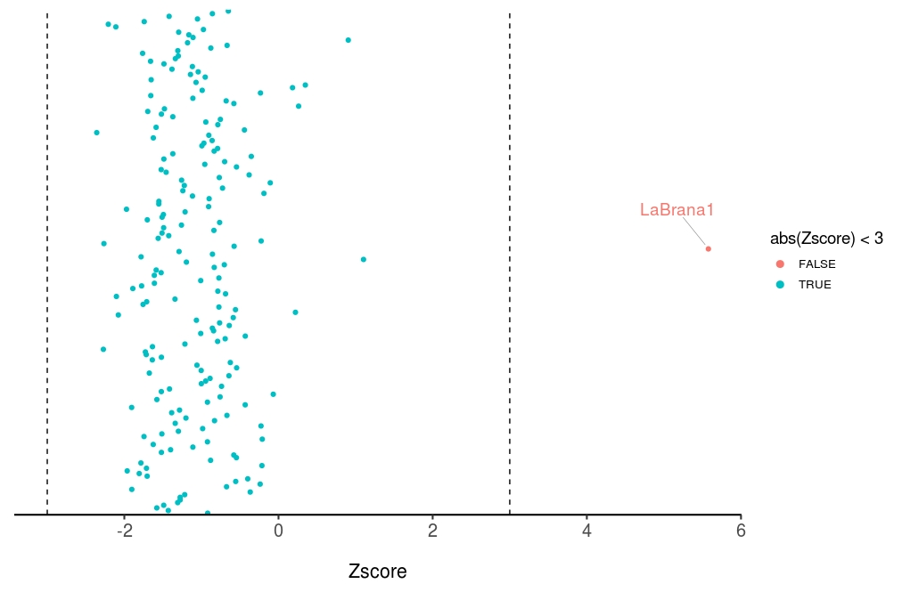

### Western European hunter-gatherers(WHG)


***f4*(Loschbour, HungaryGamba_HG; *Test*, Chimp)**


Making the paparmeter file:
```
nano par.WHG

genotypename: Haak_full.geno 
snpname: Haak_full.snp
indivname: Haak_full.ind
popfilename: f4_pop_WHG
```
Making ```popfilename``` file:

```
awk '{print "Loschbour" "\t" "HungaryGamba_HG" "\t" $1 "\t" "Chimp"}' pop.list.txt > f4_pop_WHG

```
[pop.list.txt](data/pop.list.txt)

We can then run the D-statistic tests like so in the terminal:

```
qpDstat -p par.WHG > WHG.f4.result
```


If I run all the 193 *f4* tests, the program will be killed. I did some google searces and found out " In some cases using popfilename the program uses an excessive amount of memory." So I sovlved this by divide the run into mulityple small runs and combine the result of each run. It is mentioned in the [```qpDstat``` manual](https://github.com/DReichLab/AdmixTools/blob/master/README.Dstatistics). 


```
qpDstat -p par.WHG -l 1 -h 50 > WHG.f4.result.1
qpDstat -p par.WHG -l 51 -h 101 > WHG.f4.result.2
qpDstat -p par.WHG -l 102 -h 152 > WHG.f4.result.3
qpDstat -p par.WHG -l 153 -h 193 > WHG.f4.result.4
```
Each run is really fast, like 1-2 mins.

Extraction final results:
```
cat WHG.f4.result.* | grep "result:" | awk '{print$2 "\t" $3 "\t" $4 "\t" $5"\t" $6 "\t" $7 }' > WHG.f4.result
```
[WHG.f4.result](data/WHG.f4.result)

The results have the following format: Pop1(**W**)  Pop2(**X**)  Pop3(**Y**)  Pop4(**Z**)  **D-stat**	 **SD**  **Z score**


I think the easiest way to review the results is to plot the Z-score for each X (test) population, So I wrote this ```R``` code to achieve this goal.

```
library(ggplot2)
library(tidyverse)
library(ggrepel)


# Read f4 test result.
WHG.result <- read.table("WHG.f4.result")

# Rename each column .
names(WHG.result) <- c("W", "Y", "X", "Z", "D", "stderr", "Zscore")

# Plot the Z-score.
ggplot(WHG.result, aes(Zscore,X, color = abs(Zscore) < 3)) +
  geom_point(size=1.5) +
  geom_vline(xintercept = c(-3,3), linetype = 2)+
  theme_classic(base_size = 16)+
  theme(axis.title.y=element_blank(),
        axis.text.y=element_blank(),
        axis.ticks.y=element_blank(),
        axis.line.y=element_blank(),
        axis.text.x = element_text(size=15),
        axis.title.x = element_text(margin = margin(t = 20, r = , b = 0, l = 0)),
        legend.title = element_text(size=14),
        legend.text = element_text(size=10)  )+
  guides(colour = guide_legend(override.aes = list(size=2.5)))+
  geom_text_repel(aes(label = X),
                  data          = subset(WHG.result, abs(Zscore) > 3),
                  size          = 5,
                  box.padding   = 1.5,
                  point.padding = 0.5,
                  force         = 10,
                  segment.size  = 0.2,
                  segment.color = "grey50",
                  direction     = "y")  
  

```



