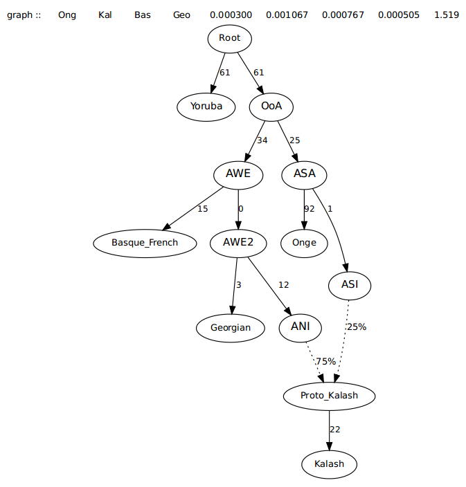

# qpGraph: estimating admixture groups

Here, I am trying to repeat the analysis, "Phylogeneticrelationships of ancient Eurasians" in Supplementary Information 8, [Haak *et al*. (2015)](https://www.nature.com/articles/nature14317) using [```qpGraph```](https://github.com/DReichLab/AdmixTools/blob/master/README.QPGRAPH) in [AdmixTools](https://github.com/DReichLab/AdmixTools). In this section, the authors modeled the phylogenetic relationships of Eurasian hunter-gathers.

## qpGraph overview:

The ```qpGraph``` program is part of the [AdmixTools](https://github.com/DReichLab/AdmixTools) pacakge. The ```qpGraph``` relies on an user-defined topology of the admixture graph and calculates the best-fitting admixture proportions and branch lengths based on the observed *f*-statistics. [Patterson *et al*. (2012)](https://www.genetics.org/content/192/3/1065.short), [CompPopGenWorkshop2019](https://github.com/stschiff/compPopGenWorkshop2019_docs/blob/master/contents/07_qpgraph/qpGraph.rst).

From [CompPopGenWorkshop2019](https://github.com/stschiff/compPopGenWorkshop2019_docs/blob/master/contents/07_qpgraph/qpGraph.rst), I quoted here:

The general approach of an admixture graph is to reconstruct the genetic relationships between different groups through a phylogenetic tree allowing for the addition of admixture events. The method operates on a defined graph’s topology and estimates f2, f3, and f4-statistic values for all pairs, triples, and quadruples of groups, compared to the expected allele frequency correlation of the tested groups. For a given topology, ```qpGraph``` provides branch lengths (in units of genetic drift) and mixture proportions. Groups that share a more recent common ancestor will covary more than others in their allele frequencies due to common genetic drift. We should keep in mind that the model is based on an unrooted tree and that while we show graphs with a selected outgroup as the root, the results should not depend on the root position.


The reconstructed graph is never meant to reflect a comprehensive population history of the region under study but the best fitted model to the limit of the available groups and method’s resolution.

As reported in the Method section of [Lipson and Reich 2017](https://academic.oup.com/mbe/article/34/4/889/2838774):

“Our usual strategy for building a model in ADMIXTUREGRAPH is to start with a small, well-understood subgraph and then add populations (either unadmixed or admixed) one at a time in their best-fitting positions. This involves trying different branch points for the new population and comparing the results. If a population is unadmixed, then if it is placed in the wrong position, the fit of the model will be poorer, and the inferred split point will move as far as it can in the correct direction, constrained only by the specified topology. Thus, searching over possible branching orders allows us to find a (locally) optimal topology. If no placement provides a good fit (in the sense that the residual errors are large), then we infer the presence of an admixture event, in which case we test for the best-fitting split points of the two ancestry components. After a new population is added, the topology relating the existing populations can change, so we examine the full model fit and any inferred zero-length internal branches for possible local optimizations.”


## Data

Fully public genotype dataset (354,212 SNPs) described in [Haak *et al*. (2015)](https://www.nature.com/articles/nature14317), [avaiable here](https://reich.hms.harvard.edu/datasets).


In [CompPopGenWorkshop2019](https://github.com/stschiff/compPopGenWorkshop2019_docs/blob/master/contents/07_qpgraph/qpGraph.rst), the author suggested that you can exclude from your genotype data a subset of SNPs that are transitions in CpG sites. Because those Cytosines are prone to be methylated and if deamination ( the typical chemical modification of ancient DNA) occurs at the same position Cytosine is directly converted into Thymine without becoming Uracil. Thus, the resulting C to T modification cannot be removed with an enzymatic reaction like performing uracil-DNA glycosylase (UDG) treatment. This results in additional noise in ancient DNA data that can be reduced by excluding those SNPs. This is especially relevant when analysing ancient samples that have been processed using different laboratory protocols.


Here, I didn't exclude any SNPs for the time being, but in the future I will try to do that. And then I can compare results of both treatments and see if they result in different results and conclusions.


The data I worked with here are:

```
data.geno

data.ind

data.snp

```
And I change the file names to:

```
Haak.geno

Haak.ind

Haak.snp
```

## qpGraph analyses

### Basic Model

Begin with by fitting the basic model to the new data.

**1. Preparing the parameter file**

In order to run ```qpGraph```, I prepared a parameter file save as: [par.basicmodel.han](data/par.basicmodel.han). The authors used the Onge population as Eastern-non-African, but the Onge population is not included in the public dataset, so I used Han chinese population instead.

```
genotypename: Haak.geno
snpname: Haak.snp
indivname: Haak.ind
outpop:  NULL
useallsnps: YES
blgsize: 0.05
forcezmode: YES
lsqmode: YES
diag:  .0001
bigiter: 6
hires: YES
lambdascale: 1
```

```outpop```: NULL does not use an outgroup population to normalize f-stats by heterozygosity e.g. selecting a group in the graph in which SNPs must be polymorphic. 

```useallsnps```: YES each comparison uses all SNPs overlapping in that specific test, otherwise the program looks only at the overlapping SNPs between all groups. 

```blgsize```: 0.05 is the block size in Morgans for Jackknife. 

```diag```: .0001 uses the entire matrix form of the objective function to avoid the basis dependence of the least-squares version of the computation. 

```lambdascale```: 1 in order to preserve the standard scaling of the f-statistics without an extra denominator. 

```lsqmode```: YES otherwise unstable for large graphs. hires: YES controls output when more decimals are desired.

**2. Preparing the graph topology file**


I prepared the scaffold graph based on Figure S8.1 in Supplementary Information 8, [Haak *et al*. (2015)](https://www.nature.com/articles/nature14317), which based on the basic model in [Iosif Lazaridis *et al*. (2014)](https://www.nature.com/articles/nature13673). The following can be saved in a file named as: [BasicModel.han](data/BasicModel.han).

```
root  Root
label Mbuti Mbuti
label Han Han
label MA1 MA1
label Karitiana Karitiana
label Loschbour Loschbour
label LBK_EN LBK_EN

edge  a Root Mbuti
edge  b Root non_African
edge  C1 non_African Basal_Eurasian
edge  C2 non_African X
edge  C3 X Eastern_non_African
edge  C4 Eastern_non_African Han
edge  C5 Eastern_non_African Z
edge  C6 X W
edge  C7 W Ancient_North_Eurasian
edge  C8 W Western_Eurasian
edge  C9 Ancient_North_Eurasian MA1
edge  C10 Ancient_North_Eurasian Q
admix Proto_Karitiana Z Q 61 39
edge  C11 Proto_Karitiana Karitiana
edge  C12 Western_Eurasian Loschbour
edge  C13 Western_Eurasian Y
admix Proto_LBK_EN Y Basal_Eurasian 77 23
edge  C14 Proto_LBK_EN LBK_EN
```

If you don't know the format of the graph topology file, you can refer to the manual, [here](https://github.com/DReichLab/AdmixTools/blob/master/examples.qpGraph/gr1triv)

or 

refer to this example from [eurogenes.blogspot](http://eurogenes.blogspot.com/2017/06/qpgraph-open-thread.html)




```
root     Root
label    Yoruba Yoruba
label    Onge   Onge      
label    Basque_French   Basque_French    
label    Georgian   Georgian   
label    Kalash   Kalash
edge  OoA  Root OoA  
edge  Yoruba  Root Yoruba
edge  AWE OoA AWE
edge  ASA OoA ASA
edge  Onge ASA Onge
edge  Basque_French AWE Basque_French
edge  AWE2 AWE AWE2
edge  Georgian AWE2 Georgian
edge  ANI AWE2 ANI
edge  ASI ASA ASI
admix   Proto-Kalash ASI ANI 20 80
edge  Kalash Proto-Kalash Kalash
```


```graphviz``` installation:

```
conda install -c anaconda graphviz python-graphviz
```


```
dot -Tpng basic_model.han.dot -o basic_model.han.png
```


```
qpGraph -p par.basicmodel.han -g BasicModel.han -o basic_model.han.ggg -d basic_model.han.dot > basic_model.han.out
```


https://github.com/stschiff/compPopGenWorkshop2019_docs/blob/master/contents/07_qpgraph/qpGraph.rst


**Reference**:
1. Patterson, Nick, et al. "Ancient admixture in human history." Genetics 192.3 (2012): 1065-1093.

2. Haak, Wolfgang, et al. "Massive migration from the steppe was a source for Indo-European languages in Europe." Nature 522.7555 (2015): 207.

3. Lazaridis, Iosif, et al. "Ancient human genomes suggest three ancestral populations for present-day Europeans." Nature 513.7518 (2014): 409.
